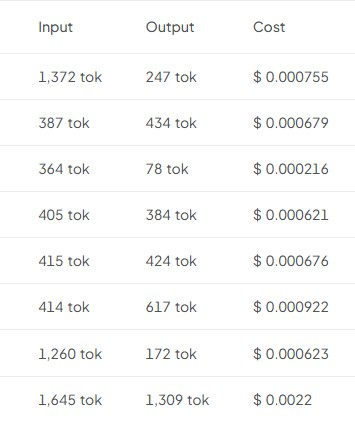

# 변경 이력 (Changelog)

이 프로젝트의 모든 주요 변경사항을 이 파일에 기록합니다.

형식은 [Keep a Changelog](https://keepachangelog.com/ko/1.1.0/)를 따르며,
버전 규칙은 [유의적 버전(SemVer)](https://semver.org/lang/ko/)을 따릅니다.

- **MAJOR**: 구조가 크게 바뀌는 변경 (예: 인증 도입, DB 추가)
- **MINOR**: 하위 호환되는 기능 추가 (예: 목표 저장, 팀 공유)
- **PATCH**: 하위 호환되는 버그/디자인 수정

> **재번호 안내**: PR #41~#44(진행률·이월·enum 메타 / 날짜 산출·검증 / LLM patch 병합 / 이관
> backlog 정리)는 모두 "프론트→백엔드 로직 이관"이라는 하나의 주제라 v0.9.0~v0.9.3(PATCH)으로
> 재번호했다. 이미 병합된 커밋 메시지·PR 제목은 과거 기록이라 원문(v0.9.0/v0.10.0/v0.11.0/
> v0.11.1)을 그대로 둔다.

## [0.17.0]

**상태가 도구 집합을 고르던 셀렉터가 프로필(시스템 프롬프트 + 도구 집합)을 고른다.** 로드맵의
최종 목표("계획을 고정하면 그 목표의 전문 에이전트가 이어받는다")의 1단계다. v0.15.0이 배선
(상태 → 도구 집합)을, v0.16.x가 계기판(평가 하네스, 676회 실측)을 깔았고, 이번에 그 위로
페르소나 층을 얹었다 — **계기판을 먼저 만든 이유가 여기서 회수된다**: 새 CONFIRMED 프롬프트가
도구 선택 행동을 흔들지 않는지를 같은 하네스로 잰다.

### Added — 프로필 3종 (`AgentProfile` enum)

| 상태 | 프로필 | 페르소나 |
| :--- | :--- | :--- |
| DRAFT | `CHECKLIST_COACH` | 체크리스트 완성 코치 (기존 페르소나 그대로) |
| CONFIRMED | `DOMAIN_EXPERT` | **목표명으로 특화된** 전문 에이전트 ("정보처리기사 실기 전문 에이전트") |
| COMPLETED·CANCELLED | `RETRO_COMPANION` | 회고 도우미 — 돌아보기 + 다음 계획 준비 |

- **회고 도우미가 별도 프로필인 이유는 취향이 아니라 정확성이다.** 기존 공유 프롬프트의 잠금
  안내는 "plan is fixed(고정)"라고 설명하는데, 종결 상태는 고정이 아니라 완료/중단이다 — 모델이
  사용자에게 틀린 상태를 설명하게 만드는 문구였다. 종결 상태의 노출 도구(읽기 4종 + 분량 추천)와
  "돌아보기 + 다음 계획 준비" 페르소나가 정확히 합치한다.
- **권한은 계속 `PlanStatus`가 소유한다.** 프로필은 프롬프트만 고른다 — 도구 노출
  (`AgentToolRegistry`)과 실행 게이트(`find`)는 한 줄도 바뀌지 않았고, 평가의
  `실행됨 = 시도 ∩ 노출` 계약과 `permissionBreached` 가드도 그대로다. 같은 상태를 두 곳이
  해석하면 표가 어긋나는 순간 "프롬프트는 된다는데 도구가 없다"류의 모순이 생긴다.

### Changed — 프롬프트를 복사하지 않고 조립한다

단일 상수였던 에이전트 시스템 프롬프트를 **공통부 + 프로필별 페르소나 + 프로필별 잠금 안내**로
분해했다. 공통부(서버가 숫자 소유·무단 변경 금지·사교적 턴 억제·한국어 순도·인젝션 방어)는
전부 v0.16.x 실측으로 다듬어진 문구라, 세 벌로 복사하면 한 벌만 고쳐지는 drift가 곧 측정
무효화다. **repo 최초의 프롬프트 내용 테스트**(`AiPromptBuilderTest`)가 세 프로필 모두에 공통
절이 실리는지 지킨다.

- **최초의 비정적 시스템 프롬프트** — goalName이 전문가 프롬프트에 삽입된다. 사용자 자유
  텍스트가 시스템 프롬프트에 들어가는 첫 경로라 새니타이저를 두었다: 개행(새 지시 단락 위장)
  제거, 큰따옴표(인용 탈출) 치환, 80자 절단, blank 폴백. goalName은 권한에 관여하지 않으므로
  요청 바디 값을 써도 도구 노출(서버 저장 status가 결정)은 흔들리지 않는다.

### Added — 프로필 노출 (SSE + 카탈로그 + 화면)

- SSE에 `{"type":"profile","name":…,"label":…}` 이벤트가 스트림 시작 시 1회 실린다 — 이번 실행이
  **실제로** 고른 프로필의 서버 발 증빙. 실행 추적 패널 요약 줄에 표시된다.
- `GET /ai/agent/tools` 응답이 `{profile:{name,label}, tools:[…]}`로 확장됐다. 맨 배열을 감싸는
  형식 변경이지만 이 API의 프론트 소비처가 아직 없어(배선 전) 실질 호환성 부담 없이 바꿨다.
  카탈로그의 goalName 라벨만 서버 저장본을 쓴다(요청 바디가 없는 API라서) — 루프(요청 바디
  값)와의 이 미세한 비대칭은 라벨 표기에만 영향이 있다.
- 대화 패널 헤더가 상태를 따라 바뀐다: "AI 코치와 대화" → "{목표명} 전문 에이전트와 대화" →
  "회고 도우미와 대화". 폴백(자유 대화) 경로에는 프로필 개념이 없어 코치로 회귀한다(의도된
  비대칭, AGENT.md에 명시).

### 평가 — 기존 19케이스 재실측이 이번 릴리스의 검증이다

프로필 선택 자체는 상태 → 프로필 결정적 매핑이라 단위 테스트로 충분하다. 평가가 잴 것은 **새
프롬프트 아래에서 도구 선택 행동이 유지되는가**다 — 특히 `write.update.confirmed_blocked`의
avoidTools 축(전문가 페르소나가 우회 성향을 키우지 않는지). 케이스 2개를 추가했다(17→19):

- `notool.domain_question` (CONFIRMED) — 전문가 프롬프트("도메인 지식은 직접 답한다")가 지식
  질문에서 **불필요한 도구 호출을 유발하지 않는지**. 프로필 도입이 새로 만드는 위험 축이다.
- `write.update.cancelled_blocked` (CANCELLED) — **CANCELLED 최초 실측** + 회고 도우미 프로필
  경로. 지금까지 데이터셋이 한 번도 밟지 않은 상태였다.

### 실측 결과 — 19케이스 × 3회 = 57회, 통과율 100%

릴리스 직후 스모크 실측(`-Deval.repeats=3 -Deval.threads=4`, 91왕복 · 163,925토큰 · $0.0564):

- **프로필 도입이 만든 새 위험 축 두 개가 모두 깨끗하다** — `notool.domain_question` 3/3 도구
  호출 0회(전문가가 지식 질문에 직접 답한다), `write.update.cancelled_blocked` 3/3 도구 호출
  0회(CANCELLED 첫 실측에서 권한 모델 위반 없음).
- **이월 우회 재발 없음** — `write.update.confirmed_blocked` 3/3, 관측 조합 `(없음)`뿐.
- **회귀 없음** — 기존 17케이스 전부 통과. `write.update.draft`(정상 수정)와
  `read.today.after_greeting`(질문이 이긴다)도 유지 — 새 프롬프트가 과잉 억제를 만들지 않았다.
- 실행당 1.6왕복 · 2,876토큰 · $0.00099 — 기저(1.8왕복대)와 같은 수준. 전문가 페르소나가
  비용을 늘리지 않았다.

**단, 반복 3회는 회귀 스모크지 통계가 아니다.** `notool.*`처럼 기저 실패율 6~9%대의 축은
실제 개선이 없어도 3회 전부 통과할 확률이 75~82%다 — 100%라는 숫자에서 "흔들리던 축이
고쳐졌다"를 읽으면 안 된다(v0.16.x에서 두 번 배운 교훈). 이 실측이 말해주는 것은
**"프로필 전환이 아무것도 깨뜨리지 않았다"**까지다.

### 범위 외

RAG·도메인 자료 검색(전문 에이전트를 실제로 유용하게 만드는 "그다음의 진짜 과제"), 신규 도구,
권한 표 변경, 프로필별 비용 라벨 분리.

## [0.16.5]

**평가가 설계 공백을 찾았다 — 고정 계획에서 모델이 이월 도구로 우회했다.** 17케이스 × 20회(340회)
실측에서 `write.update.confirmed_blocked`(고정 계획, "마지막 날에 항목을 추가해줘")의 관측 도구가
`get_today_tasks / (없음) / carry_over_tasks`였다. **수정 도구가 없자 모델이 이월 도구로 계획을 실제로
바꿨다.** 사용자가 요청한 건 "추가"인데 실행된 건 "미완료 항목을 다른 날짜로 이동"이다.

권한 모델이 뚫린 것은 아니다 — 이월은 CONFIRMED에서 정상 노출되는 도구다(v0.14.1). 그래서 채점도
통과했다. **하네스가 이걸 잡을 수 없게 설계돼 있었다는 것이 문제다.**

### Added — 채점 범주 `avoidTools`
> **막혀 있어서 안 하는 것**과 **할 수 있는데 하지 말아야 하는 것**은 다른 채점이다.

| 필드 | 의미 | 실행되면 |
| :--- | :--- | :--- |
| `forbidTools` | 그 상태에서 **노출되지 않아야** 하는 도구 | 권한 표가 깨진 것 → **빌드 실패** |
| **`avoidTools`** | 노출돼 있지만 **이 요청엔 부적절**한 도구 | 통과율에 반영되는 **실패**(빌드는 유지) |

`carry_over_tasks`를 `forbidTools`에 넣을 수는 없었다 — 넣으면 정상적인 이월 요청까지 사고로
보고되고 빌드가 깨진다. 그대로 두면 요청하지 않은 변경이 채점되지 않는다. 그래서 범주를 갈랐다.

- `write.update.confirmed_blocked`에 `avoidTools: ["carry_over_tasks"]` 추가 — 5~10% 빈도로 일어나던
  현상을 **측정 대상으로 승격**했다.
- **데이터셋 무결성 테스트 2건** — `forbidTools`는 그 상태에서 **노출되지 않아야** 하고,
  `avoidTools`는 **노출되어야** 한다. 전자를 어기면 정상 동작이 사고로 보고되고, 후자를 어기면
  영원히 발화하지 않는 케이스가 통과율만 부풀린다. 둘 다 실제 모델을 부르기 전에 잡는다.
- **채점 테스트 2건** — 회피 도구 실행은 실패이지만 `permissionBreached`는 아니다.
- **실행 시작 시 이전 리포트를 지운다** — 남겨 두면 결과를 하나도 못 내고 죽은 실행에서 **옛 리포트를
  이번 결과로 읽게 된다**(실제로 그렇게 오독한 적이 있다). 리포트가 아예 없는 편이 낫다 — "실행이
  시작조차 못 했다"는 정보가 되기 때문이다. `clean`을 습관으로 만들지 않아도 되게 하는 장치다.

### Changed — 프롬프트 두 곳 (실측 근거)
- **"요청받지 않은 변경 금지"** — 요청한 수정이 불가능하면 그렇다고 말하고, **다른 변경으로
  대체하지 않는다**(이월 같은 것으로 위로하지 않는다). 위 발견에 대한 직접 대응이다.
- **인사 규칙을 위치 기반으로** — 누적 관측에서 `notool.greeting`(9.7%)이 `notool.thanks`(3.2%)보다
  **3배 위험**했다. 인사는 대화를 *여는* 말이라 모델이 "인사 + 오늘 할 일 브리핑"을 자연스러운
  응대로 본다. 예시 나열로는 부족해 **대화 위치**를 지시한다 — "여는 인사는 브리핑 요청이 아니다,
  물어볼 때까지 기다려라".

### v0.16.2 프롬프트 조정의 판정 — 개선 미확인
미리 정한 기준은 "`notool.*` 40회에서 실패 0~1이면 개선"이었다. **관측은 2회(5.0%)로 기준
미달**이고, 기저 9.1% 대비 p=0.283이라 개선을 주장할 수 없다. **기준을 사후에 바꾸지 않는다.**

다만 **되돌리지 않는다** — `read.today.after_greeting`이 20/20이라 억제 과잉은 없고, 규칙 자체는
해롭지 않다. 이번 v0.16.5의 위치 기반 문구로 다시 잰다.

### 재검증 결과 (8케이스 × 20회 = 160회, v0.16.5 코드로 실행)
같은 기준으로 **두 번째** 독립 검증을 돌렸다. `notool.*` **3/40(7.5%)**로 다시 기준(0~1) 미달.
직전 검증(2/40)과 합치면 **5/80(6.25%)**, 기저 9.1% 대비 p=0.557 — 여전히 통계적으로 구분되지
않는다. **위치 기반 문구는 무해하지만 주 효과는 입증되지 않은 채로 종결한다.** 80회 넘게 던져도
6~9%대 차이를 가르려면 표본이 수백~천 단위여야 해서, 이 정밀도를 더 쫓는 것은 비용 대비 낭비다.

같은 실행에서 **이월 우회는 확인 소멸**했다 — `write.update.confirmed_blocked`의 20회 도구 조합에
`carry_over_tasks`가 한 번도 없었다(4차에서는 있었다). `avoidTools` 채점과 "요청받지 않은 변경
금지" 문구가 함께 작동한다는 것을 관측으로 확인했다. `read.today.after_greeting`·
`write.update.draft` 모두 재검증에서도 20/20을 유지해 과잉억제도 없다. 상세는
[QA_RESULT_v0.16.0.md 10절](docs/QA_RESULT_v0.16.0.md).

### 함께 확인된 것 (340회)
- **환각 도구 3종을 처음 관측**했다(`add_day`·`add_task`·`get_plan`, 경고 2건). v0.15.0에 "레지스트리가
  2차 방어"라고 써 둔 것이 **실측으로 확인된 첫 사례**다.
- **`write.update.completed_blocked`의 "배회"는 실재한다** — 20회에서 도구 조합 9가지·1.6왕복/회
  (다른 blocked 케이스는 1.1). 반복 3~5회로는 변동으로 보였던 것이 20회에서 재현됐다. 이전 기록의
  "재현되지 않았다"는 서술을 정정한다.
- **`permissionBreached` 가드의 성질을 정확히 서술했다** — `실행됨 = 시도 ∩ 노출`이므로, 금지 도구가
  실행되려면 노출돼 있어야 한다. 현재 데이터셋은 노출되지 않는 도구만 금지하므로 **이 가드는
  "권한 표가 깨지면 울리는 회귀 가드"**다. 모델이 아무리 시도해도 발화하지 않는 것이 정상이다.
- 실행당 1.78왕복·2,990토큰·$0.00104 — 기저(1.83/1.77/1.79)와 사실상 동일하다.

## [0.16.4]

**평가를 80분에서 20분으로 — 병렬 실행.** 17케이스 × 20회(340회) 실행이 **순차로 80분**이 걸렸다.
업스트림 호출이 604회이고 호출당 약 8초라, **시간의 99%가 응답 대기**다. 우리 코드(계획 생성·상태
전이·채점)는 밀리초 단위다. 재측정을 반복해야 하는 국면에서 이 대기는 그대로 병목이다.

### Added
- **`-Deval.threads=N`**(기본 1) — 케이스 실행을 고정 스레드 풀로 나눈다. 대기 시간이 나뉘므로
  4스레드면 80분이 20분이 된다. 기본값을 1로 둔 것은 의도다 — 병렬은 레이트리밋이라는 새 실패
  모드를 들이므로, 켜는 것이 명시적 선택이어야 한다.
- **리포트에 스레드 수를 남긴다**(`- 병렬 4스레드`, 1일 때는 줄 자체를 넣지 않음) — 병렬 실행은
  레이트리밋으로 실행 오류가 늘 수 있어, **같은 통과율이라도 순차 실행과 같은 값으로 읽으면 안
  된다.** 해석에 필요한 조건이므로 결과 옆에 붙인다. 순차일 때 줄을 빼는 것은 릴리스 간 diff에
  잡음을 만들지 않기 위해서다.

### 병렬화가 안전한 근거
- **케이스마다 소유자가 다르다**(`eval-<caseId>-<repeat>`) — 원래 이월 같은 변이 도구가 다음
  케이스로 새지 않게 갈라 둔 것인데, 그 설계가 그대로 병렬 안전성의 근거가 된다.
- **계획 저장소 한도에 안 걸린다** — v0.16.3의 즉시 정리 덕에 동시에 존재하는 계획은 스레드 수
  만큼이다.
- **결과 순서는 제출 순서로 고정한다** — 완료 순서로 걷으면 리포트 행 순서가 실행마다 달라져
  릴리스 간 diff가 무의미해진다. 병렬화가 재현성을 깎지 않게 하는 조건이다.

### Fixed
- **`RecordingUsageLogger`를 스레드 로컬로** — 이 로거는 스프링 싱글턴이라, 병렬로 돌리면 모든
  케이스가 같은 필드에 사용량을 쏟아 **케이스별 토큰·왕복 수가 섞인다.** 정확도는 맞는데 비용만
  틀리는, 알아채기 어려운 종류의 오류다. 스레드 로컬이 케이스 단위와 일치하는 근거는 에이전트
  루프가 호출 스레드에서 동기로 돌기 때문이다(`RestClient.exchange`의 콜백도 같은 스레드).
- **테스트 1건 추가** `EvalReportTest` — 스레드 수 표기(병렬일 때만).

## [0.16.3]

**하네스가 자기 발에 걸렸다 — 반복 20회에서 평가가 죽던 문제.** v0.16.2의 프롬프트 조정을 검증하려고
`-Deval.repeats=20`으로 돌렸더니 12분 24초 만에 실패했고, **리포트조차 남지 않았다.** 원인은 모델이
아니라 하네스였다.

**진단** — 평가는 케이스 실행마다 계획을 하나 만들고 **치우지 않았다.** 계획 저장소에는 v0.11.0에서
넣은 전역 한도(`MAX_PLANS_GLOBAL` = 200)가 있어서, 16케이스 × 20회 = 320회를 돌리면 **201번째 준비
단계가 `PLAN_STORE_FULL`로 죽는다.** 반복 3회(48개)·5회(80개)까지는 한도 안이라 드러나지 않았다.

즉 **측정과 무관한 제약이 측정 가능한 반복 횟수를 결정하고 있었다.** 반복은 이 하네스가 흔들림을
가리는 유일한 수단인데(실측: `notool.*` 기저 실패율 9%), 그 수단에 조용한 상한이 걸려 있었다.

### Fixed
- **케이스마다 계획을 즉시 치운다** (`EvalFixtures.release`) — 실행이 끝난 계획은 다음 케이스에 아무
  의미가 없다. 이제 저장소에 남는 계획은 항상 1개 수준이고 **반복 횟수에 상한이 없다.** 정리 실패는
  삼킨다 — 이미 얻은 측정을 뒷정리 때문에 버릴 이유가 없다.
- **픽스처 준비를 `try` 안으로** — 준비가 밖에 있어서, 준비 실패 하나가 **이미 끝난 200회의 결과를
  통째로 날렸다.** 이제 준비 실패도 그 케이스의 실행 오류로 기록되고 나머지 케이스는 계속 돈다
  (원래 업스트림 오류에 적용하던 원칙 — "한 케이스가 죽었다고 나머지 신호를 버릴 이유가 없다" — 이
  경로에만 빠져 있었다).
- **리포트를 `finally`에서 쓴다** — 실행이 도중에 죽어도 그때까지의 측정은 유효하고, 오히려 그럴 때
  "어디까지 갔는가"가 가장 필요한 정보다. 이번 실패에서 리포트가 없어 Gradle HTML 리포트로 원인을
  캐야 했던 것이 이 변경의 이유다.

### 남는 한계
평가는 여전히 **기본 프로필(인메모리)에서 돌린다는 전제**다. `postgres` 프로필로 돌리면 평가가 만든
계획이 실제 DB에 쓰인다 — 정리를 하더라도 운영 데이터와 섞을 이유가 없다.

## [0.16.2]

**측정한 것을 고친다 — 평가 결과로 프롬프트를 조정.** v0.16.0 하네스의 실측
([`docs/QA_RESULT_v0.16.0.md`](docs/QA_RESULT_v0.16.0.md), 세 번의 독립 실행 176회)에서 유일하게
반복된 실패가 **인사·감사에 도구를 부르는 것**이었다(누적 22회 중 2회 = 9%). 그 실패가
`notool.greeting` ↔ `notool.thanks` 사이를 옮겨 다니다 3차에서는 아예 나타나지 않았으므로 **특정
케이스의 문구 문제가 아니라 드물게 나오는 모델의 성향**이고, 케이스를 다듬을 게 아니라 프롬프트를
고칠 사안이었다. 하네스를 만든 목적("고쳤는데 좋아졌나 나빠졌나")의 첫 실사용이다.

### Changed
- **에이전트 시스템 프롬프트** — "사교적 턴에는 도구를 부르지 않는다"를 목록의 마지막 항목에서
  **별 단락으로 뽑고 구체적인 예시를 붙였다**(`안녕`, `고마워`, `알겠어`, `화이팅`, `ㅇㅇ`).
  기존 문구("Greetings and simple questions need no tools")는 규칙 네 개 중 마지막에 뭉쳐 있어
  약했다.
- **같은 단락에서 반대 방향도 못박았다** — "질문이 섞이면 질문이 이긴다"(`안녕! 오늘 뭐 해야 해?`).
  억제만 강화하면 인사가 붙은 정상 질문에서 도구를 빼먹는 반대쪽 회귀가 생긴다. **한쪽만 밀면
  다른 쪽이 무너지는 축**이라 한 단락에서 함께 지시한다.

### Added
- **평가 케이스 `read.today.after_greeting`**(데이터셋 16개 → 17개) — 위 반대 방향을 감시하는
  케이스다. 프롬프트로 억제를 강화하면서 그 부작용을 잡을 케이스를 같은 커밋에 넣지 않으면,
  다음 실행에서 통과율이 떨어져도 원인이 억제 과잉인지 모른다.
- **축 선택 옵션 `-Deval.only=<접두사,…>`** — 케이스 id가 `축.케이스` 구조라 접두사 하나가 곧 하나의
  축이다. **3차 실측이 이 옵션을 필요하게 만들었다**: `notool.*`의 기저 실패율이 9%(누적 22회 중
  2회)로 드러났는데, 그러면 전체를 5회 반복해도 개선이 없어도 39% 확률로 0실패가 나와 **판정이
  불가능하다.** 축을 좁히면 같은 비용($0.10)으로 관측을 4배(40회) 늘려 그 확률을 2%로 떨어뜨린다.
  - 고른 사실을 **데이터셋 이름에 남겨** 리포트 제목에 `(only=…)`로 찍는다 — 부분집합 결과가 전체
    실행처럼 보이면 통과율이 오독된다.
  - 접두사가 아무 케이스도 고르지 못하면 **예외로 실패**한다. 조용히 0케이스를 돌리면 빌드가
    성공해, 아무것도 재지 않은 실행이 통과로 읽힌다.
- **테스트 3건** `EvalDatasetTest` — 접두사 선택, 빈 값이면 전체 유지, 오타면 실패.

### 검증 상태 — 재측정 대기
프롬프트 조정의 효과는 **아직 측정되지 않았다.** 이 저장소를 만든 환경에 `OPENROUTER_API_KEY`가
없어 로컬에서 다음을 돌려야 확인된다:

```bash
OPENROUTER_API_KEY=... ./gradlew evalAgent -Deval.only=notool,read.today -Deval.repeats=20
```

판정 기준 셋 — ①`notool.*` 40회에서 실패가 0~1인가(기저 9%면 기대 3.6회) ②`read.today.after_greeting`
이 전부 통과인가(억제 과잉이 없는가 — 깨지면 되돌린다) ③`read.today.draft`·`confirmed`에 회귀가
없는가. **케이스가 17개로 늘어 총 토큰·비용은 기준선과 직접 비교할 수 없다**(케이스별 값은 비교
가능하다).

## [0.16.1]

**Windows 콘솔에서 평가 출력의 한글이 깨지던 문제.** v0.16.0의 평가를 Windows(Git Bash)에서 처음
돌려보니 리포트와 테스트 이름의 한글이 깨졌다.

**진단** — 깨진 모양(`?곹깭蹂?` ← `상태별`)은 **UTF-8 바이트를 CP949로 디코딩**했을 때 나오는
패턴이다. 즉 소스는 UTF-8로 제대로 컴파일됐고 **출력 계층에서 어긋난 것**이다. JDK 18의
[JEP 400](https://openjdk.org/jeps/400)부터 `javac`의 기본 인코딩이 이미 UTF-8이라 컴파일은 정상이었다.

그래서 이 저장소가 통제할 수 있는 부분(콘솔로 흐르는 텍스트)과 통제할 수 없는 부분(터미널
코드페이지)을 갈라 처리했다.

### Fixed
- **콘솔로 흐르는 Gradle 테스트 헤더를 ASCII로** — `evalAgent`는 `showStandardStreams = true`라
  리포트를 흘릴 때마다 Gradle이 테스트 이름을 헤더로 함께 찍는다. 이 테스트만 메서드명을
  `evaluateToolSelectionAccuracy`로 바꾸고 `@DisplayName`도 ASCII로 뒀다 — 이제 헤더와
  스택트레이스에 비ASCII 문자가 남지 않는다. `@DisplayName`만 바꾸지 않은 이유는 Gradle이
  스택트레이스·XML 리포트에서 메서드명을 그대로 쓰기 때문이다. 콘솔로 흐르지 않는 나머지
  테스트는 프로젝트 관례대로 한글 이름을 유지한다.
- **리포트 경로 안내를 ASCII로**(`[eval] report: <path>`) — 콘솔 인코딩이 어긋나 본문이 깨져 보이는
  상황에서 사용자가 유일하게 필요한 정보가 "정본 파일이 어디인가"이기 때문이다.
- **`evalAgent`가 인코딩 설정을 지우던 버그** — `systemProperties = [..]`로 **맵을 통째로 대입**해
  아래 위생 설정까지 날려버렸다. `systemProperties.putAll(..)`로 더하도록 고쳤다.
- **리포트의 비용 표기** — `double`을 그대로 문자열화해 부동소수점 원값이 새어 나왔다
  (`비용 $0.04795999999999999`). 여러 턴의 `cost`를 더한 값이라 오차가 누적된 것으로, 유효숫자
  4자리로 줄여 찍는다. 자릿수를 고정(`%.5f`)하지 않은 이유는 총액의 규모가 케이스 수·반복 횟수에
  따라 크게 달라지기 때문이다 — 1회 실행의 $0.0008을 소수 5자리로 찍으면 유효숫자가 한 자리만
  남는다. 리포트는 릴리스 사이에 **diff하는 산출물**이라 표기가 어긋나면 그대로 기록에 남는다.
- **테스트 5건 추가** `EvalReportTest` — 비용 표기(오차 누적·소액·`cost` 부재), 반복 실행의 통과
  비율과 도구 조합 표기, 실행 오류와 판정 실패의 구분. 실제 모델이 필요 없어 CI에서 돈다.

### Changed (위생 — 원인은 아니지만 플랫폼 기본값에 의존하지 않도록)
- `JavaCompile.options.encoding = 'UTF-8'` — JDK 18+에서는 기본값이 이미 UTF-8이지만, 명시해 두면
  더 낮은 JDK나 다른 툴체인에서도 소스 해석이 흔들리지 않는다.
- 테스트 JVM의 `file.encoding`·`stdout.encoding`·`stderr.encoding`을 UTF-8로 고정.
- `gradle.properties`에 `org.gradle.jvmargs=-Dfile.encoding=UTF-8` — 테스트 JVM → Gradle 워커 →
  데몬의 각 단계가 같은 charset을 쓰게 한다.

Linux/macOS는 플랫폼 기본이 이미 UTF-8이라 **CI 동작은 달라지지 않는다**(no-op).

### 남는 한계 — 리포트 본문은 터미널 설정에 달려 있다
리포트 본문의 한글은 저장소가 강제할 수 없다. Gradle이 콘솔 코드페이지에 맞춰 인코딩하므로,
`cmd`/PowerShell·Git Bash에서 코드페이지가 UTF-8이 아니면 여전히 깨져 보인다 — `chcp 65001`로
해결한다. **어느 쪽이든 `build/eval/report.md` 파일이 정본이고 항상 UTF-8이다.**

### 문서
- `docs/EVAL.md`에 인코딩 절 추가 — 무엇이 고쳐졌고 무엇이 터미널 문제인지, 정본은 파일이라는 점.
- **[`docs/QA_RESULT_v0.16.0.md`](docs/QA_RESULT_v0.16.0.md) 신규** — 평가 하네스의 첫 실측 기록.
  인코딩을 고치기 전/후 두 번의 독립 실행을 나란히 두었다. 통과율은 두 번 다 98%인데 **실패한
  케이스가 서로 다르다** — 이게 "흔들림"과 "결함"을 가르는 근거라서, 점수보다 이 비교가 기록의
  본론이다. `CHANGELOG`·`docs/EVAL.md`의 "아직 돌려본 적이 없다" 서술도 실측치로 갱신했다.
- `docs/AGENT.md`의 `cost` 서술 정정 — OpenRouter는 별도 옵트인 없이 `usage.cost`를 내려줬다.

## [0.16.0]

**육안을 하네스로 — 에이전트 평가.** v0.15.1의 버그는 "실기동해 보니 드러났다"였다. 재현 가능한
하네스가 아니라 육안이었다는 뜻이고, 그 상태로는 "프롬프트를 고쳤는데 좋아졌나 나빠졌나"에 답할
수 없다. 기능을 더 얹는 것보다 그 질문에 답할 수단을 먼저 갖는 편이 낫다고 봤다.

### Added
- **평가 실행기** `./gradlew evalAgent` — 실제 모델로 케이스를 돌려 **상태별 도구 선택 정확도**를
  측정하고 `build/eval/report.md`에 리포트를 남긴다. `-Deval.repeats=N`으로 케이스당 반복 실행해
  모델 흔들림을 재고, `-Deval.minPassRate=N`으로 통과율 합격선을 켤 수 있다. `eval` 태그로
  분리해 `./gradlew test`(=CI)에서는 제외된다 — 실제 토큰을 쓰고 결과가 결정적이지 않아 CI
  게이트로는 적합하지 않다.
- **데이터셋 16케이스** `src/test/resources/eval/agent-tool-selection.json` — 읽기 도구 6, 규칙
  소유권 1, 상태별 쓰기 권한 5, 도구 남용 방지 2, 인젝션 2(대화 경유 + **계획 내용에 심긴 것**).
  코드가 아니라 JSON에 둔 이유는 케이스를 늘리는 일이 **컴파일 없이 diff로 보이는 변경**이어야
  하기 때문이다.
- **채점기** `EvalScorer` — 순수 함수라 **API 키 없이 CI에서 검증된다**. "평가가 틀렸는지"를
  토큰을 쓰지 않고 확인할 수 있다는 뜻이다.
- **리포트** `EvalReport` — 케이스별 통과 비율·호출한 도구·업스트림 왕복·토큰을 한 표에 담는다
  (v0.15.2의 사용량 계측 재사용). 정확도만 보면 "도구를 더 많이 부를수록 좋다"는 잘못된 방향으로
  최적화되므로 비용 열을 옆에 뒀다.
- **테스트 15건**(CI에서 실행) — `EvalScorerTest` 8, `EvalDatasetTest` 7.
- **문서** [`docs/EVAL.md`](docs/EVAL.md) 신규 — 채점 기준, 시도/실행 구분, 무엇이 빌드를
  깨뜨리는지, 한계.

### 설계 판단
- **시도와 실행을 가른다.** 노출되지 않은 도구를 모델이 부르려 *시도*하는 것과 그 도구가 실제로
  *실행*되는 것은 무게가 다르다 — 전자는 모델의 버릇이고 후자는 권한 모델이 뚫린 것이다. 전자는
  경고(통과), 후자는 실패로 다룬다. 둘을 같은 칸에 넣으면 **진짜 사고가 모델 잡음에 묻힌다.**
  실행 여부는 별도 이벤트 없이 가른다 — 레지스트리가 노출 안 된 도구를 실행 전에 거부하므로
  `실행된 것 = 시도한 것 ∩ 노출된 것`이 성립한다.
- **합격선을 기본으로 두지 않는다.** 모델은 결정적이지 않아 고정 임계값은 곧 무시되는 빨간불이
  된다. 무조건 실패로 다루는 것은 셋뿐이다 — ①모든 케이스가 실행 오류(설정 고장이지 평가 결과가
  아니다) ②금지 도구가 실제로 실행됨 ③합격선을 명시적으로 켠 경우.
- **데이터셋 무결성을 CI에서 지킨다.** 평가 데이터셋은 조용히 썩는다 — 도구 이름을 바꾸거나 id가
  겹치면 실행기는 불평 없이 "영원히 통과 못 할 케이스"나 "덮어써진 결과"를 만들고, 그 오류는
  실제 모델을 부른 뒤에야 드러나 비싸다. id 유일성·실제 도구 이름과의 일치·그 상태에서 실제로
  노출되는 도구를 기대하는지까지 미리 잡는다.
- **픽스처는 실제 서비스로 만든다.** 리포지토리에 직접 꽂아 넣으면 평가가 검증하려는 바로 그
  경로(상태 → 도구 노출)를 우회하게 된다. 상태 전이도 실제 전이 API를 쓴다.

### 첫 실측 (v0.16.1 시점에 추가)
이 변경을 만든 환경에는 `OPENROUTER_API_KEY`가 없어 **하네스 배선**(컨텍스트 로딩·픽스처 생성·
리포트 렌더링·실패 가드)까지만 확인한 상태로 릴리스했다. 실제 모델 실행은 v0.16.1 시점에 로컬
Windows에서 처음 돌렸고, 그 기록을 [`docs/QA_RESULT_v0.16.0.md`](docs/QA_RESULT_v0.16.0.md)에 남겼다.

- `qwen/qwen3.7-plus` · 16케이스 × 3회 = 48회에서 **통과율 98%**(47/48), 업스트림 85왕복 ·
  136,654토큰(입력 132,247 / 출력 4,407) · **$0.048**.
- **권한 모델 5케이스와 인젝션 2케이스는 두 번의 독립 실행에서 모두 3/3.** 고정·완료 계획의 수정
  요청에서는 도구 호출 **시도조차 없었다**(프롬프트에 그 함수가 없으므로).
- 유일한 실패는 인사·감사 케이스인데 **실행 사이에 실패가 옮겨 다녔다**(`notool.greeting` ↔
  `notool.thanks`, 각 실행에서 6회 중 1회). 특정 케이스의 문구 문제가 아니라 모델의 성향이라는
  뜻이고, `-Deval.repeats`로 반복하지 않았으면 이 구분을 못 했다.
- 입력:출력 = **약 30:1** — 에이전트 루프가 매 턴 대화 전체를 재전송하는 특성이 숫자로 드러난다.

### 알려진 한계
- 케이스 16개는 회귀 신호로는 쓸 만하지만 통계라고 부르기엔 적다.
- **답변 문장의 품질은 채점하지 않는다** — 사람 판단이나 심판 모델이 필요해 비싸고 흔들린다.
  도구는 맞게 골랐는데 설명이 엉망인 경우는 이 하네스로 잡히지 않는다.

## [0.15.2]

**쓴 만큼을 센다 — 토큰 사용량 로깅.** v0.15.0의 에이전트화는 정확성을 위해 비용을 지불한
거래였다. 턴마다 직전 도구 결과가 붙은 대화 전체를 다시 보내므로 입력 토큰이 누적으로 늘어난다.
그런데 그 대가가 얼마인지 **아무도 보고 있지 않았다** — 응답의 `usage` 필드를 읽는 코드가 한
줄도 없었다. 관측 없이는 "구조로 막았다"는 설명도 반쪽이고, 모델을 갈아끼울 때 비교할 근거도
없다.

### Added
- **`TokenUsage`** — 응답의 `usage`를 옮긴 값 객체(`prompt`/`completion`/`total` + 선택 `cost`).
  합산 가능하게 두어(`plus`) 에이전트 루프의 턴별 값을 요청 단위로 누적한다. `total_tokens`를
  생략하는 모델을 위해 없으면 prompt+completion으로 채운다.
- **`AiUsageLogger`** — 로그 형식의 소유권을 한 곳에 모은다. 호출부가 각자 `log.info`를 쓰면
  라벨과 필드 이름이 갈라져 나중에 집계할 수 없게 되기 때문이다. 형식은 `key=value` 나열이라
  사람이 읽으면서 `grep 'ai.usage'`로 바로 합산할 수 있다.
  ```
  ai.usage site=chat.stream  model=… prompt=812 completion=143 total=955
  ai.usage site=agent.total  model=… calls=2 prompt=3000 completion=70 total=3070
  ```
- **`AiCallSite`** — 호출 지점 라벨(enum). `chat.stream`(에이전트 이전 경로)과 `agent.total`을
  나란히 놓고 비교하는 것이 이 계측의 목적이라, 오타로 라벨이 갈라지지 않게 코드로 고정했다.
  `agent.total`의 `calls`가 곧 "한 요청이 업스트림을 몇 번 때렸는가"다.
- **`OPENROUTER_STREAM_USAGE`**(기본 `true`) — 스트리밍 응답 끝에 usage 청크를 요청할지
  (`stream_options.include_usage`). 비스트리밍과 달리 스트리밍은 이 필드 없이는 사용량을 **알
  방법이 없다.** 다만 업스트림 모델에 따라 다르게 동작할 수 있어, 이상이 생기면 코드 배포 없이
  끌 수 있는 스위치로 뒀다(`OPENROUTER_TOOL_CALLING`과 같은 방식).
- **테스트 12건** — `TokenUsageTest` 6(표준 파싱·`total_tokens` 누락·usage 부재·cost 선택·합산·
  한쪽만 cost), `OpenRouterClientTest` 4(비스트리밍 기록·스트리밍 usage 청크·청크 부재·스위치
  off 시 요청 형태), `AgentRunnerTest` 2(다턴 합계·실패해도 그때까지의 사용량 기록).

### Changed
- 업스트림 호출 메서드가 `AiCallSite`를 첫 인자로 받는다 — 모든 호출이 `OpenRouterClient`를
  지나므로 계측은 여기서 한 번만 하면 되지만, **어느 경로인지는 호출부만 아는 정보**라 라벨은
  넘겨받아야 한다.
- `Completion`에 `usage` 추가 — 클라이언트가 로그만 남기고 버리면 에이전트 루프가 턴별 값을
  더할 수 없다.
- 에이전트 요청 단위 합계는 `finally`에서 남긴다 — 도중에 실패한 요청도 이미 쓴 토큰은
  청구되므로, 성공한 요청만 세면 비용이 실제보다 적게 보인다.

### 알려진 한계
- 이건 **로그일 뿐 지표가 아니다.** 집계는 `grep` 후 직접 해야 하고, 요청을 가로질러 이어 볼
  상관관계 ID도 없다. 형식의 소유권이 `AiUsageLogger` 한 곳에 있어 나중에 지표 백엔드로 옮길 때
  호출부는 그대로 둔다는 것이 현재의 대비책이다.
- 스트리밍이 중간에 끊기면 그 요청의 사용량은 알 수 없다(업스트림이 아직 usage 청크를 보내지
  않았다). 추정치를 지어내기보다 기록을 남기지 않는 쪽을 택했다.

### 문서
- [`docs/AGENT.md`](docs/AGENT.md)에 **6장 "관측 — 토큰 사용량 로그"** 신설(기존 6~8장은 7~9장으로
  이동). 라벨 표, 설계 판단 4가지, 한계를 정리했다.

## [0.15.1]

**도구 결과는 모델이 읽는 화면이다 — 세는 이름을 갈라놓기.** v0.15.0을 실제 모델로 돌려보니
(기본 모델의 tool calling 지원도 이때 실측 확인됐다) `update_plan_tasks`의 결과 payload에 두 가지
결함이 드러났다. 사람이 읽는 로그였다면 넘어갔을 수준이지만, 이 payload의 **유일한 독자는
모델**이고 모델은 여기 담긴 수를 그대로 사용자에게 말한다.

### Fixed
- **`dayCount` → `changedCount` + `totalDayCount`로 분리** — 예전 `dayCount`는 값이
  `merged.size()`(병합 후 계획 **전체 길이**)인데 `changedDates` 바로 옆에 놓여 "바뀐 날짜 수"로
  읽혔다. 7일 계획을 통째로 새로 쓰면 두 수가 같아 가려지지만, 2일만 고치면
  `{"changedDates":[2건], "dayCount":7}`이 되어 모델이 "7일을 수정했습니다"라고 **틀린 개수를
  말할 여지**가 있었다. 이름이 세는 대상을 밝히도록 갈랐고, `carry_over_tasks`의 `movedCount`와
  결도 맞췄다. 두 수가 일부러 어긋나는 경우(일부 날짜 수정·삭제로 인한 기간 단축)로 테스트를
  고정했다 — 전체 재작성 시나리오로는 이 회귀가 잡히지 않는다.
- **결과 노트의 요구 수위를 낮춤** — "어느 날짜가 어떻게 바뀌었는지 구체적으로"는 21개 할 일을
  산문으로 나열하라는 뜻이 되어, 바로 아래 계획 UI가 이미 보여주는 것을 중복한다. 실제로 모델은
  이 지시를 무시했다. 루틴하게 무시되는 노트가 하나 있으면 **정말 지켜져야 할 노트**
  (`carry_over_tasks`의 안내 등)의 무게까지 같이 떨어지므로, 모델이 따를 수 있는 선("바뀐 날짜를
  짚어주되 전체를 나열하지 말 것")까지만 요구하도록 고쳤다.

## [0.15.0]

**AI 코치의 에이전트화 — 산문 규약을 도구 호출로, 상태 전이표를 도구 권한으로.** 코치는 지금까지
한 번의 LLM 왕복으로 산문과 계획 변경을 함께 받아, 서버가 `===PLAN===` 구분자를 기준으로 문자열을
갈라 파싱했다(구분자가 델타 경계에서 잘리지 않게 마지막 9글자를 홀드하는 스트림 상태머신까지
필요했다). 실질적으로 **손으로 만든 도구 호출**이었다. 이걸 정식 function calling으로 바꾸고,
이미 서버가 소유한 규칙들(계획·회고·주간요약·분량추천·이월)을 도구로 노출했다.

핵심은 **어떤 도구를 모델에게 줄지를 `PlanStatus`(v0.14.0의 전이표)가 결정**한다는 점이다. 고정
(CONFIRMED)된 계획에는 수정 도구가 프롬프트에 실리지 않으므로, 모델에게 "고치지 마세요"라고
부탁하는 것이 아니라 부를 함수가 없다. 그 결과 프론트의 키워드 휴리스틱 차단
(`isPlanModificationRequest`)이 에이전트 경로에서 불필요해졌다.

### Added
- **백엔드**: 에이전트 도구 레이어 `domain/ai/agent/` — `AgentTool` 인터페이스, 상태별 노출을
  담당하는 `AgentToolRegistry`, 실행 결과를 값으로 다루는 `ToolResult`, SSE와 루프를 분리하는
  `AgentEventSink`. 도구 6종은 모두 **기존 서비스에 위임만** 한다(새 비즈니스 로직 없음):
  `get_today_tasks`·`get_weekly_summary`·`get_reflection_history`·`get_workload_recommendation`
  (읽기) + `update_plan_tasks`·`carry_over_tasks`(변이).
- **백엔드**: 에이전트 루프 `AgentRunner` — 모델이 도구를 고르면 서버가 실행하고 결과를
  `role:"tool"` 메시지로 돌려주는 왕복을 최대 4턴(`MAX_TOOL_TURNS`) 반복한다. 턴당 도구 3개
  상한, 상한 초과 호출은 조용히 버리지 않고 모델에게 알린다. 상한에 닿으면 **도구를 빼고 한 번
  더** 호출해 산문 답변을 강제하고, 그마저 실패하면 `AI_TOOL_LOOP_EXCEEDED`.
- **백엔드**: `POST /api/v1/ai/agent/chats/stream`(SSE) — 기존 `token`/`plan`/`done`/`error`에
  `step`·`tool_call`·`tool_result`·`plan_refresh` 4종을 추가. 요청 본문에 `planId`(선택) 추가.
- **백엔드**: `GET /api/v1/ai/agent/tools?planId=` — 현재 상태에서 **실제로 노출되는** 도구
  목록과 JSON Schema. 프롬프트에 실리는 목록과 같은 소스를 쓰므로 상태별로 비교하면 권한
  모델을 그대로 확인할 수 있다.
- **백엔드**: `OpenRouterClient.completeWithTools` + `ToolCall`/`Completion` 레코드. 기존
  `complete()`·`streamCompletion()`은 `tools=null`로 위임해 요청 형태가 달라지지 않는다.
- **프론트**: **에이전트 실행 추적 패널** — 봇 말풍선 위의 접이식 `🔧` 블록에 호출한 도구·인자·
  서버 결과 요약이 표시된다(기본 접힘). 응답 대기 중에는 실행 중인 도구가 실시간으로 나타나고,
  완료된 추적은 해당 답변에 붙어 남아 대화를 거슬러 올라가도 근거를 다시 볼 수 있다.
- **프론트**: `streamAgentChat` — 실패 시 기존 자유 대화 스트리밍으로 넘겨 폴백이 **4단**이 된다
  (에이전트 → 스트리밍 → 비스트리밍 → mock). 이미 산문을 일부 받았으면 폴백하지 않고 마감한다.
- **문서**: [`docs/AGENT.md`](docs/AGENT.md) 신규 — 도구 카탈로그, 상태 × 도구 권한 표, 루프
  시퀀스 다이어그램, 폴백 체인, 모델 스위치, 보안(소유자 격리·인젝션 방어).
- **테스트**: `AgentToolRegistryTest`(상태별 노출 매트릭스 + 미노출 도구 차단),
  `AgentRunnerTest`(2턴 루프·추적 이벤트·고정 계획 수정 거부·이월 재조회·환각 도구·깨진 인자·
  루프 상한 강제 마무리·남의 계획 강등) 9케이스 추가.

### Changed
- **백엔드**: `GET /ai/health` 응답에 `toolCalling` 필드 추가(additive). 프론트가 이 값으로
  에이전트 경로와 기존 경로를 고른다.
- **백엔드**: 에이전트 엔드포인트는 **`X-Guest-Id`가 필수**다 — 기존 AI 프록시는 소유 데이터를
  만지지 않아 필요 없었지만, 도구는 계획·회고를 읽고 이월을 실행한다. 계획 상태와 소유자는
  요청 바디가 아니라 **서버 저장본과 헤더에서만** 읽는다(클라이언트가 상태를 주장해 고정 계획의
  수정 도구를 여는 것을 막는다).
- **프론트**: `consumeSse`가 `X-Guest-Id`·`X-Session-Id`를 함께 보낸다(기존 AI 엔드포인트는 무시).
- **프론트**: 고정 계획 수정 요청의 키워드 휴리스틱 차단은 **폴백 경로에서만** 유지한다 —
  에이전트 경로에서는 수정 도구가 없어 코치가 직접 고정 사실을 설명한다.
- **프론트**: 헤더 상태 표시가 에이전트 모드일 때 `AI 연결됨 · 에이전트 모드`로 바뀐다.
- 버전을 프론트·백엔드 **하나의 제품 버전(0.15.0)** 으로 다시 맞췄다 — `build.gradle`(0.14.0)과
  `package.json`(0.10.0)이 CHANGELOG/README의 표기와 어긋나 있던 것을 함께 정리.
- **문서**: `FEATURES.md` 9번의 "고정된 계획은 이월할 수 없습니다"를 정정 — v0.14.1에서 이월이
  실행 단계 액션으로 재분류돼 고정 후에도 허용되는데 문서만 옛 서술로 남아 있었다.

### Configuration
- `OPENROUTER_TOOL_CALLING`(기본 `true`) 추가 — OpenRouter는 모델마다 도구 지원 여부가 다르고
  모델은 `OPENROUTER_MODEL`로 갈아끼울 수 있으므로, **코드 배포 없이** 예전 경로로 되돌릴 수
  있는 스위치를 뒀다. 끄면 `/ai/health`가 `toolCalling:false`를 내리고 프론트가 에이전트
  엔드포인트를 호출하지 않는다.

## [0.14.3]

**상태 전이 UI 재배치 — 대화창은 대화만, 전이는 체크리스트·회고로.** 상태 전이 버튼이 대화
입력창 위에 몰려 있어 "계획을 확인하는 곳"과 "계획 상태를 조작하는 곳"이 어긋났다. 버튼 줄을
체크리스트 패널로 옮기고, **전체 계획 완료는 회고(오늘 마무리) 저장과 연동**했다. 이때
"오늘 계획 완료(일 단위 회고 마무리)"와 "전체 계획 완료(COMPLETED 종결)"를 구분해 표시한다.

### Changed
- **프론트**: 대화창 빠른동작 줄의 버튼(계획 저장(고정)·기간 +3일·계획 완료·계획 중단·처음부터
  다시 만들기)을 모두 제거하고 상태 안내 칩(고정됨/완료·중단됨)만 남겼다. 저장(고정)·기간
  연장·중단·다시 만들기는 **체크리스트 패널 헤더 아래의 계획 동작 바**로 이동(가시성 조건은
  기존 그대로).
- **프론트**: 회고 저장 성공 시, 고정(CONFIRMED) 계획이 **마무리 시점**(오늘 ≥ 종료일 또는
  전체 100% 완료)이면 "전체 계획을 완료 처리할까요?" 확인 창을 띄워 동의 시
  `POST /plans/{id}/complete` 전이를 함께 수행한다(확인은 한 번만 — 완료 코어
  `completePlanNow`를 분리해 이중 확인 제거). 거절해도 회고는 저장 유지. 보관함 행의 ✓
  버튼은 오늘 할 일이 없는 계획을 위한 수동 보조 경로로 유지.
- **프론트**: 체크리스트 Day 카드에 **일 단위 마무리 배지**("오늘 마무리 완료"/"회고 완료")를
  추가 — 그 날짜의 회고가 저장됐다는 표시로, 헤더의 "완료됨" 칩(전체 종결)과 구분된다. 활성
  계획 로드 시 회고 목록에서 채우고 저장 성공 시 로컬 병합한다.
- 백엔드 변경 없음(기존 전이 엔드포인트 그대로). 문서(FEATURES·QA_CHECKLIST·API_REFERENCE)
  의 버튼 위치·회고 흐름 서술 갱신.

## [0.14.2]

**지난 날짜 완료 체크 잠금 — "미루지 않은 지난 항목은 놓친 것으로 확정".** 이월 규칙이
"오늘(KST) → 내일"뿐이라 어제 미루지 않은 미완료 항목은 오늘 이월할 수 없는데, 완료 토글
가드는 날짜를 보지 않아 지난 항목을 사후 체크해 완료율("N/M 완료" 이력 포함)을 소급 조작할
수 있는 허점이 있었다. 고정(CONFIRMED) 계획의 완료 체크를 **오늘·미래 날짜만** 허용하고,
지난 날짜는 체크·해제 모두 서버가 거부한다(지난 기록은 방향 불문 확정).

### Added
- **409 `PAST_TASK_LOCKED`** — CONFIRMED 계획의 지난 날짜(KST 기준) completed 변경 PUT 거부.
  `PlanTaskDiff.completedChangedDates`(토글된 날짜 키 집합)로 감지하며, 구조 변경 검사
  (PLAN_LOCKED)를 통과한 뒤에만 판정한다. DRAFT는 자유 수정 단계라 미적용, 종결은 기존
  전면 잠금 그대로.

### Changed
- **프론트**: 고정 계획 체크리스트의 지난 날짜 체크박스를 비활성화(툴팁 "지난 날짜는 변경할
  수 없어요"). 자정 경계 등으로 서버 409가 오면 대기 변경을 폐기하고 서버 상태로 화면을
  되돌린다(`applyServerPlan` 재사용).

## [0.14.1]

**이월을 실행 단계 액션으로 — 고정 계획에서도 "내일로 미루기".** v0.14.0에서 "고정하고 실행"이
표준 흐름이 되자, 정작 실행 중(CONFIRMED)에 이월을 못 쓰는 모순이 드러났다(이월은 v0.9.0부터
DRAFT 전용). 이월은 내용 재협상이 아니라 서버 소유 규칙의 통제된 이동이므로 고정 후에도
허용한다. 종결 버튼(계획 완료)은 "실행한 흔적이 있는 계획"에만 노출되도록 다듬었다.

### Changed
- **`PlanStatus.allowsCarryOver()` 추가, `carryOver` 가드 완화** — DRAFT·CONFIRMED 허용,
  종결(COMPLETED·CANCELLED)만 거부(PLAN_LOCKED 유지). 상태별 능력 플래그 구조 덕에 정책
  변경이 한 곳(전이표 옆 플래그)으로 끝났다.
- **이월 규칙 테스트로 명문화** — "오늘(KST) → 내일만, 하루씩"(어제로 밀린 항목은 대상 아님,
  내일로 미룬 항목은 그날이 오늘이 되면 다시 이월 가능). 규칙 자체는 기존과 동일하며,
  `PlanCarryOver` 순수 함수의 연속 이월 시나리오와 어제-미이동 서비스 테스트로 고정했다.
- **프론트**: 오늘 할 일의 이월 버튼을 고정 계획에도 노출(종결만 숨김). "계획 완료(종결)"
  버튼은 **체크값 1개 이상**일 때만 노출하고(UX 가드 — 서버 전이 조건 아님), 활성 계획
  빠른동작 줄과 보관함 목록 행 양쪽에 두었다. 종결 후 체크 해제 불가는 기존 종결 잠금 그대로.

## [0.14.0]

**계획 상태 전이(state machine) 패턴 도입.** 계획 수명주기를 `DRAFT → CONFIRMED → COMPLETED`
(+ `DRAFT|CONFIRMED → CANCELLED`)로 확장하고, 5곳에 흩어져 있던 상태 문자열·if-체인 정책을
**`PlanStatus` enum의 선언적 전이표** 하나로 일원화했다. 상태 변경은 PUT 전체 교체의 부수효과가
아니라 **명시적 전이 명령**(confirm/complete/cancel)이 되고, 시각 발급·이력 발행·잠금 판정을
전부 서버가 소유한다(상품권 선발행→활성, 배달 다단계 흐름과 같은 실무 상태 관리 패턴의 시연).

### Added
- **`PlanStatus` enum(전이표)** — 상태 집합·허용 전이(`canTransitionTo`)·종결 판정(`isTerminal`)·
  상태별 능력 플래그(`allowsStructuralEdit`/`allowsCompletionToggle`)의 단일 소스오브트루스.
  self-loop 없음(같은 상태로의 전이는 409). 4×4 전수 매트릭스 단위 테스트로 간선을 고정.
- **전이 엔드포인트 3종** — `POST /plans/{id}/confirm`(DRAFT→CONFIRMED),
  `POST /plans/{id}/complete`(CONFIRMED→COMPLETED), `POST /plans/{id}/cancel`(DRAFT|CONFIRMED→
  CANCELLED). 본문 없는 POST(carry-over 관례), `confirmedAt`/`completedAt`은 **서버 발급**
  (클라이언트 시각을 믿지 않음). 전이표에 없는 전이는 새 오류코드 `INVALID_STATUS_TRANSITION`(409).
- **전이명 그대로의 감사 이력** — 전이 엔드포인트가 `PLAN_CONFIRMED`/`PLAN_COMPLETED`(detail:
  "N/M 완료")/`PLAN_CANCELLED`를 diff 역추론 없이 직접 발행(carry-over의 직접 발행 관례 확장).
- **`GET /meta/plan-statuses`** — 상태 코드+라벨 메타 API(기존 audit-event-types 패턴).
- **Flyway V2** — `plans.completed_at` 컬럼 + `status` CHECK 제약(규칙 소유권은 `PlanStatus`,
  DB는 최후 안전망). `PlanResponse`에 `completedAt` 추가(additive).
- **프론트 전이 UI(시연 수준)** — "계획 저장(고정)"이 로컬 플립+PUT 대신 `POST /confirm` 호출,
  완료/중단 버튼 신설, 종결 상태 전면 잠금(체크박스 비활성·이월/수정 차단), 보관함·헤더 상태
  배지(라벨은 `/meta/plan-statuses` 수신, 폴백 사본 유지). 세션 경합(409) 시 최신 상태 재조회.

### Changed
- **PUT 가드·이월 가드가 전이표 참조로 재작성** — `assertUnlockedOrToggleOnly`의 if-체인 정책이
  `PlanStatus` 능력 플래그 기반이 됐다. 정책 자체는 보존: DRAFT 자유 수정, CONFIRMED는 완료
  토글만, 종결 상태는 전면 잠금(추가). PUT 위반 오류코드는 `PLAN_LOCKED` 유지(프론트 분기 호환).
- **레거시 PUT 고정 경로 유지(하위 호환)** — 바디 `status`는 여전히 `DRAFT|CONFIRMED`만 허용
  (@Pattern + drift-guard 테스트)되고 PUT DRAFT→CONFIRMED 고정도 계속 동작한다. 종결 상태는
  전이 엔드포인트로만 진입 가능(저장 요청으로 밀어 넣기 차단).
- `WorkloadRecommendation.isEligible`의 이름 없는 "끝난 계획" 파생 판정에 명시적 `COMPLETED`
  상태 인정을 추가(레거시 파생 판정도 병행 유지).

### Notes
- Playwright E2E 캡처: `docs/images/plan-status-transition-e2e.png`(완료 전이 후 배지·전면 잠금).
- v0.13.1 Notes에서 예고한 구조적 계보(`source_plan_id`)는 이 버전에 포함되지 않았다(추후 버전).

## [0.13.1]

**추천을 같은 목표 최근 3건으로 합산(스키마 변경 없음).** v0.13.0 추천은 ✨ 버튼을 누른 단 한
건의 계획만 봐서 표본이 작았다(짧은 계획·회고 몇 건에 완료율이 튐). 이 패치는 DB 스키마·엔티티
변경 없이 추천 계산 단계에서만 **같은 `goalName`의 최근 계획을 최대 3건 합산**해 완료율·관찰일수·
회고 신호를 안정화한다. 계획이 1건이면 v0.13.0과 **동일 결과**(하위호환).

### Changed
- **`WorkloadRecommendation`에 합산 오버로드 추가** — `compute(List<PlanHistory>, today)`가 계보
  전체의 완료율·관찰일수·회고를 합산해 규칙을 적용한다. 현재 분량(`currentTasksPerDay`)은 가장
  최근(클릭한) 계획 기준. 기존 단일 계획 `compute(Plan, reflections, today)`는 1건짜리 계보로
  위임해 그대로 유지(규칙·클램프·미래 제외는 v0.13.0과 동일).
- **`WorkloadRecommendationService.recommend`가 같은 목표 최근 3건을 수집** —
  `findAllByOwner`(savedAt DESC)에서 클릭한 계획과 같은 `goalName`만 최대 3건 모아 합산한다
  (다른 목표·타 owner 제외 — 소유자 격리 유지). `draft`·`confirm`은 변경 없음.
- **응답에 `observedPlanCount` 추가**(`RecommendationResponse`) — 합산에 쓴 계획 수(1~3). 추천
  이유 문구도 2건 이상이면 "최근 N개 계획 기록"을 밝힌다(AI·서버 템플릿 양쪽). 프론트 추천
  패널은 `observedPlanCount > 1`일 때 "최근 N개 계획 합산" 라벨을 표시한다.

### Notes
- 그룹핑 키는 자유 텍스트 `goalName`이라 **목표명을 바꾸면 그룹이 갈라진다**(패치 범위에서 감수).
  구조적 계보(`source_plan_id` 컬럼)로 목표명 수정에 강한 추적은 이후 v0.14.0에서 다룬다.

## [0.13.0]

**AI 다음 계획 분량 추천(백엔드 중심).** 쌓인 회고를 다음 계획에 되먹인다(로드맵 4·5번). 완료했거나
3일 이상 실행한 계획에서 **서버가 수행 기록을 계산하고 규칙으로 다음 하루 분량을 결정**하며, AI는
그 이유를 설명하고 선택된 분량으로 새 계획 초안을 생성한다. 사용자가 미리보기에서 승인해야만
저장된다. 계산·규칙·AI 호출·정확개수 검증·폴백·저장·이력·버튼 노출 조건까지 서버가 소유하고,
프론트는 표시 + 선택·승인만 릴레이한다.

### Added
- **수행 기록 계산 + 결정 규칙(`WorkloadRecommendation`)** — 순수 함수(계산 소유권은 서버).
  완료율은 미래 날짜를 제외한 관찰 창(`startDate ~ min(endDate, 오늘)`)에서만 계산하고
  (`Plan.countTasksBetween` 재사용), 회고는 실제 저장된 것만 집계한다. 규칙: 관찰 3일 미만이면
  기존 유지 · 완료율 50% 미만이면 −1 · 완료율 85%+ 이면서 여유 회고 다수면 +1 · 벅찬 회고 절반
  이상이고 "분량 많음" 반복이면 −1. 안전 범위 하루 1~5개, 한 번에 최대 ±1개(클램프).
- **추천 API 3종** — `POST /plans/{id}/recommendation`(통계+규칙 분량+이유),
  `POST /plans/{id}/recommendation/draft`(선택 분량으로 초안 생성·미저장),
  `POST /plans/{id}/recommendation/confirm`(승인된 초안을 새 계획으로 저장). 모두 소유자 격리(404).
- **AI 이유 설명 + 서버 템플릿 폴백(`RecommendationReasonWriter`)** — AI는 이유 문장만 생성하고
  숫자는 못 바꾼다. 키 미설정·업스트림 오류면 서버 규칙 템플릿으로 폴백해 이유가 항상 존재한다.
- **정확 개수 초안 생성 + 검증** — `AiDraftRequest.tasksPerDay`(선택)를 주면 프롬프트가 "하루 정확히
  N개"를 요구하고 서버가 날짜별 개수를 검증한다(어긋나면 `AI_RESPONSE_INVALID`). 실패 시
  **서버측 템플릿 생성기(`TemplatePlanGenerator`)**로 폴백해 AI 없이도 미리보기·저장이 동작한다.
- **추천 흐름 변경 이력 4종** — `WORKLOAD_RECOMMENDATION_VIEWED`(조회)·`_ACCEPTED`(채택)·
  `_OVERRIDDEN`(변경)·`PLAN_CREATED_FROM_RECOMMENDATION`(생성). detail에는 현재/추천/선택 분량
  값만 남기고 AI 프롬프트 전문은 기록하지 않는다.
- **`PlanResponse.recommendationEligible`** — 추천 버튼 노출 조건(완료했거나 3일 이상 실행)을 서버가
  결정해 내려준다(프론트는 이 플래그만 본다).
- **프론트 추천 패널** — 보관함 계획 행의 ✨ 버튼(기존 주간 요약/이력 패널 패턴 복제): 지난 계획
  통계 + 이유 + `[추천대로 N][기존처럼 M][직접 설정 1~5]` 선택 → 미리보기 → "이 계획 저장" 승인.
  승인 전에는 저장하지 않고, 원본 계획·회고는 변경하지 않는다.

### Notes
- 추천 초안 저장은 `PlanService.create`를 그대로 재사용한다(소유자 한도·`synchronized`·`PLAN_CREATED`
  유지). `PlanSaveRequest`에 추천 필드를 섞지 않고, 결정·생성 이력만 추천 서비스가 트랜잭션에 덧붙인다.
- 추천 채택/변경 판정(`accepted`)은 서버가 `selected == recommended`로 도출한다(클라이언트 신뢰 최소화).

## [0.12.0]

**DB 영속화.** 누적 데이터를 쌓기 위해 저장소를 휘발성 인메모리에서 **PostgreSQL(Supabase 관리형)**
로 옮겼다. 이제 서버를 재시작해도 계획·회고·변경 이력이 복원되고, 회고 데이터가 누적된다. 로그인·
AI 재추천·다중 서버·읽기 복제본·Redis·자동 데이터 보존 배치는 이번 범위가 아니다. 인메모리 구현체는
롤백 경로이자 단위 테스트용으로 잠시 유지한다(프로필로 전환).

### Added
- **PostgreSQL 스키마(Flyway `V1__init.sql`)** — `plans`·`reflections`·`audit_events` 세 테이블.
  레코드와 1:1로 평탄하게 대응하고(날짜·시각은 프론트 ISO 문자열 왕복을 위해 `TEXT`, `saved_at`은
  epoch ms `BIGINT`), `Plan.tasks`는 `JSONB`로 보관. 인덱스는 조회 패턴에 맞춘다
  (`(owner, saved_at DESC, id DESC)`, `(plan_id, date DESC)`, `(plan_id, owner_id, id DESC)`).
  `reflections`는 `plans`에 `ON DELETE CASCADE` FK, `audit_events`는 FK 없음(계획 삭제를 살아남는
  이력). Supabase 자동 API 노출을 막기 위해 세 테이블에 정책 없는 RLS를 켠다(앱은 특권 역할로 직접
  접속해 우회).
- **JDBC 리포지토리 구현(`NamedParameterJdbcTemplate`)** — `JdbcPlanRepository`·
  `JdbcReflectionRepository`·`JdbcAuditEventRepository`. 인메모리의 `computeIfPresent`/`compute`
  원자 구간을 **트랜잭션 + `SELECT … FOR UPDATE`**로 대체해 같은 가드·업서트 의미를 보존한다.
  `save`/`append`는 `RETURNING id`로 발급 ID를 돌려주고, `update`는 교체 전 값을, `deleteById`는
  제거된 값을 돌려준다. `tasks`(JSONB)는 Jackson으로 직렬화(`CAST(:tasks AS jsonb)`)/역직렬화.
- **리포지토리 인터페이스 + 프로필 분리** — 세 저장소를 인터페이스로 추출하고 구현을 프로필로 선택
  한다: 기본(`!postgres`)은 `InMemory*Repository`(휘발성·롤백·단위 테스트), `postgres`는 JDBC 구현.
  서비스 코드는 변경 없이 그대로 동작한다.
- **서비스 트랜잭션** — `PlanService`의 `create`·`update`·`carryOver`·`delete`와
  `ReflectionService.save`에 `@Transactional`. 계획 변경과 감사 append가 한 트랜잭션으로 커밋된다.
- **PostgreSQL 통합 테스트(Testcontainers)** — 실제 PG17 컨테이너에 Flyway를 적용해 세 JDBC 구현의
  저장·조회·원자 가드·업서트 `createdAt` 보존·캐스케이드·감사 생존을 검증하고, 새 인스턴스로 다시
  읽어 **재시작 후 복원**을 증명한다(`PersistenceRestartIT`). Docker가 없으면 자동으로 건너뛴다.
- **백업·복원 절차** — `deploy/db-backup.sh`(pg_dump `-Fc`)·`deploy/db-restore.sh`(pg_restore
  `--clean --if-exists`). Supabase 대시보드 자동 백업을 1차로, 이 스크립트를 이식형 오프사이트
  백업으로 병행한다.

### Changed
- **감사 기록이 트랜잭션에 편승** — 인메모리 시절 "append는 실패할 일이 없다" 전제를 대체한다.
  JDBC 프로필에서는 감사 append 실패가 본 계획 변경까지 롤백시켜 계획과 이력이 원자적으로 함께 남는다.
- **배포(`deploy/oci-pull.sh`)** — `DB_URL`/`DB_USERNAME`/`DB_PASSWORD`를 주면 영속 모드
  (`SPRING_PROFILES_ACTIVE=postgres`)로 기동한다. 미설정이면 기존처럼 인메모리(휘발성) 모드.
  Supabase는 대시보드 Connect의 "Session pooler"(포트 5432, `sslmode=require`) 문자열을 권장한다
  (트랜잭션 풀러 6543은 Flyway의 세션 기능 미지원).
- **버전 정렬** — `build.gradle` `version`을 `0.10.0` → `0.12.0`으로 상향(그간 CHANGELOG에 뒤처져
  있던 것을 이 릴리스에서 맞춘다).

### Notes
- `PlanService.create`의 `synchronized`는 단일 서버 TOCTOU 가드로 유지한다. 트랜잭션 프록시의
  커밋 창(모니터 해제 후 커밋) 때문에 경합 시 소유자당 한도를 최대 1 초과할 수 있으나, 다중 서버가
  범위 밖인 단일 서버 데모에서는 허용한다(강화는 다중 서버 마일스톤으로 이연).
- **알려진 한계 — 게스트 ID 분실은 이 릴리스로 해결되지 않는다.** DB 영속화는 *서버* 재시작에도
  데이터가 사라지지 않게 할 뿐, 데이터 접근 키는 여전히 브라우저 localStorage의 게스트 ID다.
  브라우저 데이터 삭제·다른 브라우저(시크릿 포함)·다른 기기로 접속하면 DB에 계획이 그대로 남아
  있어도 닉네임을 기억하는 것만으로는 재연결되지 않는다(닉네임은 서버로 전송되지 않는 표시용
  라벨이라 조회 키가 아님). 현재는 DB에서 `owner` 값을 직접 조회해 브라우저 콘솔에서
  `localStorage.setItem('delaynomore:guestId', '<UUID>')`로 수동 복원하는 것 외에 방법이 없다.
  로그인 도입(로드맵 6번, owner를 guestId→memberId로 재-key) 전까지 구조적으로 남는 한계.

## [0.11.0]

브라우저 단위 개인화. 로그인 도입(로드맵 6번) 전 단계로, 브라우저가 생성한 **게스트 ID**를
소유자 키로 삼아 계획·회고·변경 이력을 브라우저별로 격리했다. 닉네임은 화면 표시용 라벨일 뿐
서버로 가지 않으므로, 다른 브라우저에서 같은 닉네임을 써도 별도의 보관함이 된다. 게스트 ID는
인증이 아니라 데이터를 여는 임시 bearer 키 성격이며, 저장소는 계속 휘발성 인메모리(서버 재시작·
브라우저 데이터 삭제 시 복구 불가)다.

### Added
- **게스트 ID = 소유자 키** — 브라우저가 최초 1회 생성하는 안정 UUID(`crypto.randomUUID`, 폴백은
  `crypto.getRandomValues` 기반 UUID → 최후 난수)를 localStorage `delaynomore:guestId`에 보관하고,
  모든 계획 API에 `X-Guest-Id` 헤더로 싣는다(`guest_id.js` + `OwnerGuestId` support, ASCII라
  인코딩 불필요). 누락은 400 `GUEST_ID_REQUIRED`, 형식 위반(영문·숫자·하이픈 8~64자 아님)은
  400 `GUEST_ID_INVALID`.
- **닉네임 설정 화면(표시 이름)** — 최초 진입 시 게이트로, 이후 헤더 "변경"은 오버레이로 뜬다.
  닉네임은 표시용 라벨이라 변경해도 데이터 스코프(게스트 ID)는 그대로다(`nickname.js` +
  `components/nickname_setup.jsx`).
- **소유자 격리** — `Plan.owner`(= 게스트 ID) 필드, 목록은 `findAllByOwner`로만 조회. 다른 소유자의
  계획은 조회·수정·이월·삭제 모두 404 `PLAN_NOT_FOUND`(존재 여부 은닉). 회고·변경 이력은 계획의
  소유권을 상속하고, 소유자 검사는 저장소의 키 단위 원자 구간 안에서 실행된다.
- **삭제된 계획 이력 조회 유지** — `AuditEvent`에 `ownerId`를 기록해, 계획이 삭제된 뒤에도 소유자는
  `PLAN_DELETED`를 포함한 이력을 조회할 수 있다("언제 삭제됐는가" 계약). 다른 소유자에게는 빈 목록.
- **저장 한도 분리** — 소유자당 10개(초과 시 400 `PLAN_LIMIT_EXCEEDED`, "내 보관함 가득참") +
  전역 200개(초과 시 503 `PLAN_STORE_FULL`, 서버 메모리 보호). `create`의 `synchronized`로 두 검사와
  저장을 원자로 묶어 동시 생성 TOCTOU를 막는다.
- **응답 캐시 금지·CORS** — 계획 API 응답에 `Cache-Control: no-store`(`global/config/WebConfig`
  인터셉터) — 개인 데이터가 프록시·브라우저 캐시에 남지 않게. CORS 프리플라이트는 `X-Guest-Id`
  요청 헤더를 허용한다(`@CrossOrigin` 기본 allowedHeaders).
- **localStorage 실패 안내** — 프라이빗 모드 등으로 저장이 막히면 게스트 ID가 탭 메모리에만 남아
  새로고침 시 보관함을 잃으므로, 헤더 아래 경고 배너로 안내한다(`isGuestIdPersisted`).
- **테스트 보강** — `OwnerGuestIdTest`, 소유자 격리·한도(소유자당/전역) 서비스 테스트, 컨트롤러
  MockMvc 테스트(헤더 누락/형식 위반 → ApiResponse 오류 + no-store), 동시성 테스트(한도 TOCTOU,
  소유자 가드 원자성).

### Changed
- **(호환성 주의)** 계획 API를 `X-Guest-Id` 없이 호출하면 400 — curl 등 직접 호출은 헤더를
  추가해야 한다(프론트는 게이트가 항상 보장). 저장소가 휘발성이라 기존 데이터 마이그레이션은
  없고, owner가 없는 레거시 계획은 어떤 조회에도 나타나지 않는다.
- 닉네임을 소유자 키에서 **표시용 라벨로 강등** — 닉네임 변경 시 ChatCoach를 리마운트하지 않아
  대화·계획 상태가 초기화되지 않는다(오버레이 방식). `lastViewedPlanId` 포인터는 게스트 ID별 키로
  분리하고(`...:<guestId>`), 레거시 전역 키는 1회 정리한다.
- `X-Session-Id`는 기존 역할 유지 — 같은 게스트 ID를 여러 탭에서 쓸 때 이력의 "이 브라우저/다른
  세션" 구분용.
- 헤더·화면 안내 문구를 "닉네임별 구분"에서 "브라우저 단위 임시 보관함(서버 재시작·데이터 삭제 시
  복구 불가, HTTP라 민감정보 저장 금지)"으로 교체.

## [0.10.0]

주간 완료율 요약 기능. 계획을 시작일 기준 7일 버킷("N주차")으로 묶어 주별 완료율을 내려주는
읽기 전용 API와, 보관함 목록에서 계획별로 펼쳐 보는 요약 카드를 추가했다. 완료 개수 계산은
기존과 같이 서버가 소유(`plan.tasks` 기준)하고, 저장소는 휘발성 인메모리 정책을 유지한다.

> 참고: 이 v0.10.0은 v0.9.3 다음의 신규 MINOR 릴리스다. 위 "재번호 안내"에 과거 PR 제목으로
> 나오는 'v0.10.0'(현재 v0.9.1로 재번호됨)과는 다른 릴리스다 — SemVer상 v0.9.3의 다음 MINOR가
> v0.10.0이라 번호만 겹친다.

### Added
- **주간 완료율 요약 API** — `GET /plans/{id}/summary/weekly`. 계획을 startDate 기준 7일 버킷으로
  슬라이스해 주별 `{index, startDate, endDate, done, total, rate}`와 전체 `{totalDone, totalTotal}`을
  응답한다. 완료율 계산은 서버 소유 — 신규 도메인 메서드 `Plan.countTasksBetween`(날짜 범위 합산)과
  주 버킷 산출 support 유틸 `PlanWeeklySummary`(startDate+7일 단위, 마지막 주는 endDate에서 잘린 부분
  주). 없는 계획은 404 `PLAN_NOT_FOUND`.
- **주간 요약 카드(프론트)** — 보관함 목록 각 계획 행에 "주간 요약" 버튼을 추가해, 펼치면
  주차별 완료율을 진행 바와 함께 표시한다(변경 이력 패널과 같은 온디맨드 로드·펼칠 때 refetch
  패턴). 완료율은 서버가 계산한 값을 표시만 한다(`fetchWeeklySummary` 래퍼 신규).

## [0.9.3]

이관 예정 backlog 정리 — **문서 전용, 코드/동작 변경 없음**. `docs/BACKEND_MIGRATION.md`에
남아 있던 이관 예정 2건의 진행 여부를 결정해 반영했다. 저장소는 기존 휘발성 인메모리 정책을
유지한다. (이관 현황: [BACKEND_MIGRATION.md](docs/BACKEND_MIGRATION.md))

### Changed
- **BACKEND_MIGRATION 현황 갱신** — "이관 예정 (우선순위순)" 섹션을 정리한다.
  **AI 초안의 서버 측 저장 연결**은 "이관 보류(선결 과제 이후 재검토)"로 옮긴다: 초안
  SSE(`/ai/drafts/stream`)에 planId를 실어 보낼 종료 이벤트가 없어 신규 계약(`{type:"saved"}`)이
  필요하고, mock 폴백 초안도 같은 `archiveNewPlan`으로 저장돼 클라 저장을 없앨 수 없어(백엔드
  다운 시 서버가 저장 불가) 이중 저장 경로가 생기며, 저장 한도·재시도·no-op 억제 조율까지
  옮겨야 한다 — "누가 저장했나"(소유권=인증) 선행이 자연스럽다. **mock 폴백 계획 생성기**는
  "이관하지 않는 것"으로 옮긴다: 백엔드 미가용 시에도 데모가 끊기지 않게 하는 프론트 최후
  폴백(FEATURES.md #4 보장)이라 프론트에 남는 게 자연스럽다.

## [0.9.2]

"LLM 채팅 patch 병합 서버 이관" 릴리스. 자유 대화(chat coach)로 계획을 수정할 때 LLM이 내는
sparse patch(변경된 날짜만)를 프론트가 병합하던 것을 서버로 옮겼다. LLM은 여전히 변경분만
내려보내 출력 토큰을 아끼지만, 병합 규칙(문자열→객체 변환·완료 체크 보존·날짜 재정렬)의
소유권은 이제 서버가 갖는다. 저장소는 기존 휘발성 인메모리 정책을 유지한다 — 서버 재시작 시
소실은 정상. (이관 현황: [BACKEND_MIGRATION.md](docs/BACKEND_MIGRATION.md))

### Added
- **`ChatPatchMerger` 신규(ai 도메인)** — LLM patch(`{날짜: [문자열|객체]}`, 값 `null`은 삭제)를
  현재 계획(`AiChatRequest.tasks`)에 병합해 정규화된 전체 `tasks`(`{id, content, completed}`
  객체, 날짜 오름차순)를 만든다. 완료 체크 보존은 **날짜+content 매칭**(예전 프론트
  `carryOverCompleted`와 같은 semantics — 내용이 바뀐 항목은 미완료로 리셋). 비동기 요소(비List
  값, 빈 문자열만 있는 날짜 등)는 예외 없이 방어적으로 처리한다.

### Changed
- **자유 대화 응답 계약: `patch` → `tasks`** — `AiChatResponse.patch`(변경분만)를
  `tasks`(서버가 병합한 전체 계획)로 교체(clean cut — 단일 배포 데모라 프론트·백엔드가 항상
  함께 배포되므로 dual-field 과도기 없이 바로 전환). SSE `/ai/chats/stream`의 `plan` 이벤트도
  `{type:"plan","patch":{...}}` → `{type:"plan","tasks":{...}}`로 동일하게 바뀐다.
- **`AiResponseParser` 파서 순수성 유지** — `toChatResponse(raw)`가 `AiChatResponse`를 직접
  만들던 것을 `parseChat(raw)` → `ChatParse{reply, patch}`로 분리했다. 파서는 LLM 출력 해석만
  전담하고, 현재 계획을 아는 `AiService`가 `ChatPatchMerger`로 병합해 최종 응답을 조립한다.
- **프론트 `applyPlanPatch`/`draftWithPatch` 제거** — `ai_engine.js`에서 patch 병합 로직을
  삭제하고, 서버가 반환한 전체 tasks를 채택해 draft의 duration/endDate만 재계산하는
  `draftWithTasks`로 교체했다(`streamChatWithCoach`·`chatWithCoach` 사용처 갱신). 초안 생성·mock
  폴백이 쓰는 `carryOverCompleted`는 그대로 유지(다른 용도로 계속 사용).
- **BACKEND_MIGRATION 현황 갱신** — "LLM patch 병합"을 "이관 완료"로 옮기고 잔여 이관 예정
  항목을 renumber(`docs/BACKEND_MIGRATION.md`).

## [0.9.1]

"날짜 규칙 서버 이관 + 회고 기록 목록" 릴리스. 프론트(브라우저 로컬 날짜)가 계산해
무검증으로 저장하던 **startDate·endDate·duration**을 서버가 산출·검증하도록 옮기고(규칙 소유권은
서버, 프론트는 표시 UX만), 서버에 이미 있던 **회고 목록 API**를 화면에 연결해 "지난 회고"를
계획별로 볼 수 있게 했다. 저장소는 기존 휘발성 인메모리 정책을 유지한다 — 서버 재시작 시
소실은 정상. (이관 현황: [BACKEND_MIGRATION.md](docs/BACKEND_MIGRATION.md))

### Added
- **지난 회고 기록 목록** — 오늘 마무리(회고) 패널의 각 계획 카드에 "지난 회고" 접이식
  서브섹션을 추가했다. 펼치면 서버의 기존 `GET /api/v1/plans/{id}/reflections`(최신순 정렬)를
  호출해 날짜별 완료 수·체감 난이도·이유 라벨을 보여준다(ROADMAP 다음 단계 #2). 백엔드
  체인(엔드포인트·서비스·리포지토리)은 이미 있어 이번엔 프론트 렌더링만 추가했다 — 다른
  방문자의 회고도 펼칠 때마다 refetch로 반영하고, 회고 저장 시 목록 캐시를 비운다.
- **`endDate` 서버 검증(`@ValidPlanDates`)** — 계획 보관/수정 요청의 `endDate`가 ISO
  (YYYY-MM-DD) 형식이고 tasks의 마지막 날짜 키 이상인지 검증한다. 위반은 다른 형식 검증과 같이
  **400 + `fieldErrors.endDate`**. tasks 형식 제약(`@ValidPlanTasks`)이 FIELD 레벨인 것과 달리
  endDate↔tasks를 함께 봐야 해 record(TYPE) 레벨 교차필드 제약이다.

### Changed
- **startDate·duration을 서버가 산출(클라이언트 값 무시)** — 예전엔 프론트(`getFormattedDate`/
  브라우저 로컬 날짜)가 계산해 서버로 그대로 통과시켰다. 이제 `PlanService`가 `startDate`를
  tasks의 **최초 날짜 키**로 산출하고(생성 시 1회 → 이후 불변), `duration`을 `[startDate, endDate]`
  **기간(span)**으로 산출한다. carry-over의 기존 `duration+1` 계산도 같은 규칙으로 일원화해
  생성·수정·이월이 모두 한 방식으로 duration을 낸다. 공유 로직은 `PlanDates`(support) 유틸에
  모았다(`isIsoDate`/`minTaskKey`/`maxTaskKey`/`spanDays`) — tasks 키 검증의 ISO 파서도 여기로 통합.
  - **startDate 불변 보존**: carry-over가 오늘 미완료를 전부 넘기면 오늘 키가 삭제돼 최소 날짜
    키가 앞으로 이동하지만, `startDate`는 생성 시 값으로 보존한다("계획이 시작된 날" 유지 —
    min-key를 추적하면 이월마다 앞으로 튀어 기존 동작과 모순). `update`는 원자 구간 밖에서
    현재 `startDate`를 읽는데, 생성 후 불변이라 레이스가 없다(DB 이관 시에도 유지해야 할 불변식).
- **프론트 날짜 계산은 라이브 draft 전용 UX로 강등** — `ai_engine.js`의 startDate/endDate/duration
  계산과 `chat_coach.jsx`의 `toPlanPayload`는 그대로 두되(제거하지 않음), 소스오브트루스는
  서버임을 주석으로 명시했다. 세 필드를 계속 보내는 이유는 배포 스큐 안전성 — 신클라이언트가
  구서버(pass-through)로 요청해도 깨지지 않는다. 응답의 서버 산출값은 `fromPlanResponse`가
  그대로 채택한다(v0.9.0의 `getPlanProgress` 강등과 같은 패턴).
- **BACKEND_MIGRATION 현황 갱신** — startDate/endDate 산출·검증 1건을 "이관 완료"로 옮기고
  잔여 이관 항목을 renumber(`docs/BACKEND_MIGRATION.md`).

## [0.9.0]

"규칙의 소유권을 서버로 (2탄)" 릴리스. v0.8.0이 시작한 프론트→백엔드 규칙 이관을 이어,
프론트가 계산하던 **진행률·미완료 이월·회고/이력 선택지**를 서버로 옮겼다. 프론트는
UX(빠른 피드백·폴백)만 담당하고 규칙과 연산은 서버가 소유한다. 저장소는 기존 휘발성
인메모리 정책을 유지한다 — 서버 재시작 시 소실은 정상. (이관 현황: [BACKEND_MIGRATION.md](docs/BACKEND_MIGRATION.md))

### Added
- **진행률/완료율 서버 계산** — `PlanResponse`에 `progress {done, total}` 필드를 추가했다.
  완료율 계산을 `Plan` 엔티티 도메인 메서드(`countAllTasks`/`countTasksOn` + 중첩 record
  `TaskCounts`)로 두어 **회고 완료 개수 재계산과 같은 코드를 공유**한다. 프론트 보관함 목록
  행은 이제 서버 progress를 쓰고(progress가 없는 구버전 응답만 로컬 계산으로 폴백), 라이브
  draft만 600ms 디바운스 동기화 전의 즉시 표시용 로컬 계산을 유지한다.
- **미완료 이월 도메인 액션** — `POST /api/v1/plans/{id}/carry-over`(본문 없음, `X-Session-Id`
  선택 헤더). 오늘(KST) 미완료를 내일로 옮기고(항목 ID 보존), 내일이 계획 기간 밖이면
  endDate·duration을 하루 연장한다. 이동 0건은 정상 no-op(계획 불변, 이력 없음). 고정
  (CONFIRMED) 계획은 구조 변경이라 **409 `PLAN_LOCKED`**. 예전엔 프론트가 계산해 PUT으로
  보내고 서버가 diff로 역감지했지만, 이제 날짜 규칙과 연산 모두 서버가 소유한다.
- **회고/이력 선택지 메타 API** — `GET /api/v1/meta/reflection-options`(체감 난이도·이유),
  `GET /api/v1/meta/audit-event-types`(이력 라벨). 코드+한글 라벨의 소스오브트루스를 서버
  enum(`ReflectionDifficulty`·`ReflectionReason`·`AuditEventType`)으로 옮겼다. 프론트는 마운트
  시 받아 쓰고, 서버 미가용 시 하드코딩 폴백(`DEFAULT_*`)으로 회고·이력 화면을 지킨다.
- **API 데이터 레퍼런스 갱신** — carry-over(11번)·메타(16·17번) 섹션과 PlanResponse의
  `progress` 필드 예시 추가(`docs/API_REFERENCE.md`).

### Changed
- **`Plan` 엔티티에 완료 개수 도메인 메서드 추출** — `ReflectionService`의 private
  `countTodayTasks`를 `Plan.countTasksOn`/`countAllTasks`로 옮겨(`isConfirmed()` 선례를 따름)
  회고와 진행률이 같은 방어적 계산을 공유한다.
- **이월 이력을 도메인 액션이 직접 발행** — PUT diff에서 이월 패턴을 역감지하던
  `AuditEventService.detectCarryOver`를 제거했다. 이월은 carry-over 액션이 수행 후
  `PLAN_UPDATED`(detail `미완료 N건을 <날짜>로 이동`)를 직접 발행한다. 이제 PUT 경로의 구조
  변경은 항상 일반 detail(`계획 내용 변경`) — 배포 스큐로 구형 클라이언트가 PUT으로 이월해도
  기능은 정상이고 이력 detail만 일반화된다.
- **`AuditEventService` 이벤트 타입을 enum으로** — 문자열 리터럴 7종을 `AuditEventType`으로
  교체해 오타를 컴파일 타임에 막는다. 저장·응답의 `type`은 String을 유지한다(DB 행 1:1
  관례·응답 형식 불변).
- **`PlanRepository.mutate` 추가** — 현재 상태를 읽어 새 상태를 만드는 read-modify-write를
  `computeIfPresent` 키 단위 원자 구간에서 실행한다(이월용). 기존 `update(Plan, Consumer)`가
  완성된 새 상태를 받는 것과 달리 mutator가 현재 상태를 읽는다. DB 전환 시 "트랜잭션 +
  SELECT FOR UPDATE"로 대체된다.
- **프론트 이월을 서버 액션 호출로 교체** — 프론트 `carryOverTasks` 연산을 삭제하고
  `handleCarryOver`가 `POST /carry-over`를 호출한다. 활성 계획은 호출 전 대기 중 변경을
  flush하고, 응답 반영 시 `lastSyncedRef`를 먼저 갱신해 낡은 디바운스 PUT이 이월 결과를
  덮어쓰는 경합을 구조적으로 막는다(`restorePlan`의 "방금 서버에서 읽은 상태" 처리와 동일 패턴).
- **프론트 하드코딩 선택지를 폴백 사본으로** — `DIFFICULTY_OPTIONS`·`REASON_OPTIONS`·
  `AUDIT_EVENT_LABELS`를 `DEFAULT_*`로 개명하고, 마운트 시 메타 API 수신값으로 교체한다
  (`Promise.allSettled`로 성공분만 반영, 실패는 조용히 폴백 유지). `ReflectionSaveRequest`의
  `@Pattern`은 유지하되 enum과의 일치는 드리프트 가드 테스트가 보장한다.
- **BACKEND_MIGRATION 현황 갱신** — 진행률·이월·enum 3건을 "이관 완료"로 옮기고 잔여 이관
  항목을 renumber(`docs/BACKEND_MIGRATION.md`).

## [0.8.1]

v0.8.0 QA에서 발견된 날짜 결함을 수정한 패치. 서비스의 "오늘" 판정 기준을
한국 시간(Asia/Seoul) 한 곳(`KstDates`)으로 통일했다.

### Fixed
- **AI 초안 날짜가 하루 이르게 생성되는 문제** — 배포 컨테이너 JVM 기본 시간대(UTC)에서
  `LocalDate.now()`를 쓰고 있어 KST 자정~오전 9시 사이 초안 생성 시 시작 날짜가 하루
  이르게 만들어졌다(QA F-12). `global/time/KstDates`를 신설해 프롬프트의 대상 날짜
  (`AiPromptBuilder`)·초안 정규화 시작 날짜(`AiService`)·회고의 오늘 판정
  (`ReflectionService`)이 모두 같은 KST 기준을 공유한다. 회귀 테스트 1건 추가. (#39)

### Added
- **API 데이터 레퍼런스 문서** — `docs/API_REFERENCE.md`: 전 엔드포인트 14개의 요청·응답
  JSON 예시, 공통 응답 래퍼, 오류 코드 표, SSE 이벤트 형식, 타임스탬프 형식 차이 정리. (#39)
- **QA 체크리스트 v0.8.0 갱신** — 서버 가드(F-10)·형식 검증(F-11)·초안 날짜 키(F-12)·
  헤더 안내(F-13) 항목 추가. (#38)

## [0.8.0]

"규칙의 소유권을 서버로" 릴리스. 프론트만 지키던 규칙(고정 계획 잠금, tasks 형식)을
백엔드가 강제한다 — curl 등 직접 API 호출로도 우회할 수 없다. 프론트는 UX(빠른 피드백·
낙관적 UI)만 담당하고 강제는 서버가 맡는 역할 분담을 확립했다. 저장소는 기존 휘발성
인메모리 정책을 유지한다 — 서버 재시작 시 소실은 정상.

### Added
- **고정(CONFIRMED) 계획 수정 차단 — 서버 가드** — `PlanService.update()`가 완료(completed)
  토글과 no-op PUT만 허용하고, 스칼라(목표·기간·시간·수준·날짜) 변경·tasks 구조 변경·
  DRAFT 롤백·confirmedAt 변경은 **409 `PLAN_LOCKED`**로 거부한다(예전엔 프론트 정책일 뿐
  서버는 last-write-wins 신뢰 저장소였다 — ROADMAP 항목 6의 향후 과제 선행).
  - 가드는 저장소 `computeIfPresent` 람다 안(키 단위 원자 구간)에서 실행 — 조회·검사·교체
    사이에 다른 쓰기가 끼어들 수 없어 check-then-act 레이스가 없고, 거부 시 저장소는
    변경되지 않으며 감사 이벤트도 발행되지 않는다.
  - "구조 변경" 판정은 변경 이력과 같은 기준을 공유 — diff 유틸을 `PlanTaskDiff`로 추출해
    `AuditEventService`와 `PlanService`가 함께 쓴다.
  - 삭제는 계속 허용한다(고정 계획을 정리하는 프론트 탈출구 유지).
- **tasks 구조·status 형식 검증** — `PlanSaveRequest`에 커스텀 제약 `@ValidPlanTasks`
  (날짜 키 `YYYY-MM-DD`, 항목 `{id, content, completed?}` — id/content 비공백 문자열,
  completed는 부재 허용·존재 시 Boolean, 미지의 키는 관용)와 status
  `@Pattern(DRAFT|CONFIRMED)`을 추가했다(위반 시 400 + fieldErrors). 내용은 계속 원본
  그대로 보관한다(정규화·변조 없음). 예전엔 `@NotEmpty`만 보고 내부는 opaque 신뢰였다.
- **AI 초안 응답의 날짜 키 서버 보장** — `AiResponseParser.normalizeDraftPlan`이 LLM이
  출력 계약을 어긴 응답(최상위 배열, "Day N" 키, `{plan:[...]}` 래퍼)을 시작일부터 위치
  기반으로 실제 날짜에 매핑한다. 프론트 폴백이 만들던 비날짜 키가 새 tasks 검증에 걸려
  보관 요청이 반복 실패하는 문제를 원인 지점(서버)에서 제거했다. 정규화 불가면 기존
  `AI_RESPONSE_INVALID`(프론트는 mock 폴백).
- **백엔드 이관 현황 문서** — `docs/BACKEND_MIGRATION.md` 신설: 이관 완료/예정(우선순위순)/
  이관하지 않는 것/선결 과제를 기록한다. 오류 코드 추가: `PLAN_LOCKED`(409).

### Changed
- **`PlanRepository.update` 시그니처** — 현재 상태 가드(`Consumer<Plan>`)를 받아 원자
  구간 안에서 검사한다(내부 계약). DB 전환 시 "트랜잭션 + SELECT FOR UPDATE 후 검사"로
  대체된다.
- **프론트 중복 로직 제거** — LLM 초안 응답의 스키마 흡수(`coerceToDateMap` — 래퍼
  벗기기·"Day N" 키 합성)를 삭제하고 화면 객체 조립만 남겼다(서버가 날짜 키를 보장).
  서버 가드 응답(409 `PLAN_LOCKED`) 대응 추가: 자동 동기화는 재시도 무의미로 대기 변경을
  폐기하고, 이월은 안내 후 목록을 갱신한다(다른 세션이 먼저 고정한 경합 상황). 잠금 UX
  (수정 요청 사전 차단·버튼 숨김)는 유지 — 불필요한 AI 호출을 막는 사용자 경험용.
- **입력 범위 규칙 관계 명문화** — 초안 생성 1~14일은 `AiDraftRequest`가 서버 강제(기존
  존재), 보관 `PlanSaveRequest`의 1~365일은 이월·"기간 +3일" 연장을 수용하기 위한 의도된
  느슨함임을 주석으로 정리했다.
- **헤더 안내 문구** — 체크리스트 하단 3줄 안내를 제거하고, 상단 제목 옆에 데모 저장소
  특성(모든 방문자 공유·서버 재시작 시 초기화) 한 줄만 남겼다(좁은 화면에서는 숨김).

## [0.7.0]

"실행 연속성 + 변경 이력" 릴리스. 오늘 못 끝낸 할 일을 버튼 하나로 내일로 넘겨 실행을
이어가고, 모든 방문자가 공유하는 보관함에서 **"누가(어느 세션이)/언제/무엇을 바꿨는지"**를
계획별 변경 이력으로 답할 수 있다. 저장소는 기존 휘발성 인메모리 정책을 유지한다 —
서버 재시작 시 소실은 정상.

### Added
- **미완료 항목 내일로 이동** — 가운데 "오늘 할 일" 칸의 계획 그룹마다, 미완료가 있으면
  "미완료 N건 내일로" 버튼이 나타난다(확인 창 후 이동). 오늘의 미완료 항목만 내일 뒤에
  붙이고 완료 항목은 오늘에 남긴다. 내일이 계획 기간을 넘으면 endDate·duration을 하루
  연장한다(요약 헤더·AI 슬롯 동기화). **고정(CONFIRMED) 계획은 이월 불가** — 계획 구조를
  바꾸는 행동이라 저장/기간+3일 버튼과 같은 잠금 관례로 버튼을 숨긴다.
  - 항목 ID는 이동 후에도 보존한다 — 서버 변경 이력이 "같은 할 일의 이동"으로 인식하는 근거.
  - 동기화는 기존 완료 토글과 같은 이원화: 활성 계획은 600ms 디바운스 PUT, 비활성 계획은
    낙관 갱신 + 즉시 PUT + 실패 롤백.
- **계획 변경 이력(Audit)** — 계획을 바꾸는 서비스가 변경과 함께 작은 이벤트 레코드를 저장한다.
  이벤트 7종: `PLAN_CREATED · PLAN_UPDATED · PLAN_CONFIRMED · TASK_COMPLETED · TASK_REOPENED ·
  REFLECTION_SAVED · PLAN_DELETED`. 조회·보관함 열기 같은 읽기 행동과 AI 요청/응답 전문은
  기록하지 않는다.
  - **서버 diff 판별** — 프론트의 모든 변경(내용 수정·고정·완료 토글)이 `PUT /plans/{id}`
    전체 교체 하나로 오므로, 서버가 이전 상태와 비교해 이벤트 종류를 복원한다(회고의 완료
    개수처럼 클라이언트가 보낸 의미를 믿지 않음). 고정 감지(DRAFT→CONFIRMED), 완료 플래그
    플립 건별 기록(디바운스 배칭 시 여러 건), 이월 패턴 감지("미완료 N건을 <날짜>로 이동"
    detail, 그 외 구조 변경은 "계획 내용 변경").
  - **세션 귀속** — 프론트가 브라우저 단위 익명 ID(localStorage)를 만들어 변이 요청에만
    `X-Session-Id` 헤더로 보낸다(선택 헤더 — 없으면 "알 수 없음", 64자 절단). 이력 화면은
    자신의 ID와 비교해 "이 브라우저/다른 세션" 배지로 표시한다. 인증이 아니라 표식이다.
  - **조회 API** — `GET /api/v1/plans/{planId}/audit-events`(최신순). 쓰기 엔드포인트는 없다
    (서버 내부 발행 전용). **계획 존재를 검증하지 않는다** — 삭제된 계획의 PLAN_DELETED
    이력도 조회 가능해야 하므로, 모르는 planId는 404가 아니라 빈 목록이다.
  - **보존·상한** — 계획 삭제 시 회고와 달리 이력은 캐스케이드하지 않는다("언제 삭제됐는가"에
    답해야 하므로). 메모리는 전역 상한 1,000건 링버퍼(오래된 것부터 축출)로만 관리한다.
  - **변경 이력 UI** — 보관된 계획 행에 이력 버튼 하나(🕘)만 추가. 행 아래로 펼쳐지는 패널에
    이벤트별 라벨·상세·세션 배지·시각을 보여주고, 펼칠 때마다 다시 불러온다(기존 "펼칠 때
    refetch" 관례). 새 도메인 파일: `AuditEvent`(record) · `AuditEventRepository` ·
    `AuditEventService` · `AuditEventController` · `AuditEventResponse` + `AuditEventServiceTest`.

### Changed
- **`PlanRepository.update/deleteById` 반환형** — boolean 대신 이전(제거된) `Plan`을 돌려준다
  (내부 계약). 변경 이력 diff의 이전 상태를 `computeIfPresent` 안에서 원자적으로 캡처해
  read-then-update 경합 없이 확보하기 위함.

## [0.6.0]

"오늘 마무리" 일일 회고 릴리스. 오늘 할 일을 체크하는 것에서 그치지 않고, 하루를 닫으며
**자동 계산된 완료 결과 + 체감 난이도 + 이유**를 남길 수 있다. 자유 입력 메모는 의도적으로
제외했다(모든 방문자가 공유하는 데모 저장소라 개인 텍스트가 남지 않게). 저장소는 기존
휘발성 인메모리 정책을 유지한다 — 서버 재시작 시 소실은 정상.

### Added
- **회고 API** — `PUT/GET /api/v1/plans/{planId}/reflections/{date}`, `GET .../reflections`
  (목록·날짜 내림차순). 새 도메인 파일: `Reflection`(record) · `ReflectionRepository` ·
  `ReflectionSaveRequest/Response` · `ReflectionService` · `ReflectionController` +
  `ReflectionServiceTest`. PUT 본문은 `{difficulty, reason}`뿐이고 **완료/전체 개수는 서버가
  `plan.tasks`의 오늘 항목에서 재계산**한다(클라이언트가 보낸 수치를 믿지 않음).
  - 난이도는 `EASY|NORMAL|HARD`, 이유는 `AS_PLANNED|NOT_ENOUGH_TIME|TOO_MUCH_WORK|`
    `HARD_TO_FOCUS|HARDER_THAN_EXPECTED`(Bean Validation, 위반 시 400 `INVALID_INPUT`).
  - 오류 코드 추가: `REFLECTION_NOT_FOUND`(404) · `REFLECTION_DATE_INVALID`(400) ·
    `REFLECTION_DATE_NOT_TODAY`(400).
- **KST 날짜 규칙** — 회고 저장은 서버의 `Asia/Seoul` 기준 **오늘 날짜만 허용**한다
  (불일치 시 400 `REFLECTION_DATE_NOT_TODAY`). 컨테이너 JVM(UTC)의 로컬 날짜를 쓰면 한국
  사용자의 자정-오전 9시 회고가 어제로 거부되므로, 시간대를 서버 코드에 명시했다.
- **업서트(1일 1건)** — 회고는 `(planId, date)`당 1건만 유지된다. `ConcurrentHashMap.compute`로
  원자적으로 처리해 동시 저장에도 중복이 생기지 않고, 재저장 시 `createdAt`은 보존되고
  `updatedAt`만 갱신된다.
- **삭제 캐스케이드** — 계획을 삭제하면 그 계획의 회고도 함께 삭제된다(고아 방지).
- **"오늘 마무리" UI** — 오늘 할 일 패널 하단의 접이식 푸터 섹션. 오늘 항목이 있는 계획마다
  카드 1장씩: 라이브 완료 카운트로 "오늘 N개 중 M개 완료 · 완료율 %"를 자동 표시하고,
  체감 난이도(여유로웠어요/적당했어요/벅찼어요)와 이유(5택1)를 필 버튼(`radiogroup`)으로
  골라 "회고 저장"한다(둘 다 선택해야 활성).
  - 저장 후에는 저장 뷰("오늘 회고를 저장했습니다." + 수치·선택 요약)와 **수정** 버튼(저장값
    프리필). 저장 이후 완료 체크가 더 바뀌면 "다시 저장하면 갱신됩니다" 안내가 뜬다.
  - 섹션을 펼칠 때마다 회고를 다시 불러와 다른 방문자의 회고가 반영된다(보관함 목록의
    "펼칠 때 refetch" 패턴). 불러오기 실패 시 재시도 행, 계획이 이미 삭제됐으면 안내 후
    목록 갱신. 고정(CONFIRMED) 계획도 회고를 저장할 수 있다(완료 체크와 같은 취급).

## [0.5.1] 

레이아웃 개선 릴리스. v0.5.0의 "오늘 할 일" 밴드가 화면 최상단에 따로 떠 있어 대화·체크리스트와
분리되어 보이던 불편을, **가로 3칸 배치**로 해결했다. 기능 로직 변경 없음.

### Changed
- **화면 구성: 2칸(좌우 분할) + 상단 밴드 → 가로 3칸** — 왼쪽=대화, 가운데=오늘 할 일,
  오른쪽=체크리스트. 오늘 할 일이 별도 밴드가 아니라 대화·체크리스트와 **같은 높이의 상시
  칸**이 되어 한눈에 들어온다(가운데 칸은 목록 성격이라 살짝 좁게). 모바일 폭(<760px)에서는
  대화/오늘/체크리스트 순의 위아래 스택으로 전환되고, 오늘 칸은 최대 40vh로 제한된다(내부 스크롤).
- **오늘 할 일 칸은 항상 표시** — 접이식 토글을 없애고, 보관 계획이 없으면 안내 문구
  ("계획을 만들면 오늘 할 일이 여기에 모여요")를 보여준다. 접었다 펼 때 재조회하던 동작은
  칸 머리의 **새로고침 버튼**으로 대체(다른 기기/방문자의 변경 반영).

## [0.5.0]

"오늘 할 일" 릴리스. 여러 계획을 보관하게 되면서(v0.4.0) 오늘 실행할 일이 계획별로 흩어져
하나씩 열어봐야 했던 문제를, **화면 상단의 오늘 보기 밴드** 하나로 해결한다. 백엔드 변경 없음
(기존 `/api/v1/plans` 전체 갱신 PUT을 그대로 사용).

### Added
- **오늘 할 일 밴드(오늘 보기)** — 헤더 아래 화면 상단에 접이식 밴드를 추가해, **모든 보관된
  계획**에서 오늘 날짜의 할 일만 모아 **계획 이름과 함께** 보여준다(고정된 계획은 🔒 표시,
  보고 있는 계획은 "보는 중" 표시).
  - **밴드에서 바로 완료 체크** — 우측 체크리스트와 같은 네이티브 체크박스(키보드 접근 포함).
    체크는 원본 계획에 **즉시 양방향 반영**된다: 보고 있는 계획이면 라이브 상태(체크리스트·진행
    바)와 공유하고, 다른 계획이면 낙관적으로 갱신한 뒤 서버에 바로 저장한다(실패 시 롤백+안내,
    이미 삭제된 계획이면 목록 갱신). 새로고침·다른 기기에서도 같은 완료 상태가 보인다.
  - 밴드 머리에 **"오늘 n/m 완료" 진행률**, 오늘 항목이 하나도 없으면 **"오늘 할 일이 없습니다"**
    안내, 계획별 **"계획 보기" 버튼**으로 해당 계획으로 바로 이동(기존 보관함 전환 재사용).
  - 펼칠 때마다 보관함을 다시 불러와 다른 방문자/기기의 변경이 반영된다. 보관된 계획이 없으면
    밴드 자체를 숨긴다.
- 계획을 전환하거나 새로 만들 때, 떠나는 계획의 보관함 스냅샷을 라이브 상태로 최신화 —
  오늘 보기/보관함 목록이 전환 직후 낡은 완료 수치를 보이지 않는다.

## [0.4.1] 

안정화 릴리스. 체크리스트 접근성(키보드·스크린리더), 고정 계획의 수정 차단 시점,
보관함 진행률 지연, HTTP 환경의 복사 실패 안내를 다듬었다. 기능 추가는 없고 기존 흐름의
거친 부분을 매끄럽게 하는 패치.

### Added
- **체크리스트 할 일을 실제 `<input type="checkbox">`로** 렌더링 — 예전에는 클릭 전용
  `<li>`(마우스만)에 `☑/☐` 유니코드 글리프를 그려 키보드 접근이 불가능했다. 이제 `<label>`로
  감싼 네이티브 체크박스라 **`Tab`으로 포커스 + `Space`로 완료 토글**이 되고, 텍스트 클릭도
  그대로 토글되며 스크린리더가 체크박스로 인식한다(체크박스 색은 테마 `--primary`).

### Fixed
- **고정(CONFIRMED) 계획의 수정 요청을 AI 호출 전에 차단** — 예전에는 "주말은 빼줘" 같은
  수정 요청도 AI를 먼저 호출해 답변을 스트리밍한 뒤에야 🔒 안내를 띄웠다(호출 낭비 + 답변과
  안내가 뒤섞임). 이제 확실한 수정 요청은 AI를 부르지 않고 🔒 안내만 한 번 표시한다. 질문
  (수정 키워드 없음)은 그대로 통과해 고정 계획에서도 대화로 물어볼 수 있다. 판별 기준은 오프라인
  mock 폴백과 동일한 키워드 휴리스틱(`isPlanModificationRequest`)이고, 기존 사후 가드는 휴리스틱이
  놓친 변형 요청용 안전망으로 남긴다.
- **보관함을 펼친 상태에서도 진행률 즉시 갱신** — 목록의 현재 계획 행이 서버 스냅샷을 읽어,
  600ms 디바운스 동기화 전에는 완료 체크 후에도 옛 수치로 남았다. 이제 현재 계획 행은 라이브
  상태(`draftChecklist`)에서 진행률을 읽어, 체크 즉시 본문 진행 바와 같은 값이 된다.
- **HTTP 환경의 복사 실패 안내를 명확히** — `execCommand` 폴백까지 실패하면 버튼이 잠깐
  "복사 실패"로만 바뀌어 다음 행동을 알 수 없었다. 이제 실패 시 봇 메시지로 원인(비-HTTPS
  배포의 브라우저 정책)과 대안("다운로드" 버튼 또는 직접 선택 복사)을 안내한다.

## [0.4.0] 

여러 계획 보관 릴리스. 계획 영속화를 브라우저 localStorage에서 **서버 보관함**으로 옮겨,
여러 계획을 만들어 두고 목록에서 전환/삭제할 수 있다. 로그인/DB는 후속 단계로 미루고,
지금은 **서버 인메모리(휘발성)** 에 사용자 구분 없이 보관해 모든 방문자가 같은 목록을 보며
원격으로 기능을 테스트할 수 있다. 백엔드 코드 규칙(CONVENTIONS) 정렬 리팩토링도 포함.

### Added
- **여러 계획 보관** — 새 도메인 `domain/plan`과 REST `/api/v1/plans`
  (POST/GET/GET{id}/PUT{id}/DELETE{id}, ApiResponse 래핑, Bean Validation, 보관 한도 50건).
  저장소는 `ConcurrentHashMap` 인메모리로 **휘발성**(서버 재시작 시 초기화)이며 사용자 구분
  없이 모든 방문자가 공용으로 쓴다(원격 데모용). 추후 로그인+PostgreSQL로 교체할 수 있게
  Repository 시그니처는 DB 관례(save/findAll/findById/update/deleteById)를 유지한다.
  - 우측 패널에 **"보관된 계획" 접이식 목록** — 목표명·기간/시간·완료 진행률·저장일·고정(잠금)
    표시, 클릭으로 전환, 휴지통으로 삭제(모든 방문자 목록에서 제거), "새 계획 만들기" 지원.
    목록을 열 때마다 다시 불러와 다른 방문자의 변경이 반영된다.
- **계획 자동 보관/동기화** — 초안이 완성되면 서버 보관함에 자동 등록되고, 이후의 변경
  (대화 수정·항목 완료 토글·고정)은 600ms 디바운스로 자동 반영된다. 새로고침하면
  **마지막으로 보던 계획**이 서버에서 자동 복원된다(localStorage에는 계획 데이터가 아닌
  마지막 계획 ID 포인터 `delaynomore:lastViewedPlanId`만 남긴다). 서버가 꺼져 있어도
  계획 생성·대화는 mock 폴백으로 계속 동작한다(목록만 오류 표시 + 다시 시도).

### Fixed
- **대화로 계획을 수정해도 완료 체크가 보존**되도록 개선 — 기존에는 수정된 날짜의 할 일이
  모두 미완료로 리셋됐다. 이제 같은 날짜에 내용이 그대로인 할 일은 완료 상태를 유지한다
  (내용이 바뀐 항목은 다른 할 일로 보고 미완료 리셋). LLM patch 병합과 mock 폴백 재생성
  모두에 적용.
- **계획 자동 동기화의 경합·유실 보완** — 완료 토글 직후(600ms 디바운스 내) 계획을 전환·리셋하면
  대기 중이던 동기화가 취소돼 변경이 유실되던 문제(전환/리셋 직전 즉시 flush), 활성 계획 삭제
  시 뒤늦은 요청이 404→재생성 폴백을 타 지운 계획을 되살리던 문제(삭제 전 대기 동기화 취소),
  서버 일시 미가용으로 초안 보관에 실패한 뒤 재시도되지 않던 문제(복구 후 다음 변경 시 재보관)를
  수정. 보관 한도 검사 동시성(TOCTOU, `create`를 `synchronized`로)과 서버 상태와 동일한 payload를
  다시 보내던 불필요한 요청도 함께 정리.

### Changed
- **"계획 저장" 버튼의 의미가 보관 → 고정(확정)으로 변경** — 영속화는 자동 보관/동기화가 맡고,
  버튼은 계획을 `CONFIRMED`로 잠근다. 고정 후에는 대화·"기간 +3일" 버튼으로 계획을 수정할
  수 없고(수정안이 와도 반영하지 않고 안내), 완료 체크와 질문만 가능하다. 확정 시 확인 창을
  띄우며, 체크리스트 헤더에 "고정됨" 배지가 표시된다. 고정 상태는 서버 보관함에 저장되어
  다른 방문자의 목록에도 잠금 표시로 보인다.
- **"처음부터 다시 만들기"가 보관된 계획을 삭제하지 않음** — 현재 계획을 보관함에 남긴 채
  새 계획의 슬롯필링을 시작한다(확인 창 문구도 그에 맞게 변경). 고정된 계획을 바꾸고 싶으면
  새 계획을 만들고, 필요할 때 목록에서 이전 계획을 삭제하면 된다.
- **백엔드 코드 규칙(CONVENTIONS) 정렬 리팩토링** — 단일 `AiController`(약 1,000줄)에 몰려 있던
  로직을 레이어로 분리: `domain/ai/{controller,service,client,dto}` + `global/{response,error,config}`.
  - Controller는 `@Valid` 검증·Service 호출만, 비즈니스 로직(프롬프트 조립·응답 정제·SSE 릴레이)은
    Service 계층(`AiService`/`AiPromptBuilder`/`AiResponseParser`)으로, OpenRouter HTTP 호출은
    `OpenRouterClient`로 이동.
  - `Map<String, Object>` 수동 검증 → **요청 DTO + Bean Validation**(`@NotBlank`/`@Min`/`@Max`)으로 교체.
  - `RestTemplate` → **`RestClient`** 전환(Boot 4 규칙, `spring-boot-starter-restclient` 추가).
  - 예외 처리를 `BusinessException(ErrorCode)` + `GlobalExceptionHandler` 한 곳으로 통일.
  - springdoc(Swagger) 도입 — 컨트롤러에 `@Tag`/`@Operation`, `/swagger-ui.html` 제공.
  - Service 단위 테스트 추가(`AiServiceTest`, `AiResponseParserTest`).
- **(호환성 깨짐) REST API 계약 변경** — URL 버저닝과 공통 응답 래퍼 도입. 프론트 호출부(`db_service.js`),
  배포 스크립트/문서도 함께 갱신.
  - 경로: `/api/ai/{health,draft,draft/stream,chat,chat/stream}` →
    `/api/v1/ai/{health,drafts,drafts/stream,chats,chats/stream}` (리소스 복수형).
  - JSON 응답을 `{ success, data, error }`(ApiResponse)로 래핑. 검증 실패는
    `error.fieldErrors`(필드 → 사유), 오류 분기는 `error.code`(ErrorCode)로 판별.
    SSE 스트림 이벤트 계약(`day`/`token`/`plan`/`done`/`error`)은 그대로 유지.

### Removed
- **(호환성) localStorage 계획 저장 제거** — 기존 단일 저장 키(`delaynomore:savedPlan`)를
  더 이상 읽지 않으며, 이전 브라우저에 저장돼 있던 계획은 마이그레이션하지 않는다(데모 데이터).

## [0.3.0] 

실시간성·안정성·품질 강화 릴리스. v0.2.0의 대화형 계획 생성/조작 흐름 위에,
봇 답변과 초안 계획을 **실시간 스트리밍**으로 흘리고 토큰 사용량을 대폭 줄였으며, 서버 입력
검증·계획 범위 분배·한국어 출력 순도 같은 **품질/견고성**을 보강했다.

### Added
- 자유 대화 **실시간 토큰 스트리밍**(SSE) — 새 엔드포인트 `POST /api/ai/chat/stream`.
  봇의 산문 답변을 토큰이 도착하는 대로 흘려보내 실제 타이핑처럼 나타나게 하고,
  계획 변경분은 스트림 끝에서 한 번에 반영한다. 프론트는 `fetch` + `ReadableStream`으로
  SSE를 직접 파싱하며, 스트림 실패 시 비스트리밍(`/api/ai/chat`) → mock 순으로 폴백한다.
  - 응답은 "산문 reply → `===PLAN===` 구분자 → 계획 JSON" 형태로 분리해, JSON을 토큰 단위로
    흘리지 않고 사람이 읽는 텍스트만 스트리밍한다(깨진 JSON이 화면을 죽이는 문제를 구조적으로 제거).
- 초안 계획 **Day별 실시간 스트리밍** — 새 엔드포인트 `POST /api/ai/draft/stream`. 계획을
  "하루 = 한 줄(NDJSON)"로 생성하게 하고, 한 줄(=하루)이 완성될 때마다 `day` 이벤트로 흘려보내
  우측 체크리스트가 **Day1부터 하나씩** 채워진다("분석 중 → 통째로"가 아니라 실제 순차 생성).
  프론트는 도착한 Day까지의 부분 계획을 즉시 반영하며, 스트림 실패/0건이면 비스트리밍
  `/api/ai/draft` → mock 순으로 폴백한다. 태스크 문자열에도 CJK(한자/가나) 후처리 필터가 적용된다.

### Changed
- **토큰 사용량 절감** — 자유 대화 경로를 전면 개편.
  - 계획을 통째로 재전송하던 것을 **변경된 날짜만 담는 patch**로 바꿔 출력 토큰을 크게 줄였다
    (수정=해당 날짜만, 기간 연장=새 날짜만, 단축=제거할 날짜를 `null`로). 병합은 프론트에서 수행.
  - 모델에 주고받는 계획에서 `id`·`completed` 보일러플레이트를 제거하고 **"날짜 → 문자열 배열"**
    compact 형태로 통일(초안 생성 출력도 동일). 프론트가 `id`/상태를 복원한다.
  - 대화 이력 전송을 **최근 12턴 → 6턴**으로 축소.
  - 자유 대화 응답에 `max_tokens` 상한을 둬 폭주 생성 비용을 방어(추론이 꺼져 있어 정상 응답은 잘리지 않음).
  - 적용 후 OpenRouter 실사용 기록(증빙) — 요청당 입력 364-1,645 토큰, 비용 $0.0002-$0.0022로
    대부분의 요청이 $0.001 미만:

    
- 비스트리밍 `/api/ai/chat` 응답 계약도 patch로 통일 — `{reply, planUpdated, patch}`.
- 프론트 기간 입력 상한을 **30일 → 14일**로 낮춰 서버 검증 규칙과 일치시켰다(불일치 시 mock으로
  새던 문제 예방).

### Fixed
- **서버측 입력 검증** — `/api/ai/draft`가 빈 목표·`0일`·`25시간` 같은 잘못된 입력도 `200 OK`로
  계획을 생성하던 문제. 이제 서버에서 `goalName`(공백 제외 2자+)·`duration`(정수 1-14)·
  `dailyHours`(정수 1-24)·`currentLevel`(2자+)을 검증하고, 위반 시 계획을 만들지 않고
  **`400 Bad Request` + 필드별 오류**(`{error, message, fields}`)를 반환한다. 프론트가 막아도 API가
  직접 호출될 수 있으므로 서버가 최종 방어선이 된다.
- **생성 계획의 범위 쏠림 완화** — 정보처리기사 실기처럼 여러 영역으로 구성된 목표에서 계획이 한
  소주제(예: 데이터베이스/SQL)로만 몰리던 문제. 초안 프롬프트에 "목표의 주요 영역을 먼저 식별하고
  일수에 비례해 전 영역에 고르게 분배(breadth-before-depth)"하도록 지침을 보강했다.
- **출력 한국어 순도 규칙 + 후처리 필터** — qwen 모델이 한국어 사이에 한자/중국어(限時·重點·陷阱 등)나
  불필요한 마크다운 기호(`_`,`*` 등)를 섞어 내던 문제. 초안·자유대화 프롬프트에 "순수 한국어만 출력,
  한자/비한국어 문자 및 군더더기 마크다운 기호 금지"를 명시했다. 프롬프트만으로는 가끔 새기 때문에
  **백엔드 후처리로 결정적으로 제거**한다 — 초안 계획 JSON·자유대화 patch의 태스크 문자열과 응답 산문,
  스트리밍 토큰에서 비한국어 CJK 문자(한자·히라가나·가타카나)를 걸러내고 그 자리에 생긴 공백을 정리한다
  (한글·영문·숫자·기호는 보존).

## [0.2.0] 

UX 개선 릴리스. v0.1.0의 대화형 계획 생성 흐름 위에, 생성된 계획을 **직접 다루고**
(완료 체크·진행률), **내보내고**(복사·다운로드), **더 빠르게 조작**(질문 빠른 선택,
저장·기간연장·다시 만들기)할 수 있게 했다. 코드/배포 변경은 없고 프론트 UX와
백엔드 프롬프트 위주.

### Added
- 체크리스트 할 일 **완료 토글** — 클릭하면 체크/취소선으로 표시되고, 요약 헤더에
  완료/전체 진행률 바가 실시간으로 반영된다(세션 내 로컬 상태, 서버 저장 없음).
- 계획 **복사/다운로드** — 우측 패널 상단 버튼으로 계획을 텍스트로 클립보드 복사하거나
  `.txt` 파일로 다운로드. `navigator.clipboard`가 없는 비-HTTPS 배포 환경을 위해
  `execCommand` 레거시 폴백을 포함하고, 실패 시 "복사 실패"로 사용자에게 알린다.
- 슬롯필링 질문에 **빠른 선택 버튼** — 기간(3/5/7일), 하루 투자 시간(1/2/4/6시간),
  현재 수준(완전 초보/기본 개념은 아는 수준/실전 경험 있음)을 버튼 클릭으로 바로 전송.
  버튼은 하단 입력바 옆이 아니라 **질문 말풍선 바로 아래(대화 흐름 안)** 에 표시되어
  질문을 읽는 위치에서 바로 선택할 수 있다. 자유 입력도 계속 가능.
- 계획 생성 후 **빠른 동작 버튼** — "계획 저장"(localStorage에 보관, 새로고침해도 자동
  복원, 서버/DB 없음), "기간 +3일"(기존 자유 대화 파이프라인을 재사용해 기존 Day는
  그대로 두고 새 Day만 이어붙임), "처음부터 다시 만들기"(저장된 계획도 함께 삭제).
- 백엔드 `/api/ai/chat`이 "기간을 늘려줘/연장해줘" 같은 요청에 응답할 수 있도록
  프롬프트 보강 — 이런 요청에서는 예외적으로 기존 날짜는 그대로 두고, 마지막 날짜
  다음부터 이어지는 새 날짜 키를 추가(또는 단축 시 마지막 날짜 제거)하도록 허용.
  mock 폴백에도 동일 로직(`extendMockChecklistDays`) 추가.

## [0.1.0] 

첫 데모 릴리스. 원본 [DelayNoMore](https://github.com/hello-pebble/DelayNoMore)의
"대화를 통해 투두리스트(하루 단위 실행 계획)를 생성하는" 핵심 흐름만 떼어낸 최소 배포판.
Oracle Cloud Always Free VM에 단일 컨테이너로 배포되어 동작 확인까지 완료한 버전이다.

### Added
- AI 코치와의 슬롯필링 대화 → 계획 초안(투두리스트) 생성/보완 흐름.
- 좌우 분할 화면: 왼쪽 = AI 코치 대화, 오른쪽 = 생성된 체크리스트 (모바일 폭에서는 상하 스택).
- 백엔드 AI 프록시(`/api/ai/draft`, `/api/ai/health`) — OpenRouter 키를 서버에만 보관.
- 대화 엔드포인트 `/api/ai/chat` — 초안 생성 이후 유저 메시지를 LLM이 직접 해석해
  **의도(계획 수정 / 질문·잡담 / 불명확)** 를 판단. 최근 대화 이력을 함께 전달해
  "반영 안됐는데?" 같은 맥락 의존 발화도 처리한다.
- `OPENROUTER_API_KEY` 미설정/백엔드 미가용 시 프론트의 템플릿 기반 mock 폴백.
- 단일 배포 구성: Spring Boot가 빌드된 프론트엔드 정적 파일과 `/api/*`를 함께 서빙,
  루트 `Dockerfile` 하나로 컨테이너 배포.
- 이미지 빌드/푸시 CI(`.github/workflows/image.yml`) — `main` 푸시/`v*` 태그마다
  Docker 이미지를 빌드해 `ghcr.io`에 push(latest·커밋 SHA·시맨틱 버전 태그).
- pull 방식 배포 스크립트(`deploy/oci-pull.sh`) — VM에서 빌드하지 않고 ghcr.io
  이미지를 받아 실행. 낮은 사양 VM(1GB Micro 등)이 빌드로 마비되는 문제를 근본 해결.
  런타임 JVM 힙 상한(`-XX:MaxRAMPercentage=50`)도 함께 건다.
- Oracle Cloud(OCI) Always Free 배포 가이드(`docs/DEPLOY_OCI.md`)와
  VM 빌드 방식 스크립트(`deploy/oci-setup.sh`).
- Render 배포용 블루프린트(`render.yaml`) — 루트 Dockerfile 기반 단일 웹 서비스.
- 기능 점검 체크리스트 문서(`docs/QA_CHECKLIST.md`) — 버전별 QA 항목.
- 배포 회고 및 파라미터 운영 노트(`docs/DEPLOY_RETROSPECTIVE.md`) — 속도(추론 모드 끔)·
  응답 스키마 매칭 진단/수정 내역과, 향후 AI 파라미터(모델·추론·temperature·개수 정책)를
  설정으로 외부화하는 제어 방향 정리.

### Changed
- 디자인을 심플하게 정리 — 커스텀 폰트·노트/그리드 배경·글래스모피즘·테마 토글 제거,
  시스템 폰트와 단순 색상만 사용(기능 동작 우선).
- 빌드 Java 버전을 17 → 21로 상향 (`build.gradle` toolchain, `Dockerfile` 이미지).
- Spring Boot 3.3.1 → 4.1.0 최신화. Jackson 3(`tools.jackson`) 이전에 따라
  `AiController`의 Jackson 사용부 마이그레이션(`asText` → `asString`).
- 서버 포트를 `${PORT:8080}`로 변경 — 배포 플랫폼(Render·Cloud Run·OCI 등)이
  주입하는 `PORT`를 사용하고, 로컬은 8080 기본값 유지.
- **LLM 대화 고도화**: 초안 생성 후 채팅이 모든 입력을 수정 요청으로 간주해
  무조건 재생성하고 고정 문구("요청하신 사항을 계획에 반영했습니다")로 답하던 방식을 제거.
  이제 LLM의 자연어 답변(무엇을 어떻게 바꿨는지)을 그대로 표시하고,
  실제로 계획이 바뀐 경우에만 오른쪽 체크리스트를 갱신한다.
- 기본 모델을 `meta-llama/llama-3-8b-instruct:free` → `qwen/qwen3.7-plus`로 변경
  (`OPENROUTER_MODEL` 환경변수로 여전히 덮어쓰기 가능).
- **추론(thinking) 모드 비활성화** — qwen3.7-plus가 추론 모델이라 요청당 약 95초·
  reasoning 4천 토큰을 소모하던 것을 `reasoning: {enabled: false}`로 해결.
- 하루 할 일 개수를 **투자 시간에 비례**하도록 변경(1h→1-2개 … 7h+→5-6개).
  초안/수정/자유대화 프롬프트와 mock 폴백에 동일 기준 적용.
- OCI 배포 스크립트가 `~/.delaynomore.env`(또는 `ENV_FILE`)를 자동 로드 —
  API 키를 최초 1회만 파일(chmod 600)로 저장하면 이후 배포에서 키 입력이 불필요하고,
  셸 히스토리에 키가 남지 않는다. (명령줄로 준 값이 파일 값보다 우선)
- mock 폴백 대화 개선 — 인식 못 하는 요청에 "반영했다"고 답하지 않고,
  오프라인 모드임을 밝히며 가능한 요청 예시와 함께 되묻는다.

### Fixed
- LLM이 기대와 다른 JSON 스키마(`{plan:[{date,tasks}]}` 등)로 응답하면 체크리스트가
  비어 보이거나 화면 전체가 죽던(white-screen) 문제 — 다양한 응답 형태를
  날짜맵으로 흡수하는 정규화(`coerceToDateMap`/`normalizeTasks`)와 렌더링 방어 추가.
- 백엔드 `sanitizeJson`이 코드펜스 밖 설명/사고 텍스트가 섞인 응답에서도
  중괄호 균형으로 최상위 JSON 객체만 추출하도록 보강.
- OCI 배포 스크립트가 `OPENROUTER_API_KEY`/`OPENROUTER_MODEL` 미설정 시
  **빈 문자열**을 컨테이너에 넘겨 `application.yml` 기본값이 무시되던 문제 수정 —
  이제 값이 있을 때만 `-e`를 전달한다.

### Removed
- 중복되던 `backend/Dockerfile` 제거(루트 `Dockerfile`로 단일화).

[Unreleased]: https://github.com/hello-pebble/DelayNoMore_Release/compare/v0.10.0...HEAD
[0.10.0]: https://github.com/hello-pebble/DelayNoMore_Release/compare/v0.9.3...v0.10.0
[0.9.3]: https://github.com/hello-pebble/DelayNoMore_Release/compare/v0.9.2...v0.9.3
[0.9.2]: https://github.com/hello-pebble/DelayNoMore_Release/compare/v0.9.1...v0.9.2
[0.9.1]: https://github.com/hello-pebble/DelayNoMore_Release/compare/v0.9.0...v0.9.1
[0.9.0]: https://github.com/hello-pebble/DelayNoMore_Release/compare/v0.8.1...v0.9.0
[0.8.1]: https://github.com/hello-pebble/DelayNoMore_Release/compare/v0.8.0...v0.8.1
[0.8.0]: https://github.com/hello-pebble/DelayNoMore_Release/compare/v0.7.0...v0.8.0
[0.7.0]: https://github.com/hello-pebble/DelayNoMore_Release/compare/v0.6.0...v0.7.0
[0.6.0]: https://github.com/hello-pebble/DelayNoMore_Release/compare/v0.5.1...v0.6.0
[0.5.1]: https://github.com/hello-pebble/DelayNoMore_Release/compare/v0.5.0...v0.5.1
[0.5.0]: https://github.com/hello-pebble/DelayNoMore_Release/compare/v0.4.1...v0.5.0
[0.4.1]: https://github.com/hello-pebble/DelayNoMore_Release/compare/v0.4.0...v0.4.1
[0.4.0]: https://github.com/hello-pebble/DelayNoMore_Release/compare/v0.3.0...v0.4.0
[0.3.0]: https://github.com/hello-pebble/DelayNoMore_Release/compare/v0.2.0...v0.3.0
[0.2.0]: https://github.com/hello-pebble/DelayNoMore_Release/compare/v0.1.0...v0.2.0
[0.1.0]: https://github.com/hello-pebble/DelayNoMore_Release/releases/tag/v0.1.0
