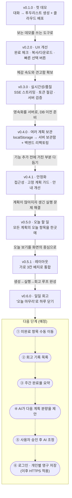

# DelayNoMore — 대화형 투두리스트 생성 데모

**🔗 라이브 데모: <http://delaynomoreapp.duckdns.org/>**
(현재 HTTP로 서비스 중이며, DB·로그인 연동 마무리 후 HTTPS를 적용할 예정입니다.)

> [DelayNoMore](https://github.com/hello-pebble/DelayNoMore)의 **"대화를 통해 투두리스트(하루 단위 실행 계획)를 생성하는"** 핵심 흐름만 떼어낸 최소 배포판입니다.

## 기능

1. AI 코치가 4가지를 순서대로 질문합니다 — **목표 → 기간 → 하루 투자 시간 → 현재 수준**.
2. 입력이 모두 채워지면 백엔드가 OpenRouter로 하루 단위 계획 초안(투두리스트)을 생성합니다.
3. 초안 생성 후에는 **자유 대화 모드**가 됩니다 — LLM이 메시지의 의도를 판단해, 수정 요청이면 계획을 고치고 무엇을 바꿨는지 설명하고(예: "주말은 빼줘"), 질문이면 답하고, 불명확하면 되묻습니다.
4. `OPENROUTER_API_KEY`가 없거나 백엔드가 응답하지 않으면 프론트가 **템플릿 기반 mock 계획**으로 자동 폴백하여 데모 흐름이 끊기지 않습니다.
5. **여러 계획 보관(데모 공유 보관함)** — 완성된 계획은 서버 보관함에 **자동 보관**되고, 이후의 수정·완료 체크·고정도 자동 동기화됩니다. 우측 패널의 "보관된 계획" 목록에서 여러 계획을 전환/삭제할 수 있고, 새로고침하면 마지막으로 보던 계획이 복원됩니다. 로그인/DB 없이 **서버 메모리에만 휘발성으로** 보관하므로 모든 방문자가 같은 목록을 보고(원격 기능 테스트용), 서버 재시작 시 초기화됩니다.
6. **"계획 저장" 버튼은 계획을 고정(확정)합니다** — 고정 후에는 대화로 계획을 수정할 수 없고(강제성 부여: 확정한 계획은 재협상 없이 실행), 완료 체크와 질문만 가능합니다. 바꾸려면 "처음부터 다시 만들기"로 새 계획을 시작하세요(이전 계획은 보관함에 남습니다).
7. **오늘 할 일(오늘 보기)** — 화면 가운데 칸이 **모든 보관된 계획**에서 오늘 날짜의 할 일만 모아 계획 이름과 함께 보여줍니다. 밴드에서 바로 완료 체크할 수 있고(원본 계획과 즉시 양방향 반영 + 서버 저장), "오늘 n/m 완료" 진행률과 "계획 보기" 이동 버튼을 제공합니다. 오늘 항목이 없으면 "오늘 할 일이 없습니다"로 안내합니다.
8. **"오늘 마무리" 일일 회고** — 오늘 할 일 칸 하단에서 하루를 닫으며 회고를 남깁니다. 완료 결과("오늘 N개 중 M개 완료 · 완료율 %")는 자동 계산되고, 체감 난이도(3택1)와 이유(5택1)만 선택해 저장합니다(자유 입력 메모 없음). 회고는 계획별·날짜별 1건만 유지(재저장 시 갱신)되고, 저장은 **오늘(한국 시간 기준) 날짜만** 허용되며, 완료 개수는 서버가 계획에서 재계산합니다. 계획과 같은 휘발성 공유 저장소라 모든 방문자가 회고를 공유하고 서버 재시작 시 초기화됩니다.

## 발전 과정

이 프로젝트는 "핵심만 담은 최소 데모"에서 출발해, 버전마다 하나의 문제를 정해 점진적으로 구체화했습니다.
상세 변경 내역은 [CHANGELOG.md](CHANGELOG.md)에 있습니다.



| 버전 | 무엇을 했나 | 의도 |
|---|---|---|
| **v0.1.0** | 원본 서비스에서 "대화로 투두리스트 생성" 핵심 흐름만 떼어내 OCI에 단일 컨테이너로 배포. mock 폴백, CI/배포 스크립트 포함. | 가장 작은 단위로 핵심 가치를 실제 배포 환경에서 먼저 검증한다. 기능을 쌓기 전에 "돌아가는 최소판"부터. |
| **v0.2.0** | 완료 체크·진행률, 계획 복사/다운로드, 슬롯필링 빠른 선택 버튼, 계획 저장(localStorage)·기간 연장. | 생성된 계획을 **보기만 하는 데모**에서 **직접 다루는 도구**로. 사용자의 클릭 수를 줄여 대화 흐름을 빠르게. |
| **v0.3.0** | 답변·초안의 SSE 실시간 스트리밍, patch 방식으로 토큰 사용량 절감, 서버측 입력 검증, 한국어 출력 순도 필터. | 기능이 아니라 **체감 품질**에 투자 — 기다림을 줄이고(스트리밍), 비용을 줄이고(patch), API를 최종 방어선으로(서버 검증). |
| **v0.4.0** | 계획 영속화를 localStorage → 서버 보관함(인메모리)으로 이전, 여러 계획 전환/삭제, 백엔드 레이어 분리 리팩토링, API v1 계약 정비. | 로그인/DB 도입 **전 단계 준비** — Repository 시그니처를 DB 관례로 맞추고 코드 구조를 정리해, 추후 교체 비용을 최소화. |
| **v0.4.1** | 네이티브 체크박스(키보드/스크린리더 접근성), 고정 계획 수정을 AI 호출 전에 차단, 진행률 즉시 갱신, HTTP 복사 실패 안내. | 새 기능을 멈추고 **기존 흐름의 거친 부분**을 다듬는 안정화 패치. 접근성과 불필요한 AI 호출 낭비 제거. |
| **v0.5.0** | 모든 보관된 계획에서 오늘 날짜의 할 일만 모아 보여주는 "오늘 할 일" 밴드 + 밴드에서 바로 완료 체크. | 여러 계획을 보관하게 되자 생긴 새 문제("오늘 뭘 하지?"가 계획별로 흩어짐)를 해결 — 관리 중심에서 **실행 중심**으로. |
| **v0.5.1** | 화면을 "2칸+상단 밴드" → **가로 3칸**(대화·오늘 할 일·체크리스트)으로 재배치. 로직 변경 없음. | 오늘 할 일이 곁다리 밴드가 아니라 **화면의 상시 중심 칸**이 되도록 — 매일 여는 화면의 기본값을 '오늘'로. |
| **v0.6.0** | "오늘 마무리" 일일 회고 — 자동 계산된 완료율 + 체감 난이도/이유 선택 저장(KST 오늘만, 1일 1건). | **생성 → 실행 → 회고**의 루프 완성. 자유 입력 메모는 공유 데모 저장소 특성상 의도적으로 제외. |

### 토큰 절감 증빙 (v0.3.0)

계획을 통째로 재전송하던 방식을 **변경분(patch)만 주고받는 방식**으로 바꾸고 계획 표현을 compact 형태로 통일한 뒤의 OpenRouter 실사용 기록입니다.
요청당 입력 364-1,645 토큰, 비용 $0.0002-$0.0022 수준으로 **대부분의 요청이 $0.001 미만**입니다.


### 다음 단계 (예정)

지금까지의 흐름(생성 → 실행 → 회고)에 이어, 쌓인 회고 데이터를 **다음 계획에 되먹이는** 방향으로 확장할 예정입니다.

1. 미완료 항목 수동 이동
2. 회고 기록 목록
3. 주간 완료율 요약
4. AI가 다음 계획 분량을 제안
5. 사용자 승인 후 AI 조정
6. 로그인과 개인별 영구 저장 (이후 HTTPS 적용)

## 구조

화면은 **가로 3칸**입니다 — **왼쪽=AI 코치와의 대화**, **가운데="오늘 할 일"**(보관된 계획들의 오늘 항목 모음), **오른쪽=생성된 체크리스트**. 모바일 폭에서는 같은 순서로 위아래 스택됩니다.

```
DelayNoMore_Release/
├── Dockerfile  # 단일 배포: 프론트 빌드 → 백엔드 static 포함 → 하나의 jar/컨테이너
├── frontend/   # React 19 + Vite (순수 JS/JSX) — 심플 디자인(시스템 폰트, 무배경)
│   └── src/
│       ├── App.jsx                    # 헤더 + AI 상태 표시 + 코치 화면 마운트
│       ├── ai_engine.js               # 슬롯필링 로직 + 계획 생성 + mock 폴백
│       ├── db_service.js              # 백엔드 호출(단일 REST 클라이언트) — AI 프록시 + 계획 보관함
│       ├── date_utils.js              # 로컬 기준 'YYYY-MM-DD' 포맷/파싱/오늘 날짜 유틸
│       └── components/chat_coach.jsx  # 가로 3칸: 대화 패널 · 오늘 할 일 · 체크리스트/보관함 패널
└── backend/    # Spring Boot 4.1 / Java 21 (AI 프록시 + 계획 보관함 + 정적 화면 서빙)
    └── src/main/java/.../
        ├── domain/ai/   # controller·service·client·dto — /api/v1/ai/{health,drafts,chats}(+/stream)
        ├── domain/plan/ # 계획 보관함+일일 회고(인메모리·휘발성) — /api/v1/plans CRUD + /plans/{id}/reflections, 추후 DB로 교체 예정
        └── global/      # 공통: response(ApiResponse) · error(ErrorCode, GlobalExceptionHandler) · config
```

## 로컬 실행

### 1. 백엔드 (포트 8080)

```bash
cd backend
OPENROUTER_API_KEY=<your_key> ./gradlew bootRun   # Windows: gradlew.bat bootRun
```

- `OPENROUTER_API_KEY`를 주지 않아도 서버는 기동됩니다(이 경우 프론트가 mock 폴백).
- 모델은 `OPENROUTER_MODEL` 환경변수로 바꿀 수 있습니다(기본: `qwen/qwen3.7-plus`).

### 2. 프론트엔드 (포트 5173)

```bash
cd frontend
npm install
npm run dev
```

Vite 개발 서버가 `/api/*` 요청을 `http://localhost:8080`으로 프록시합니다.

## 배포 (단일 컨테이너)

프론트엔드와 백엔드를 **하나의 이미지**로 빌드/배포합니다. Spring Boot가 빌드된 프론트엔드 정적 파일과 `/api/*`를 같은 서버(포트 8080)에서 함께 서빙하므로, 프론트/백엔드를 따로 배포하거나 `/api/*` 프록시를 별도로 설정할 필요가 없습니다.

```bash
# 저장소 루트에서
docker build -t delaynomore .
docker run -p 8080:8080 -e OPENROUTER_API_KEY=<your_key> delaynomore
# http://localhost:8080 접속
```

- `OPENROUTER_API_KEY` 미설정 시에도 컨테이너는 기동되며, 이 경우 프론트가 mock 폴백으로 동작합니다.
- 앱은 배포 플랫폼이 주입하는 `PORT`로 바인딩합니다(로컬 기본값 8080).
- Cloud Run · Render · Railway 등 컨테이너를 받는 어떤 호스팅에도 이 이미지 하나만 올리면 됩니다.

### 플랫폼별 가이드

- **Oracle Cloud(OCI) Always Free** (권장 · 상시 무료): [`docs/DEPLOY_OCI.md`](./docs/DEPLOY_OCI.md) — GitHub Actions가 이미지를 `ghcr.io`에 빌드/푸시하고, VM은 `deploy/oci-pull.sh`로 **빌드 없이 pull만** 해서 배포(낮은 사양 VM 권장). RAM이 넉넉하면 `deploy/oci-setup.sh`로 VM에서 직접 빌드도 가능.
- **Render**: 루트 `render.yaml` 블루프린트로 배포(New → Blueprint). 무료 티어는 미사용 시 슬립.

## 환경변수

| 변수 | 대상 | 설명 |
| :--- | :--- | :--- |
| `OPENROUTER_API_KEY` | backend | OpenRouter API 키(서버에만 보관). 미설정 시 프론트 mock 폴백. |
| `OPENROUTER_MODEL` | backend | 사용할 모델 ID (선택). |

## 버전 관리

- 이 프로젝트는 **버전을 나눠 점진적으로 진화**합니다. 현재 버전: **v0.6.0**.
- 버전 규칙은 [유의적 버전(SemVer)](https://semver.org/lang/ko/)을 따르며, 프론트엔드(`package.json`)와 백엔드(`build.gradle`)는 **하나의 제품 버전**으로 통일합니다.
- 버전별 변경사항은 [`CHANGELOG.md`](./CHANGELOG.md)에 기록합니다.
- 버전별 기능 점검은 [`docs/QA_CHECKLIST.md`](./docs/QA_CHECKLIST.md)로 확인하고, 릴리스별 수행 결과는 `docs/QA_RESULT_vX.Y.Z.md`로 기록합니다(최신: [`docs/QA_RESULT_v0.5.0.md`](./docs/QA_RESULT_v0.5.0.md)).
- 배포 회고와 AI 파라미터 제어 방향은 [`docs/DEPLOY_RETROSPECTIVE.md`](./docs/DEPLOY_RETROSPECTIVE.md)에 정리했습니다.
- 브랜치 전략은 **트렁크 기반** — `main`은 항상 배포 가능한 상태로 유지하고, 기능마다 짧게 사는 브랜치 → PR → `main` 머지 → `vX.Y.Z` 태그를 찍습니다.
- PR/`main` 푸시 시 [CI](./.github/workflows/ci.yml)가 프론트(lint+build)·백엔드(bootJar) 빌드를 검증합니다.
