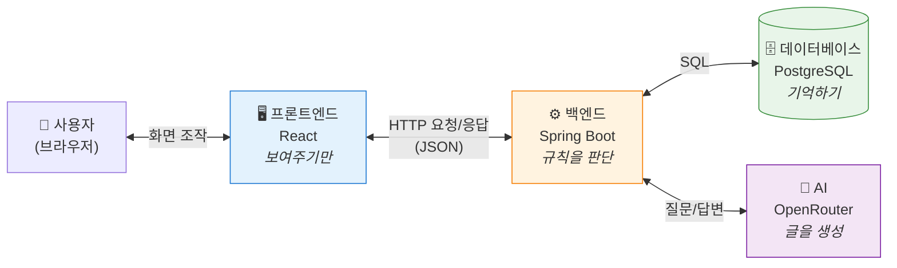
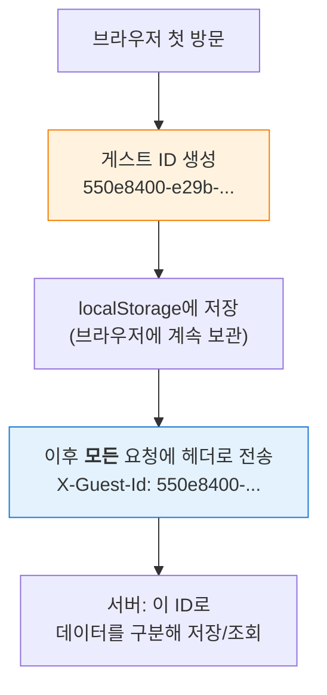
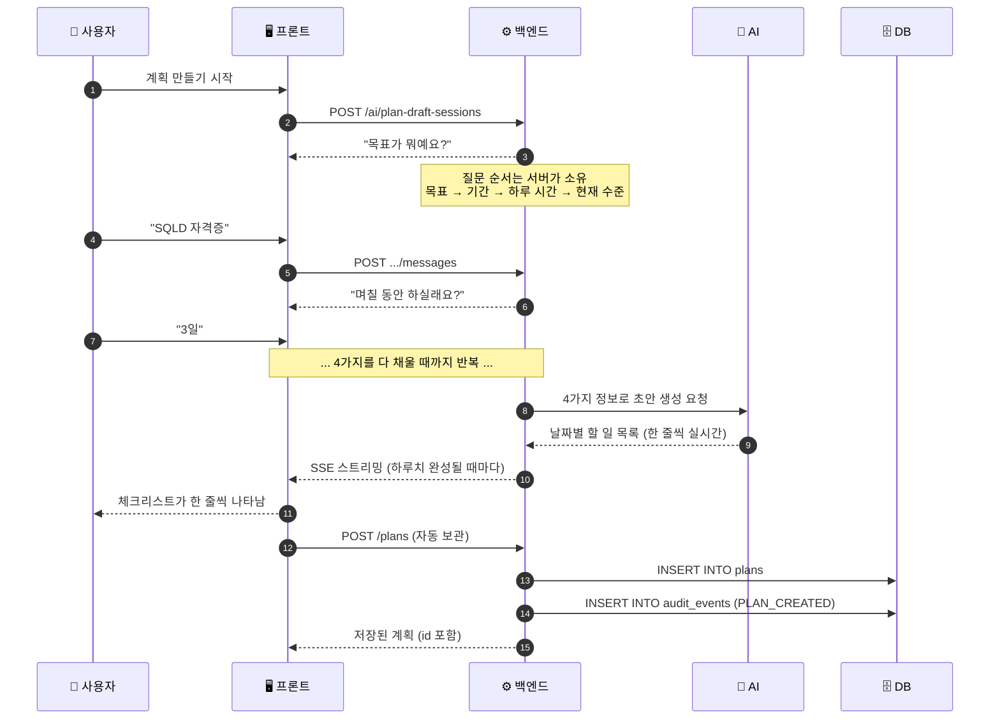
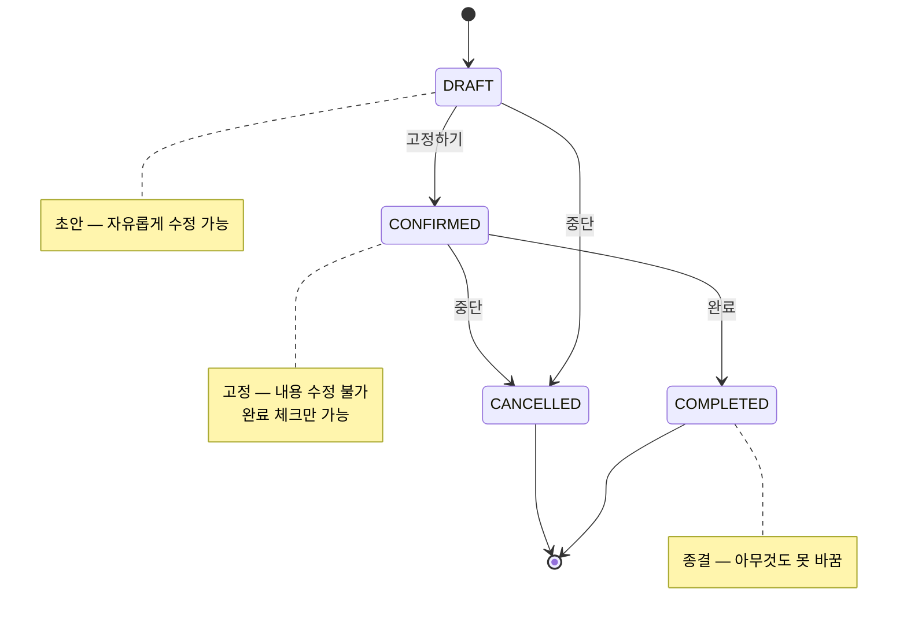
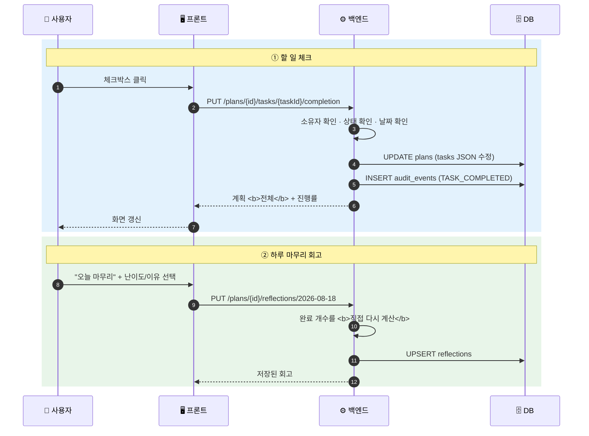
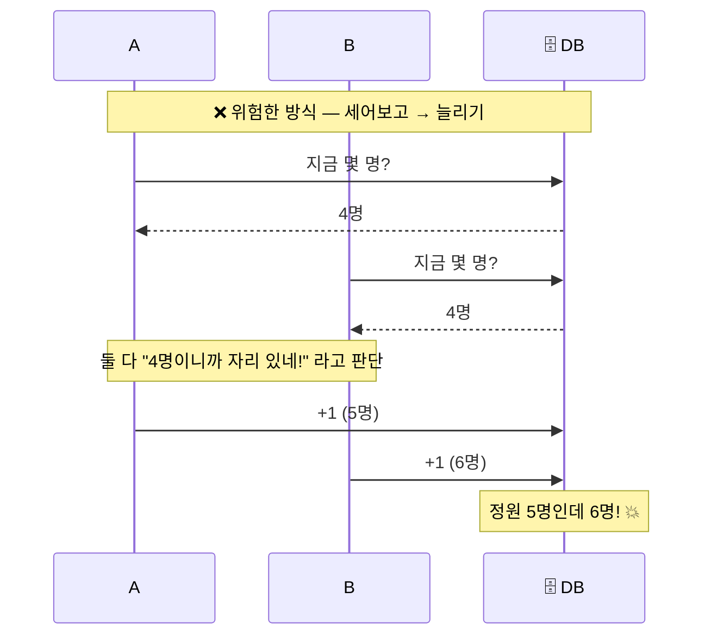
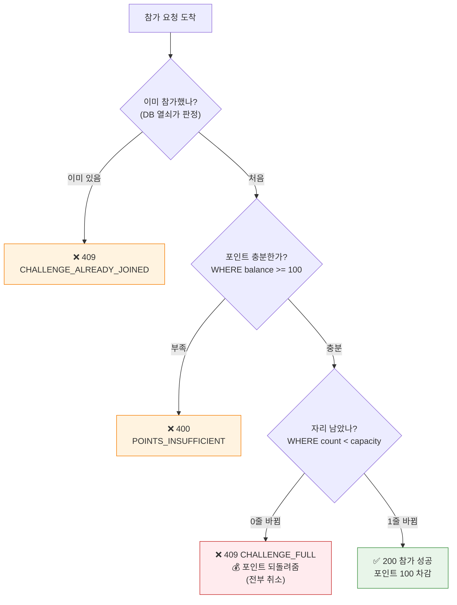
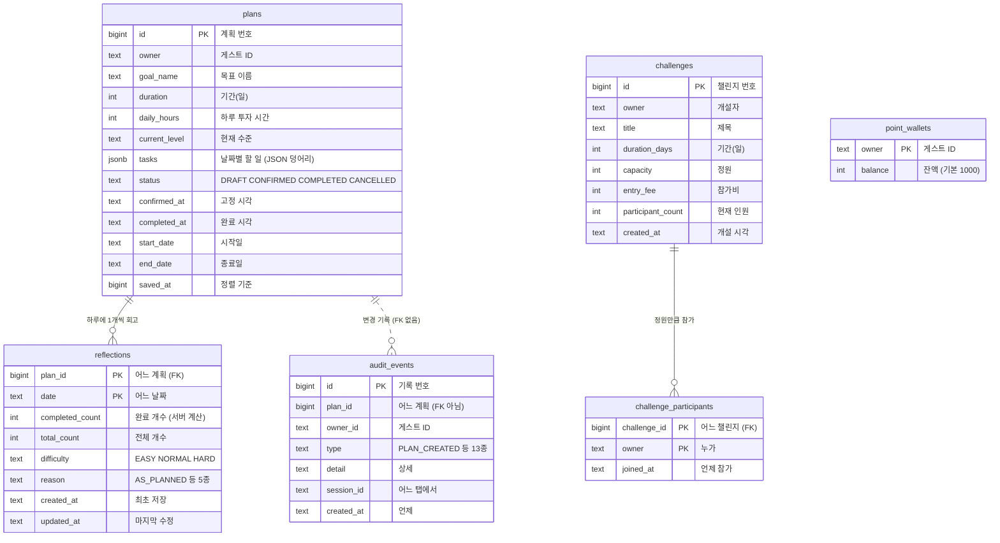
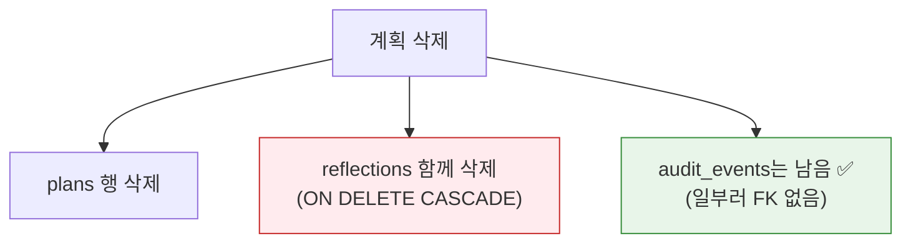
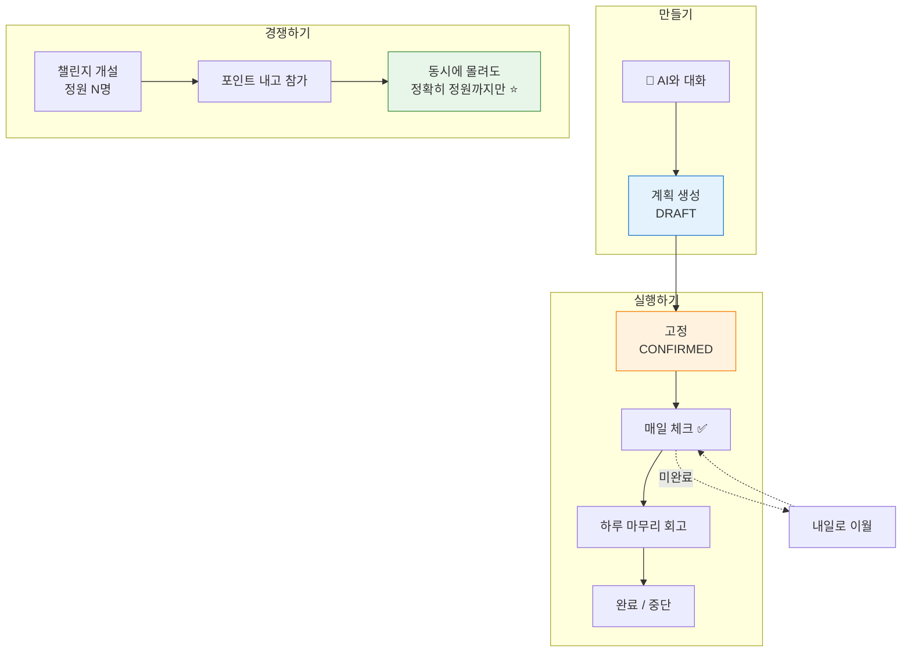

# 데이터 흐름과 구조 — 그림으로 보는 DelayNoMore

> **이 문서의 목표**: 이 서비스가 무엇을 하고, 데이터가 어디서 어디로 흐르며, 표(테이블)들이
> 서로 어떻게 연결돼 있는지를 **처음 보는 사람도** 따라올 수 있게 정리한다.
> 코드를 몰라도 그림만 따라가면 된다. (대상 버전 v0.21.0)
>
> **v0.22.0 추가분**: Google 로그인이 생기면서 "너 누구야?"(2절)와 ERD(7절)가 달라졌다 —
> [DATA_FLOW_ADD_AUTH.md](DATA_FLOW_ADD_AUTH.md) 참고.

---

## 0. 한 문장으로

**"AI와 대화하면 오늘 할 일 목록이 만들어지고, 그걸 매일 체크하며, 친구들과 정원이 정해진
챌린지에서 경쟁하는 앱"**입니다.

---

## 1. 전체 그림 — 누가 무슨 일을 하나

앱은 크게 네 덩어리입니다. 각자 맡은 일이 다릅니다.



### 핵심 원칙: **"판단은 서버가, 화면은 프론트가"**

이 프로젝트에서 가장 중요한 규칙입니다.

| 무엇 | 프론트엔드가 하는 일 | 백엔드가 하는 일 |
| :--- | :--- | :--- |
| 진행률(3개 중 2개 완료) | 서버가 준 숫자를 **표시만** | `tasks`를 세어서 **계산** |
| "이 계획 수정해도 돼?" | 서버 응답 보고 **안내만** | 상태를 보고 **허용/거부 판단** |
| "챌린지 자리 남았나?" | 버튼 모양만 바꿈 | **진짜 판정** |

> **왜 이렇게 하나요?**
> 프론트엔드는 사용자가 마음대로 조작할 수 있습니다(개발자 도구로 코드를 바꿀 수 있음).
> 그래서 "정말 중요한 판단"은 절대 프론트에 맡기지 않습니다.
> 프론트가 본 숫자는 **이미 낡았을 수도** 있습니다 — 그 사이 다른 사람이 뭔가 바꿨을 수 있으니까요.

---

## 2. "너 누구야?" — 로그인 없이 내 데이터 구분하기

이 앱에는 **아직 로그인이 없습니다.** 그런데도 "내 계획"과 "남의 계획"은 구분됩니다. 어떻게?



**놀이공원 팔찌**와 같습니다. 이름은 몰라도 팔찌 번호로 "이 사람이 아까 그 사람"인 걸 압니다.

> ⚠️ **주의할 점**
> - 닉네임은 **화면에 보이는 이름표일 뿐**이라 서버로 가지 않습니다. 닉네임을 바꿔도 데이터는 그대로입니다.
> - 브라우저 데이터를 지우면 팔찌를 잃어버린 것과 같아, **데이터를 되찾을 수 없습니다.**
> - 다른 브라우저/기기에서 접속하면 팔찌가 다르니 **완전히 다른 보관함**이 됩니다.
> - 그래서 이 ID는 사실상 비밀번호처럼 강력합니다. 서버는 이 응답들에 `Cache-Control: no-store`를
>   붙여, 다른 사람에게 캐시로 새어 나가지 않게 막습니다.

---

## 3. 데이터 흐름 ① — 대화로 계획 만들기

가장 먼저 하는 일입니다. AI와 대화하면 계획이 생깁니다.



**여기서 배울 점 3가지**

1. **AI 키는 서버에만 있습니다.** 프론트는 AI에 직접 연결하지 않고 항상 서버를 거칩니다.
   키가 브라우저에 있으면 누구나 훔쳐볼 수 있으니까요.
2. **SSE(실시간 스트리밍)** — 다 만들어질 때까지 기다리지 않고, 한 줄씩 완성되는 대로 보냅니다.
   그래서 화면에 글자가 타자 치듯 나타납니다.
3. **하루 5번만 만들 수 있습니다.** 그리고 그 횟수는 **계획을 지워도 돌아오지 않습니다** —
   횟수를 세는 기준이 `plans` 표가 아니라 삭제돼도 남는 `audit_events` 기록이기 때문입니다.

---

## 4. 계획의 일생 — 상태가 바뀌는 규칙

계획은 아무렇게나 바뀌지 않습니다. 정해진 길로만 갑니다.



| 상태 | 뜻 | 내용 수정 | 완료 체크 | 이월 |
| :--- | :--- | :---: | :---: | :---: |
| `DRAFT` (초안) | 아직 다듬는 중 | ⭕ | ⭕ | ⭕ |
| `CONFIRMED` (고정) | 실행에 집중 | ❌ | ⭕ | ⭕ |
| `COMPLETED` (완료) | 끝남 | ❌ | ❌ | ❌ |
| `CANCELLED` (중단) | 그만둠 | ❌ | ❌ | ❌ |

> **왜 고정하면 못 고치게 하나요?**
> 계획을 계속 고칠 수 있으면 "안 지킨 걸 나중에 지운 것처럼" 만들 수 있습니다.
> 고정은 "이제부터 진짜"라는 선언이라, 실행 기록이 정직하게 남습니다.
>
> 같은 이유로 **지난 날짜의 완료 체크는 바꿀 수 없습니다**(`PAST_TASK_LOCKED`).
> 어제 안 한 걸 오늘 체크해서 완료율을 조작하지 못하게 하는 겁니다.

---

## 5. 데이터 흐름 ② — 오늘 할 일 체크하고 하루 마무리



> **눈여겨볼 점**
> - 프론트는 완료 개수를 **보내지 않습니다.** 서버가 `tasks`를 보고 직접 셉니다.
>   사용자가 "10개 다 했어요"라고 거짓말할 수 없습니다.
> - 응답은 바뀐 한 칸이 아니라 **계획 전체**입니다. 프론트는 그걸 통째로 받아 화면을 다시 그립니다.
>   "내 화면 상태"와 "서버 진짜 상태"가 어긋날 일이 없어집니다.
> - 회고는 `(계획, 날짜)` 조합당 **딱 1개**입니다. 다시 저장하면 덮어씁니다(UPSERT).

### 진행률 숫자가 화면마다 다른 이유

실제로 확인한 값입니다(계획 전체 3개 · 오늘 할 일 2개 · 오늘 1개 완료).

| 화면 | 세는 범위 | 그때의 숫자 |
| :--- | :--- | :--- |
| 계획 진행률 | 계획의 **모든 날짜** | 3개 중 1개 |
| 오늘 탭 | **오늘 날짜**만 | 2개 중 1개 |
| 회고 | 그 **회고 날짜**만 | 2개 중 1개 |

같은 계획인데 숫자가 다른 건 버그가 아니라, **세는 범위가 다르기 때문**입니다.

---

## 6. 데이터 흐름 ③ — 챌린지 "정원 5명" 경쟁 ⭐

이 앱에서 **기술적으로 가장 어려운 부분**입니다.

### 문제 상황

```
자격증 공부 14일 챌린지 · 정원 5명 · 현재 4명 · 참가비 100P

           남은 자리 = 단 1개

A ─ 참가 ─┐
B ─ 참가 ─┤
C ─ 참가 ─┼──→ 거의 동시에 도착
D ─ 참가 ─┤
E ─ 참가 ─┘

     몇 명이 들어갈까?
```

### 순진하게 짜면 5명 다 들어갑니다 ❌



**왜 이런 일이?** "몇 명인지 물어보기"와 "1 늘리기"가 **두 단계**로 나뉘어 있고,
그 **사이의 틈**에 다른 사람이 끼어들기 때문입니다.
A가 "4명"이라고 들은 순간, 그 정보는 이미 **낡은 정보**가 됩니다.

### 해결: 확인과 변경을 **한 문장**으로 붙이기 ⭕

```sql
UPDATE challenges
   SET participant_count = participant_count + 1
 WHERE id = 1 AND participant_count < capacity
--               ↑ 확인이 변경 안에 들어있다
```

"자리가 있으면, 1 늘려라"를 **한 번에** 시킵니다. 틈이 없으니 끼어들 수 없습니다.
데이터베이스가 답으로 "몇 줄을 바꿨는지"를 알려줍니다.

- **1줄 바뀜** → 자리 얻음 ✅
- **0줄 바뀜** → 그 사이 정원이 참 → "모집 마감" ❌



### 나머지 절반: 실패하면 **전부 되돌리기**

자리를 못 얻었는데 **참가비만 빠져나가면** 큰일입니다.
그래서 세 가지(참가자 등록 · 포인트 차감 · 자리 예약)를 **하나의 트랜잭션**으로 묶습니다.

> **트랜잭션이란?**
> "전부 성공하거나, 전부 없던 일이 되거나" 둘 중 하나만 되게 묶는 것.
> 편의점에서 물건과 돈을 **동시에** 주고받는 것과 같습니다.
> 돈만 내고 물건을 못 받는 상황이 생기지 않습니다.

### 실제 측정 결과

| 방식 | 자리 1개에 동시 요청 | 결과 |
| :--- | :--- | :--- |
| ❌ 세어보고 → 늘리기 | 5명 전원 통과 | 정원 5명에 **9명** 입장 |
| ⭕ 조건부 UPDATE | 1명 성공 · 4명 409 | **정확히 5/5**, 탈락자 잔액 **그대로** |

두 방식 모두 **진짜 PostgreSQL로 테스트**해 위 결과를 확인했습니다(`ChallengeJoinConcurrencyIT`).
실제 서버에서도 정원 3짜리 챌린지에 3명이 동시 요청 → 200 1건 / 409 2건, 최종 3/3,
탈락자 잔액 1000P 그대로임을 확인했습니다. 상세는 [CONCURRENCY.md](CONCURRENCY.md) 참고.

---

## 7. ERD — 표들이 어떻게 연결돼 있나

### 기호 읽는 법

- `||` = 정확히 1개 · `o{` = 0개 이상 여러 개
- `PK` = 기본 열쇠(행을 구분하는 값) · `FK` = 남의 표를 가리키는 값



### 표별 설명

| 표 | 무엇을 담나 | 눈여겨볼 점 |
| :--- | :--- | :--- |
| `plans` | 계획 1개 = 1줄 | 할 일 목록은 `tasks` 한 칸에 **JSON 덩어리**로 통째로 들어감 |
| `reflections` | 하루 마무리 회고 | 열쇠가 `(계획, 날짜)` **두 개 조합** → 하루에 1개만 |
| `audit_events` | 모든 변경 기록 | **일부러 FK를 안 걸었음** → 계획이 지워져도 기록은 남음 |
| `challenges` | 챌린지 모집글 | `capacity`와 `participant_count`가 경쟁의 핵심 |
| `challenge_participants` | 누가 어디 참가했나 | 열쇠가 `(챌린지, 사람)` → **중복 참가를 DB가 막음** |
| `point_wallets` | 포인트 지갑 | 처음 쓸 때 1000P로 자동 생성 |

### 왜 `owner`로 표를 연결하지 않았나요?

ERD를 보면 `plans.owner`, `point_wallets.owner`가 모두 게스트 ID지만 **선으로 이어져 있지
않습니다.** 아직 `users`(회원) 표가 없기 때문입니다. 로그인 기능이 생기면 이 자리가
`member_id`로 바뀌고, 그때 진짜 연결선이 생깁니다.

### `tasks`를 왜 표로 쪼개지 않았나요?

원래대로라면 `tasks`는 별도 표(`plan_tasks`)여야 합니다. 하지만 여기선 **프론트가 만든 JSON을
모양 그대로 저장**합니다.

- 👍 **장점**: 프론트-백엔드-DB가 같은 모양을 쓰니 변환 코드가 없고, 계획 전체를 한 번에 읽고 씀
- 👎 **단점**: "완료한 할 일만 골라줘" 같은 SQL 검색이 어려움

지금은 항상 **계획 통째로** 읽고 쓰기 때문에 이 선택이 맞습니다.
나중에 할 일 단위 통계가 필요해지면 그때 쪼개면 됩니다.

---

## 8. 서버가 거절하는 상황들

서버는 규칙을 어기면 **한국어 이유와 함께** 거절합니다.
프론트는 `code`를 보고 어떤 안내를 띄울지 정합니다.

```json
{ "success": false, "data": null,
  "error": { "code": "CHALLENGE_FULL", "message": "모집이 마감되었습니다. ..." } }
```

| 코드 | HTTP | 언제 | 사용자에게 보이는 안내 |
| :--- | :---: | :--- | :--- |
| `GUEST_ID_REQUIRED` | 400 | 팔찌(게스트 ID) 없이 요청 | — (정상 사용 시 없는 상황) |
| `PLAN_NOT_FOUND` | 404 | 없거나 **내 것이 아닌** 계획 | "이미 삭제되었을 수 있어요" |
| `PLAN_LOCKED` | 409 | 고정된 계획을 구조 수정 | "고정된 계획은 수정할 수 없어요" |
| `PAST_TASK_LOCKED` | 409 | 지난 날짜 체크 변경 | "지난 날짜는 바꿀 수 없어요" |
| `INVALID_STATUS_TRANSITION` | 409 | 불가능한 상태 변경 | "지금 상태에선 안 돼요" |
| `PLAN_DAILY_LIMIT_EXCEEDED` | 429 | 하루 5개 초과 | "내일 다시 만들어주세요" |
| `CHALLENGE_FULL` | 409 | 정원 마감 | "다른 참가자가 마지막 자리를..." |
| `CHALLENGE_ALREADY_JOINED` | 409 | 중복 참가 | "이미 참가한 챌린지예요" |
| `POINTS_INSUFFICIENT` | 400 | 포인트 부족 | "포인트가 부족해요" |

> **재미있는 설계**: 남의 계획을 보려 하면 `403`(권한 없음)이 아니라 **`404`(없음)**를 줍니다.
> `403`을 주면 "1번 계획은 존재하는구나"라는 정보가 새어 나가기 때문입니다.
> 아예 **없는 것처럼** 대답하는 게 더 안전합니다.

---

## 9. 데이터가 사라지는 경우 / 남는 경우



**변경 기록이 남는 이유**: "이 계획이 **언제 지워졌는지**"에 답하려면, 계획이 사라져도 기록은
남아 있어야 합니다. 계획을 지웠다 다시 만드는 방법으로 하루 5개 제한을 피할 수 없는 것도
이 기록 덕분입니다.

| 상황 | 계획 | 회고 | 변경기록 | 포인트 |
| :--- | :---: | :---: | :---: | :---: |
| 계획 삭제 | 삭제 | 삭제 | **남음** | 그대로 |
| 서버 재시작 (`postgres` 프로필) | 유지 | 유지 | 유지 | 유지 |
| 서버 재시작 (기본 프로필 = 메모리) | 사라짐 | 사라짐 | 사라짐 | 사라짐 |
| 브라우저 데이터 삭제 | DB엔 남지만 **접근 불가** | 〃 | 〃 | 〃 |

---

## 10. 한 장 요약



**기억할 3가지**

1. **판단은 항상 서버가** — 프론트가 본 숫자는 이미 낡았을 수 있다
2. **기록은 지워지지 않는다** — 변경 이력은 계획이 사라져도 남는다
3. **확인과 변경은 붙여서** — 그 사이에 틈이 있으면 정원은 반드시 넘친다

---

## 더 읽을거리

| 문서 | 내용 |
| :--- | :--- |
| [CONCURRENCY.md](CONCURRENCY.md) | 정원 경쟁 동시성 처리의 상세한 근거와 대안 비교 |
| [ARCHITECTURE.md](ARCHITECTURE.md) | 디렉토리 구조 · 기술 스택 |
| [FEATURES.md](FEATURES.md) | 화면별 기능 상세 |
| [API_REFERENCE.md](API_REFERENCE.md) | 엔드포인트 전체 목록 |
