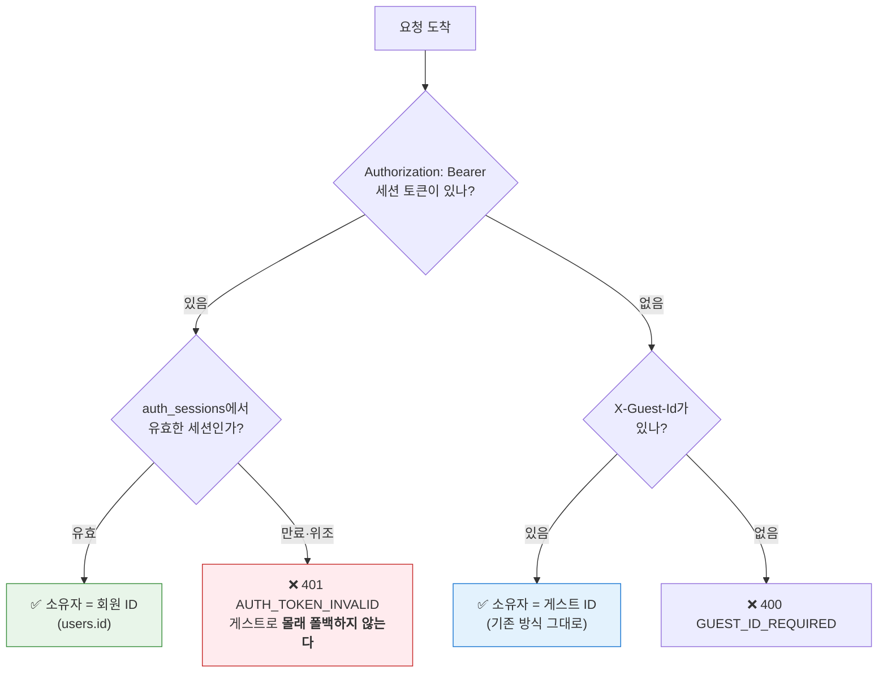
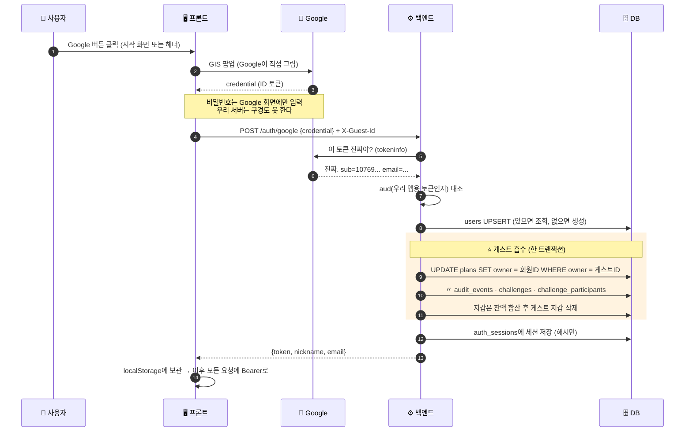
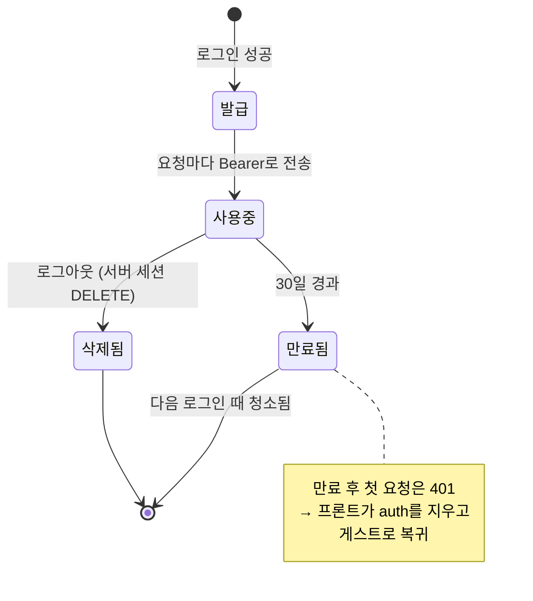
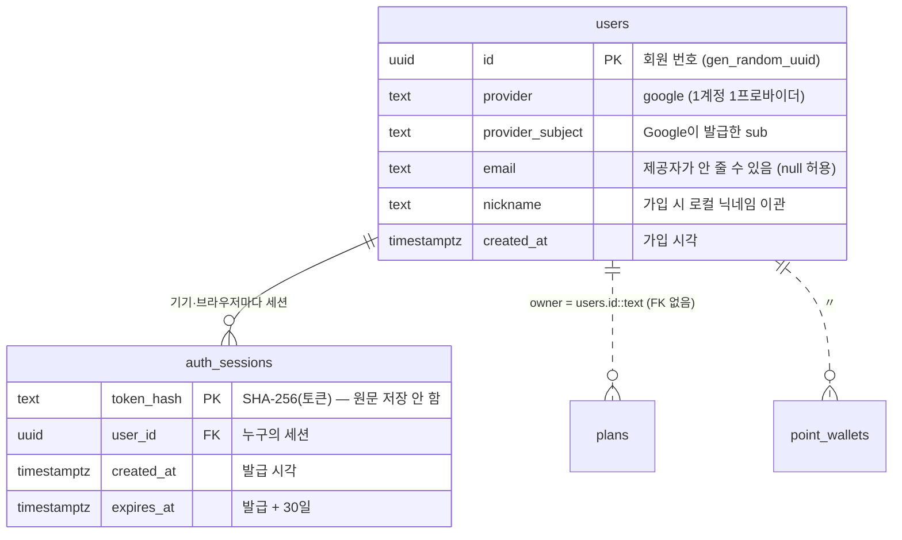
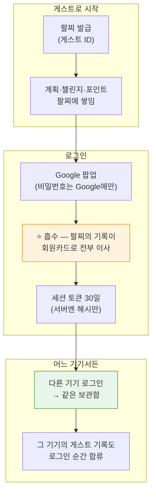

# 데이터 흐름 부록 — 로그인이 생기면 무엇이 달라지나 (v0.22.0)

> **이 문서의 목표**: [DATA_FLOW.md](DATA_FLOW.md)(v0.21.0 기준)를 읽은 사람을 위한 **추가분**이다.
> v0.22.0에서 Google 로그인이 들어오면서 "너 누구야?"의 답이 달라졌다 — 무엇이 그대로이고
> 무엇이 바뀌었는지만 다룬다. 본편의 2절("로그인 없이 내 데이터 구분하기")과 7절(ERD)을
> 이 문서가 업데이트한다.

---

## 0. 한 문장으로

**"놀이공원 팔찌(게스트 ID)로 놀다가, 회원카드(Google 계정)를 만드는 순간 팔찌에 쌓인 기록이
전부 회원카드로 옮겨지는 앱"**이 됐습니다.

---

## 1. 무엇이 그대로이고, 무엇이 바뀌었나

| 무엇 | v0.21.0까지 | v0.22.0부터 |
| :--- | :--- | :--- |
| 로그인 안 한 사용자 | 게스트 ID(팔찌)로 구분 | **완전히 동일** — 로그인 없이도 그대로 쓸 수 있다 |
| 로그인 한 사용자 | (없음) | `users.id`(회원카드)가 소유자. 어느 기기든 같은 계정 = 같은 보관함 |
| 브라우저를 잃으면 | 데이터 재연결 **불가** (본편 2절의 ⚠️) | 로그인만 하면 **재연결됨** — 이 간극을 닫는 게 이번 릴리스의 목적 |
| 소유자 컬럼(`plans.owner` 등) | 게스트 UUID 문자열 | **스키마 그대로.** 게스트 UUID와 회원 UUID가 같은 TEXT 컬럼에 공존 |
| 전송 보안 | 평문 HTTP | **HTTPS** (Caddy + Let's Encrypt — Google 로그인의 선행조건) |

> **핵심 설계**: 로그인을 넣으면서 기존 표를 **하나도 고치지 않았다.** owner 컬럼이 처음부터
> FK 없는 TEXT였던 이유가 바로 이 순간을 위해서다(본편 7절 "왜 owner로 표를 연결하지
> 않았나요?"의 답이 여기서 완성된다).

---

## 2. "너 누구야?"의 새 규칙 — 이중 신분증

이제 서버는 요청마다 신분증 **두 종류**를 순서대로 확인합니다.



이 판정은 서버의 **딱 한 지점**(`@Owner` ArgumentResolver)에 모여 있습니다. 21개 API가 전부
이 리졸버를 거치므로, "누구의 데이터인가"의 규칙이 여러 곳에 흩어질 일이 없습니다.

> **왜 만료된 토큰을 게스트로 슬쩍 처리해 주지 않나요?**
> 그게 더 친절해 보이지만 함정입니다. 사용자는 로그인돼 있다고 믿고 계획을 만들었는데
> 실제로는 **게스트 보관함에 저장**된다면? 다음 로그인 때 "내 계획이 사라졌다"가 됩니다.
> 그래서 만료는 숨기지 않고 401로 알리고, 프론트가 저장된 로그인 정보를 지운 뒤
> 게스트로 복귀합니다(다음 요청부터는 정상 동작).

---

## 3. 데이터 흐름 ④ — Google 로그인과 "흡수"

로그인의 핵심은 인증이 아니라 **그 순간 일어나는 데이터 이사(흡수)**입니다.



**여기서 배울 점 3가지**

1. **비밀번호가 서버에 없습니다.** 인증은 Google이 하고, 서버는 "Google이 발급한 토큰이
   진짜인지 + 우리 앱용인지(aud)"만 확인합니다. 그래서 비밀번호 저장·해싱·유출 걱정이
   통째로 사라집니다.
2. **흡수는 매 로그인마다 실행됩니다.** "처음 가입할 때만"이 아닙니다. 이미 옮겨진 게스트는
   바뀌는 행이 0개라 아무 일도 안 일어나고(멱등), 새 기기에서 게스트로 쌓은 데이터는
   그 기기에서 로그인하는 순간 자동으로 합쳐집니다.
3. **서버는 토큰 원문을 저장하지 않습니다.** 응답으로 한 번 내려주고, DB에는 SHA-256
   해시만 남깁니다. DB가 통째로 유출돼도 세션을 훔쳐 쓸 수 없습니다.

### 흡수할 때의 충돌 규칙 두 가지

| 상황 | 규칙 | 이유 |
| :--- | :--- | :--- |
| 게스트 지갑 + 회원 지갑이 둘 다 있음 | **잔액 합산** 후 게스트 지갑 삭제 | 포인트는 어느 쪽 것이든 내 것 |
| 같은 챌린지에 게스트로도, 회원으로도 참가 | 게스트 참가 행 **폐기** (참가비 환불 없음) | 참가표의 열쇠가 `(챌린지, 사람)`이라 둘 다 남길 수 없다 |

> **알려진 한계**: 새 게스트를 계속 만들어 로그인하면 초기 지급 1000P가 반복 합산될 수
> 있습니다. 포인트가 돈이 아닌 게임 요소라 지금은 수용하고, 문제가 되면 초기 지급분을 빼고
> 합산하는 방식으로 바꿉니다.

---

## 4. 로그아웃과 세션의 일생



- 세션은 **30일 고정**입니다. 연장(sliding)도, 리프레시 토큰도 없습니다 — 만료되면 다시
  로그인하는 게 이 앱 규모에선 가장 단순하고 안전합니다.
- 만료된 세션 행 청소는 별도 스케줄러 없이 **누군가 로그인할 때** DELETE 한 문장으로 합니다.
- 로그아웃은 서버 세션을 지우고 localStorage의 auth도 지웁니다. 로그아웃하면 **로그인 전에
  쓰던 그 브라우저의 게스트 보관함**으로 돌아갑니다(흡수돼서 비어 있을 수 있음 — 정상).

---

## 5. ERD 업데이트 — 드디어 생긴 연결선

본편 7절에서 "`users` 표가 생기면 진짜 연결선이 생긴다"고 했던 그 자리입니다.



### 점선인 이유 — 여전히 FK가 아니다

`users → plans`가 **점선**인 것에 주목하세요. `plans.owner`에는 지금 이 순간에도
**두 종류의 값**이 섞여 있습니다:

```
plans.owner 컬럼 안:
  '550e8400-e29b-...'   ← 아직 로그인 안 한 게스트의 UUID
  '910c1477-843c-...'   ← 로그인한 회원의 users.id
```

게스트 UUID는 `users` 표에 없는 값이라 FK를 걸면 게스트가 계획을 저장할 수 없게 됩니다.
두 값이 **같은 모양**(UUID 문자열)이라 한 컬럼에 자연스럽게 공존하고, 흡수는
`UPDATE ... SET owner = 회원ID WHERE owner = 게스트ID` **값 치환 다섯 문장**으로 끝납니다.
`users.id`를 순번(1, 2, 3...)이 아닌 UUID로 만든 이유가 이것입니다.

- `auth_sessions → users`만 **실선(진짜 FK)**입니다 — 세션은 회원에게만 발급되니까요.
- `UNIQUE (provider, provider_subject)`가 로그인 조회 열쇠입니다. "Google의 그 사람"은
  전 세계에 한 명이므로, 같은 계정으로 동시에 첫 로그인이 와도 회원이 두 명 생기지 않습니다
  (챌린지 정원과 같은 원리 — 판정을 DB 제약이 한다).

---

## 6. 서버가 거절하는 상황 — 추가된 3가지

본편 8절의 표에 다음이 추가됩니다.

| 코드 | HTTP | 언제 | 사용자에게 보이는 안내 |
| :--- | :---: | :--- | :--- |
| `AUTH_TOKEN_INVALID` | 401 | 세션 만료·위조 Bearer | "로그인이 만료되었습니다. 다시 로그인해주세요." |
| `AUTH_GOOGLE_INVALID` | 401 | Google ID 토큰 검증 실패 | "Google 인증에 실패했습니다. 다시 시도해주세요." |
| `AUTH_DISABLED` | 503 | 로그인 기능 꺼짐(클라이언트 ID 미설정) | — (버튼 자체가 안 보여 정상 사용 시 없는 상황) |

> **재미있는 설계**: 본편의 "403 대신 404" 원칙과 같은 결의 결정이 하나 있습니다 —
> 만료 세션을 게스트로 **조용히 폴백하지 않는 것**(2절). 둘 다 "친절해 보이는 동작이
> 사실은 정보 유출(404 쪽)이나 데이터 오귀속(401 쪽)"이라는 이유로 거부됐습니다.

---

## 7. 데이터가 사라지는 경우 / 남는 경우 — 갱신판

본편 9절의 표에서 마지막 줄의 답이 바뀌었습니다.

| 상황 | 계획 | 회고 | 변경기록 | 포인트 |
| :--- | :---: | :---: | :---: | :---: |
| 브라우저 데이터 삭제 (로그인 안 함) | DB엔 남지만 **접근 불가** | 〃 | 〃 | 〃 |
| 브라우저 데이터 삭제 (**로그인 회원**) | **로그인하면 복구** ✅ | 〃 | 〃 | 〃 |
| 로그아웃 | 계정 데이터는 서버에 유지, 화면은 게스트 보관함으로 전환 | 〃 | 〃 | 〃 |

이번 릴리스가 닫은 간극이 정확히 이 한 줄입니다.

---

## 8. 한 장 요약



**기억할 3가지**

1. **게스트는 그대로, 로그인은 선택** — 로그인 없이도 모든 기능이 동작한다
2. **흡수는 매번, 멱등하게** — 로그인하는 순간 그 브라우저의 게스트 기록이 계정으로 이사한다
3. **스키마는 안 바뀌었다** — owner가 FK 없는 TEXT였기에, 로그인 도입이 값 치환으로 끝났다

---

## 더 읽을거리

| 문서 | 내용 |
| :--- | :--- |
| [DATA_FLOW.md](DATA_FLOW.md) | 본편 — 전체 데이터 흐름 (v0.21.0 기준) |
| [API_REFERENCE.md](API_REFERENCE.md) | `/auth/*` 엔드포인트 요청·응답 상세 |
| [BACKEND_MIGRATION.md](BACKEND_MIGRATION.md) | 게스트 → 회원 re-key 계획의 원문과 완료 기록 |
| [QA_CHECKLIST.md](QA_CHECKLIST.md) | F-31 — 로그인·흡수·HTTPS 점검 목록 |
