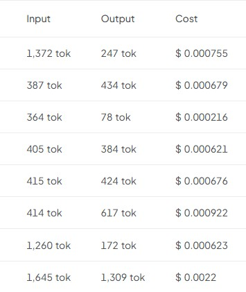

# 발전 과정

이 프로젝트는 "핵심만 담은 최소 데모"에서 출발해, 버전마다 하나의 문제를 정해 점진적으로 구체화했습니다.
상세 변경 내역은 [CHANGELOG.md](../CHANGELOG.md)에 있습니다.

```mermaid
graph TD
    V01["v0.1.0 · 첫 데모<br/>대화 → 투두리스트 생성 + 클라우드 배포"]
    V02["v0.2.0 · UX 개선<br/>완료 체크 · 복사/다운로드 · 빠른 선택 버튼"]
    V03["v0.3.0 · 실시간성/품질<br/>SSE 스트리밍 · 토큰 절감 · 서버 검증"]
    V04["v0.4.0 · 여러 계획 보관<br/>localStorage → 서버 보관함 + 백엔드 리팩토링"]
    V041["v0.4.1 · 안정화<br/>접근성 · 고정 계획 가드 · 안내 개선"]
    V05["v0.5.0 · 오늘 할 일<br/>모든 계획의 오늘 항목을 한곳에"]
    V051["v0.5.1 · 레이아웃<br/>가로 3칸 배치로 통합"]
    V06["v0.6.0 · 일일 회고<br/>'오늘 마무리'로 하루 닫기"]
    V07["v0.7.0 · 실행 연속성 + 변경 이력<br/>미완료 내일로 이월 · 계획별 Audit 로그"]
    V08["v0.8.0 · 규칙의 소유권을 서버로<br/>고정 계획 서버 가드 · tasks/status 검증"]
    V081["v0.8.1 · 날짜 결함 패치<br/>'오늘' 판정을 KST 한 곳으로 통일"]
    V09["v0.9.0 · 규칙의 소유권을 서버로 (2탄)<br/>진행률·미완료 이월·회고/이력 선택지 서버 이관"]
    V091["v0.9.1 · 날짜 규칙 서버 이관 + 회고 기록 목록<br/>startDate/endDate/duration 서버 산출·검증 · 지난 회고 목록"]
    V092["v0.9.2 · LLM 채팅 patch 병합 서버 이관<br/>변경분 병합·완료 체크 보존을 서버가 소유"]
    V093["v0.9.3 · 이관 예정 backlog 정리<br/>서버 저장 보류·mock 폴백 현행 유지(문서 전용)"]
    V0100["v0.10.0 · 주간 완료율 요약<br/>계획을 시작일 기준 7일 버킷으로 묶은 완료율 API + 요약 카드"]

    V01 -->|"보는 데모를 쓰는 도구로"| V02
    V02 -->|"체감 속도와 견고함 확보"| V03
    V03 -->|"영속화를 서버로, DB 이전 준비"| V04
    V04 -->|"기능 추가 전에 거친 부분 다듬기"| V041
    V041 -->|"계획이 많아지자 생긴 실행 문제 해결"| V05
    V05 -->|"오늘 보기를 화면의 중심으로"| V051
    V051 -->|"생성→실행→회고 루프 완성"| V06
    V06 -->|"못 끝낸 하루를 다음 날로 잇기"| V07
    V07 -->|"프론트 정책을 서버 강제로"| V08
    V08 -->|"QA에서 드러난 날짜 결함 수정"| V081
    V081 -->|"남은 프론트 계산 로직도 서버로"| V09
    V09 -->|"날짜 산출·검증까지 서버로 + 회고 되짚기"| V091
    V091 -->|"남은 이관 예정 중 patch 병합부터"| V092
    V092 -->|"이관 backlog 정리"| V093
    V093 -->|"이관 정리 후 기능 확장 시작"| V0100

    subgraph NEXT["다음 단계 (예정)"]
        direction TB
        N4(["④ AI가 다음 계획 분량을 제안"])
        N5(["⑤ 사용자 승인 후 AI 조정"])
        N6(["⑥ 로그인 · 개인별 영구 저장<br/>(이후 HTTPS 적용)"])
        N4 -.-> N5 -.-> N6
    end

    FINAL(["🎯 최종 목표 · 전문 에이전트 인계<br/>계획을 고정하면 체크리스트 완성 도우미 대신<br/>목표 영역의 전문 에이전트가 실행을 전담<br/>(자격증 → 1:1 과외 · 다이어트 → 코치)"])

    V0100 -.-> NEXT -.-> FINAL
```

## 버전별 의도

| 버전 | 무엇을 했나 | 의도 |
|---|---|---|
| **v0.1.0** | 원본 서비스에서 "대화로 투두리스트 생성" 핵심 흐름만 떼어내 OCI에 단일 컨테이너로 배포. mock 폴백, CI/배포 스크립트 포함. | 가장 작은 단위로 핵심 가치를 실제 배포 환경에서 먼저 검증한다. 기능을 쌓기 전에 "돌아가는 최소판"부터. |
| **v0.2.0** | 완료 체크·진행률, 계획 복사/다운로드, 슬롯필링 빠른 선택 버튼, 계획 저장(localStorage)·기간 연장. | 생성된 계획을 **보기만 하는 데모**에서 **직접 다루는 도구**로. 사용자의 클릭 수를 줄여 대화 흐름을 빠르게. |
| **v0.3.0** | 답변·초안의 SSE 실시간 스트리밍, patch 방식으로 토큰 사용량 절감, 서버측 입력 검증, 한국어 출력 순도 필터. | 기능이 아니라 **체감 품질**에 투자 — 기다림을 줄이고(스트리밍), 비용을 줄이고(patch), API를 최종 방어선으로(서버 검증). |
| **v0.4.0** | 계획 영속화를 localStorage → 서버 보관함(인메모리)으로 이전, 여러 계획 전환/삭제, 백엔드 레이어 분리 리팩토링, API v1 계약 정비. | 로그인/DB 도입 **전 단계 준비** — Repository 시그니처를 DB 관례로 맞추고 코드 구조를 정리해, 추후 교체 비용을 최소화. |
| **v0.4.1** | 네이티브 체크박스(키보드/스크린리더 접근성), 고정 계획 수정을 AI 호출 전에 차단, 진행률 즉시 갱신, HTTP 복사 실패 안내. | 새 기능을 멈추고 **기존 흐름의 거친 부분**을 다듬는 안정화 패치. 접근성과 불필요한 AI 호출 낭비 제거. |
| **v0.5.0** | 모든 보관된 계획에서 오늘 날짜의 할 일만 모아 보여주는 "오늘 할 일" 밴드 + 밴드에서 바로 완료 체크. | 여러 계획을 보관하게 되자 생긴 새 문제("오늘 뭘 하지?"가 계획별로 흩어짐)를 해결 — 관리 중심에서 **실행 중심**으로. |
| **v0.5.1** | 화면을 "2칸+상단 밴드" → **가로 3칸**(대화·오늘 할 일·체크리스트)으로 재배치. 로직 변경 없음. | 오늘 할 일이 곁다리 밴드가 아니라 **화면의 상시 중심 칸**이 되도록 — 매일 여는 화면의 기본값을 '오늘'로. |
| **v0.6.0** | "오늘 마무리" 일일 회고 — 자동 계산된 완료율 + 체감 난이도/이유 선택 저장(KST 오늘만, 1일 1건). | **생성 → 실행 → 회고**의 루프 완성. 자유 입력 메모는 공유 데모 저장소 특성상 의도적으로 제외. |
| **v0.7.0** | 미완료 항목을 내일로 옮기는 이월 버튼(DRAFT 전용) + 계획별 변경 이력(생성·수정·고정·완료 체크·회고·삭제를 서버가 diff로 판별·기록, 세션 귀속 배지). | 못 끝낸 하루를 다음 날로 이어 **실행의 연속성**을 만들고, 모든 방문자가 공유하는 보관함에서 "누가/언제/무엇을 바꿨는지"에 답한다. |
| **v0.8.0** | 고정(CONFIRMED) 계획 수정 차단을 서버 가드로(409 PLAN_LOCKED, 완료 토글만 허용), tasks/status 형식 검증, AI 초안 날짜 키 서버 보장, 프론트 중복 로직 제거 + 이관 현황 문서([BACKEND_MIGRATION.md](BACKEND_MIGRATION.md)). | **규칙의 소유권을 서버로** — 프론트는 UX만 담당하고 강제는 서버가 맡는 역할 분담을 확립. curl 등 직접 호출로도 규칙을 우회할 수 없다. |
| **v0.8.1** | 서비스의 "오늘" 판정 기준을 KST 한 곳(`KstDates`)으로 통일 — UTC 컨테이너에서 AI 초안 시작 날짜가 하루 이르게 생성되던 결함 수정. API 데이터 레퍼런스 문서 추가. | v0.8.0 QA에서 드러난 날짜 결함을 잡는 패치. 프롬프트·초안·회고가 모두 같은 시간대 기준을 공유하게. |
| **v0.9.0** | 프론트가 계산하던 진행률(PlanResponse.progress)·미완료 이월(POST /plans/{id}/carry-over 도메인 액션)·회고/이력 선택지(메타 API + 서버 enum)를 서버로 이관. 이월 역감지(detectCarryOver) 제거, 완료 개수 계산을 Plan 엔티티로 통합. | **규칙의 소유권을 서버로 (2탄)** — v0.8.0이 시작한 이관을 이어, 남은 프론트 계산·규칙을 서버로. 프론트는 표시·폴백만, 연산과 소스오브트루스는 서버가 소유. |
| **v0.9.1** | 프론트(브라우저 로컬 날짜)가 계산해 무검증 저장하던 startDate/endDate/duration을 서버로 이관 — startDate는 tasks 최초 날짜 키로 산출(불변), duration은 span으로 산출, endDate는 `@ValidPlanDates`로 형식·범위 검증(공유 `PlanDates` 유틸, carry-over duration 계산도 일원화). 함께 서버에 이미 있던 회고 목록 API를 화면에 연결해 계획별 "지난 회고" 목록을 추가. | **날짜 규칙까지 서버로 + 회고 되짚기** — v0.8.0~v0.9.0 이관의 남은 날짜 계산·검증을 서버가 소유하게 하고(프론트는 라이브 draft 표시 UX만), 쌓인 회고를 다시 볼 수 있게 해 "생성→실행→회고→되짚기" 루프를 넓힌다. |
| **v0.9.2** | 자유 대화(chat coach)의 LLM patch 병합을 프론트(`applyPlanPatch`)에서 서버(`ChatPatchMerger`)로 이관 — LLM은 여전히 변경된 날짜만 담은 patch를 내지만(토큰 절약 유지), 서버가 현재 계획에 병합해 정규화된 전체 tasks를 응답한다. 완료 체크 보존(날짜+content 매칭)도 서버가 재현. `AiChatResponse.patch`→`tasks`, SSE `plan` 이벤트도 동일 계약 변경. | **남은 이관 예정 중 가장 깔끔한 항목부터** — 병합 규칙은 오늘부터 서버가 유일한 소유자이고, 프론트는 반환된 전체 계획을 채택만 한다. |
| **v0.9.3** | `docs/BACKEND_MIGRATION.md`에 남아 있던 이관 예정 2건의 진행 여부를 결정(문서 전용, 코드/동작 변경 없음). **AI 초안의 서버 측 저장 연결**은 "이관 보류"로(선결 과제인 인증·DB 도입 이후 재검토), **mock 폴백 계획 생성기**는 "이관하지 않는 것"으로 확정. | **이관 backlog 정리** — 남은 두 항목을 무기한 미결로 두지 않고 명시적으로 결정해, BACKEND_MIGRATION.md가 "진행 중" 상태로 계속 남지 않게 한다. |
| **v0.10.0** | 계획을 시작일 기준 7일 버킷("N주차")으로 묶어 주별 완료율을 내려주는 읽기 전용 API(`GET /plans/{id}/summary/weekly`)와 보관함 목록의 계획별 접이식 요약 카드를 추가. 완료 개수 계산은 서버 소유(신규 `Plan.countTasksBetween` + `PlanWeeklySummary` 유틸). | **되먹임 루프의 첫 기능** — 이관(v0.9.x)이 정리한 서버 소유 완료율을 주 단위로 표면화해, 로드맵의 "쌓인 회고를 다음 계획에 되먹이는" 방향(③)의 토대를 놓는다. |

## 토큰 절감 증빙 (v0.3.0)

계획을 통째로 재전송하던 방식을 **변경분(patch)만 주고받는 방식**으로 바꾸고 계획 표현을 compact 형태로 통일한 뒤의 OpenRouter 실사용 기록입니다.
요청당 입력 364-1,645 토큰, 비용 $0.0002-$0.0022 수준으로 **대부분의 요청이 $0.001 미만**입니다.

## 버전 관리 정책

- 이 프로젝트는 **버전을 나눠 점진적으로 진화**합니다. 현재 버전: **v0.10.0**.
- 버전 규칙은 [유의적 버전(SemVer)](https://semver.org/lang/ko/)을 따르며, 프론트엔드(`package.json`)와 백엔드(`build.gradle`)는 **하나의 제품 버전**으로 통일합니다.
- 버전별 변경사항은 [`CHANGELOG.md`](../CHANGELOG.md)에 기록합니다.
- 버전별 기능 점검은 [`QA_CHECKLIST.md`](QA_CHECKLIST.md)로 확인하고, 릴리스별 수행 결과는 `QA_RESULT_vX.Y.Z.md`로 기록합니다(최신: [`QA_RESULT_v0.5.1.md`](QA_RESULT_v0.5.1.md)).
- 배포 회고와 AI 파라미터 제어 방향은 [`DEPLOY_RETROSPECTIVE.md`](DEPLOY_RETROSPECTIVE.md)에 정리했습니다.
- 브랜치 전략은 **트렁크 기반** — `main`은 항상 배포 가능한 상태로 유지하고, 기능마다 짧게 사는 브랜치 → PR → `main` 머지 → `vX.Y.Z` 태그를 찍습니다.
- PR/`main` 푸시 시 [CI](../.github/workflows/ci.yml)가 프론트(lint+build)·백엔드(bootJar) 빌드를 검증합니다.

관련 문서: [로드맵·최종 목표](ROADMAP.md)
