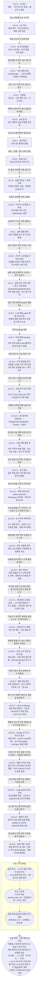

# 발전 과정

이 프로젝트는 "핵심만 담은 최소 데모"에서 출발해, 버전마다 하나의 문제를 정해 점진적으로 구체화했습니다.
상세 변경 내역은 [CHANGELOG.md](../CHANGELOG.md)에 있습니다.

```mermaid
graph TD
    V01["v0.1.0 · 첫 데모<br/>대화 → 투두리스트 생성 + 클라우드 배포"]
    V02["v0.2.0 · UX 개선<br/>완료 체크 · 복사/다운로드 · 빠른 선택 버튼"]
    V03["v0.3.0 · 실시간성/품질<br/>SSE 스트리밍 · 토큰 절감 · 서버 검증"]
    V04["v0.4.0 · 여러 계획 보관<br/>localStorage → 서버 보관함 + 백엔드 리팩토링"]
    V041["v0.4.1 · 안정화<br/>접근성 · 고정 계획 가드 · 안내 개선"]
    V05["v0.5.0 · 오늘 할 일<br/>모든 계획의 오늘 항목을 한곳에"]
    V051["v0.5.1 · 레이아웃<br/>가로 3칸 배치로 통합"]
    V06["v0.6.0 · 일일 회고<br/>'오늘 마무리'로 하루 닫기"]
    V07["v0.7.0 · 실행 연속성 + 변경 이력<br/>미완료 내일로 이월 · 계획별 Audit 로그"]
    V08["v0.8.0 · 규칙의 소유권을 서버로<br/>고정 계획 서버 가드 · tasks/status 검증"]
    V081["v0.8.1 · 날짜 결함 패치<br/>'오늘' 판정을 KST 한 곳으로 통일"]
    V09["v0.9.0 · 규칙의 소유권을 서버로 (2탄)<br/>진행률·미완료 이월·회고/이력 선택지 서버 이관"]
    V091["v0.9.1 · 날짜 규칙 서버 이관 + 회고 기록 목록<br/>startDate/endDate/duration 서버 산출·검증 · 지난 회고 목록"]
    V092["v0.9.2 · LLM 채팅 patch 병합 서버 이관<br/>변경분 병합·완료 체크 보존을 서버가 소유"]
    V093["v0.9.3 · 이관 예정 backlog 정리<br/>서버 저장 보류·mock 폴백 현행 유지(문서 전용)"]
    V0100["v0.10.0 · 주간 완료율 요약<br/>계획을 시작일 기준 7일 버킷으로 묶은 완료율 API + 요약 카드"]
    V011["v0.11.0 · 브라우저 단위 개인화<br/>게스트 ID(X-Guest-Id) 격리 · 닉네임은 표시용 라벨"]
    V012["v0.12.0 · DB 영속화<br/>인메모리 → PostgreSQL(Supabase) · Flyway + JDBC"]
    V013["v0.13.0 · 다음 계획 분량 추천<br/>서버 규칙이 분량 결정 · AI는 이유·내용 · 승인 전 미저장"]
    V0131["v0.13.1 · 추천 합산<br/>같은 목표 최근 3건 합산으로 통계 안정화"]
    V014["v0.14.0 · 계획 상태 전이(state machine)<br/>PlanStatus 전이표 + 명시적 전이 API"]
    V015["v0.15.0 · AI 코치의 에이전트화<br/>도구 호출 루프 · 상태가 도구 권한을 결정 · 실행 추적 패널"]
    V0152["v0.15.2 · 토큰 사용량 계측<br/>모든 LLM 호출의 사용량을 경로별로 로깅"]
    V016["v0.16.0 · 평가 하네스<br/>실제 모델로 도구 선택 정확도 측정 · 정확도와 비용을 한 표에"]
    V017["v0.17.0 · 에이전트 프로필<br/>상태 → (시스템 프롬프트 + 도구 집합) · 고정하면 전문 에이전트 인계"]
    V018["v0.18.0 · 모바일 우선 화면<br/>가로 3칸 폐지 · 하단 탭바 전환"]
    V019["v0.19.0 · 서버 소유 작성·실행·오늘<br/>작성 세션 · 단일 작업 완료 명령 · 오늘 Dashboard 읽기 모델"]
    V020["v0.20.0 · 일일 생성 한도<br/>하루 5회(KST) · 감사 이력이 카운트 소스 · 첫 429"]
    V021["v0.21.0 · Goal Challenge<br/>정원 한정 챌린지 · 조건부 UPDATE가 정원 판정(TOCTOU 차단)"]
    V022["v0.22.0 · Google 로그인 + 게스트 흡수<br/>세션 토큰 · owner re-key(멱등) · HTTPS(Caddy) · ≥1024px 2분할 복원"]
    V023["v0.23.0 · 챌린지 자동 개설<br/>같은 조건 고정 3명이 모이면 열림 · 부분 UNIQUE 인덱스가 중복 판정"]
    V024["v0.24.0 · LangChain4j 전송 교체<br/>프로토콜만 위임 · 고수준 기능(@Tool 등) 의도적 배제"]
    V025["v0.25.0 · 챌린지 정산<br/>완주자 균등 분배·전원 환불 · settled_at 조건부 UPDATE(최대 1회)"]
    V026["v0.26.0 · 슬랙 연동 1단계<br/>일일 체크리스트 DM · 저장소 최초 @Scheduled · 멱등은 DB 클레임"]

    V01 -->|"보는 데모를 쓰는 도구로"| V02
    V02 -->|"체감 속도와 견고함 확보"| V03
    V03 -->|"영속화를 서버로, DB 이전 준비"| V04
    V04 -->|"기능 추가 전에 거친 부분 다듬기"| V041
    V041 -->|"계획이 많아지자 생긴 실행 문제 해결"| V05
    V05 -->|"오늘 보기를 화면의 중심으로"| V051
    V051 -->|"생성→실행→회고 루프 완성"| V06
    V06 -->|"못 끝낸 하루를 다음 날로 잇기"| V07
    V07 -->|"프론트 정책을 서버 강제로"| V08
    V08 -->|"QA에서 드러난 날짜 결함 수정"| V081
    V081 -->|"남은 프론트 계산 로직도 서버로"| V09
    V09 -->|"날짜 산출·검증까지 서버로 + 회고 되짚기"| V091
    V091 -->|"남은 이관 예정 중 patch 병합부터"| V092
    V092 -->|"이관 backlog 정리"| V093
    V093 -->|"이관 정리 후 기능 확장 시작"| V0100
    V0100 -->|"소유·격리 기준을 브라우저별로"| V011
    V011 -->|"휘발성 인메모리를 DB로 영속화"| V012
    V012 -->|"회고를 다음 계획 분량으로 되먹임"| V013
    V013 -->|"작은 표본으로 튀던 추천을 안정화"| V0131
    V0131 -->|"상태 규칙을 선언적 전이표로"| V014
    V014 -->|"단일 왕복을 도구 루프로 · 전이표가 도구 권한이 되다"| V015
    V015 -->|"정확성을 위해 치른 비용을 재기 시작"| V0152
    V0152 -->|"비용을 재게 됐으니 이제 품질을 잰다"| V016
    V016 -->|"계기판 위에서 프로필 전환 — 잴 수단을 갖추고 층을 쌓는다"| V017
    V017 -->|"기능이 다 들어간 화면을 실제로 쓰는 기기에 맞춘다"| V018
    V018 -->|"화면을 줄였으니 남은 프론트 정책도 서버로"| V019
    V019 -->|"이관이 끝난 생성 경로에 속도 제한을"| V020
    V020 -->|"혼자 쓰던 앱에 처음으로 경합을 들여온다"| V021
    V021 -->|"휘발성 게스트 키에 계정을 달아 간극을 닫는다"| V022
    V022 -->|"아무도 안 파는 방을 기다리지 않게 — 개설을 자동으로"| V023
    V023 -->|"기능 확장 전에 전송 계층의 기반을 교체"| V024
    V024 -->|"걷기만 하던 참가비에 끝(정산)을 만든다"| V025
    V025 -->|"앱 안에서 닫힌 하루 루프를 앱 밖 채널로"| V026

    subgraph NEXT["다음 단계 (예정)"]
        direction TB
        N1(["슬랙 후속 — v0.27 멘션 자연어 완료 체크<br/>· v0.28 슬랙 문답 회고 + 활동시간 대화 변경"])
        N2(["추천 고도화<br/>구조적 계보(source_plan_id) · 요일별 분량 · 난이도 제안"])
        N3(["전문 에이전트에 도메인 지식 연결<br/>검색/RAG 도구 + 상태별 노출 설계"])
        N1 -.-> N2 -.-> N3
    end

    FINAL(["🎯 최종 목표 · 전문 에이전트 인계<br/>계획을 고정하면 체크리스트 완성 도우미 대신<br/>목표 영역의 전문 에이전트가 실행을 전담<br/>(자격증 → 1:1 과외 · 다이어트 → 코치)<br/>— v0.17.0이 인계 구조(프로필) 완성, v0.26.0이 찾아가는 채널(슬랙) 개통<br/>· 도메인 지식(RAG)이 남은 과제"])

    V026 -.-> NEXT -.-> FINAL
```

## 버전별 의도

| 버전 | 무엇을 했나 | 의도 |
|---|---|---|
| **v0.1.0** | 원본 서비스에서 "대화로 투두리스트 생성" 핵심 흐름만 떼어내 OCI에 단일 컨테이너로 배포. mock 폴백, CI/배포 스크립트 포함. | 가장 작은 단위로 핵심 가치를 실제 배포 환경에서 먼저 검증한다. 기능을 쌓기 전에 "돌아가는 최소판"부터. |
| **v0.2.0** | 완료 체크·진행률, 계획 복사/다운로드, 슬롯필링 빠른 선택 버튼, 계획 저장(localStorage)·기간 연장. | 생성된 계획을 **보기만 하는 데모**에서 **직접 다루는 도구**로. 사용자의 클릭 수를 줄여 대화 흐름을 빠르게. |
| **v0.3.0** | 답변·초안의 SSE 실시간 스트리밍, patch 방식으로 토큰 사용량 절감, 서버측 입력 검증, 한국어 출력 순도 필터. | 기능이 아니라 **체감 품질**에 투자 — 기다림을 줄이고(스트리밍), 비용을 줄이고(patch), API를 최종 방어선으로(서버 검증). |
| **v0.4.0** | 계획 영속화를 localStorage → 서버 보관함(인메모리)으로 이전, 여러 계획 전환/삭제, 백엔드 레이어 분리 리팩토링, API v1 계약 정비. | 로그인/DB 도입 **전 단계 준비** — Repository 시그니처를 DB 관례로 맞추고 코드 구조를 정리해, 추후 교체 비용을 최소화. |
| **v0.4.1** | 네이티브 체크박스(키보드/스크린리더 접근성), 고정 계획 수정을 AI 호출 전에 차단, 진행률 즉시 갱신, HTTP 복사 실패 안내. | 새 기능을 멈추고 **기존 흐름의 거친 부분**을 다듬는 안정화 패치. 접근성과 불필요한 AI 호출 낭비 제거. |
| **v0.5.0** | 모든 보관된 계획에서 오늘 날짜의 할 일만 모아 보여주는 "오늘 할 일" 밴드 + 밴드에서 바로 완료 체크. | 여러 계획을 보관하게 되자 생긴 새 문제("오늘 뭘 하지?"가 계획별로 흩어짐)를 해결 — 관리 중심에서 **실행 중심**으로. |
| **v0.5.1** | 화면을 "2칸+상단 밴드" → **가로 3칸**(대화·오늘 할 일·체크리스트)으로 재배치. 로직 변경 없음. | 오늘 할 일이 곁다리 밴드가 아니라 **화면의 상시 중심 칸**이 되도록 — 매일 여는 화면의 기본값을 '오늘'로. |
| **v0.6.0** | "오늘 마무리" 일일 회고 — 자동 계산된 완료율 + 체감 난이도/이유 선택 저장(KST 오늘만, 1일 1건). | **생성 → 실행 → 회고**의 루프 완성. 자유 입력 메모는 공유 데모 저장소 특성상 의도적으로 제외. |
| **v0.7.0** | 미완료 항목을 내일로 옮기는 이월 버튼(DRAFT 전용) + 계획별 변경 이력(생성·수정·고정·완료 체크·회고·삭제를 서버가 diff로 판별·기록, 세션 귀속 배지). | 못 끝낸 하루를 다음 날로 이어 **실행의 연속성**을 만들고, 모든 방문자가 공유하는 보관함에서 "누가/언제/무엇을 바꿨는지"에 답한다. |
| **v0.8.0** | 고정(CONFIRMED) 계획 수정 차단을 서버 가드로(409 PLAN_LOCKED, 완료 토글만 허용), tasks/status 형식 검증, AI 초안 날짜 키 서버 보장, 프론트 중복 로직 제거 + 이관 현황 문서([BACKEND_MIGRATION.md](BACKEND_MIGRATION.md)). | **규칙의 소유권을 서버로** — 프론트는 UX만 담당하고 강제는 서버가 맡는 역할 분담을 확립. curl 등 직접 호출로도 규칙을 우회할 수 없다. |
| **v0.8.1** | 서비스의 "오늘" 판정 기준을 KST 한 곳(`KstDates`)으로 통일 — UTC 컨테이너에서 AI 초안 시작 날짜가 하루 이르게 생성되던 결함 수정. API 데이터 레퍼런스 문서 추가. | v0.8.0 QA에서 드러난 날짜 결함을 잡는 패치. 프롬프트·초안·회고가 모두 같은 시간대 기준을 공유하게. |
| **v0.9.0** | 프론트가 계산하던 진행률(PlanResponse.progress)·미완료 이월(POST /plans/{id}/carry-over 도메인 액션)·회고/이력 선택지(메타 API + 서버 enum)를 서버로 이관. 이월 역감지(detectCarryOver) 제거, 완료 개수 계산을 Plan 엔티티로 통합. | **규칙의 소유권을 서버로 (2탄)** — v0.8.0이 시작한 이관을 이어, 남은 프론트 계산·규칙을 서버로. 프론트는 표시·폴백만, 연산과 소스오브트루스는 서버가 소유. |
| **v0.9.1** | 프론트(브라우저 로컬 날짜)가 계산해 무검증 저장하던 startDate/endDate/duration을 서버로 이관 — startDate는 tasks 최초 날짜 키로 산출(불변), duration은 span으로 산출, endDate는 `@ValidPlanDates`로 형식·범위 검증(공유 `PlanDates` 유틸, carry-over duration 계산도 일원화). 함께 서버에 이미 있던 회고 목록 API를 화면에 연결해 계획별 "지난 회고" 목록을 추가. | **날짜 규칙까지 서버로 + 회고 되짚기** — v0.8.0~v0.9.0 이관의 남은 날짜 계산·검증을 서버가 소유하게 하고(프론트는 라이브 draft 표시 UX만), 쌓인 회고를 다시 볼 수 있게 해 "생성→실행→회고→되짚기" 루프를 넓힌다. |
| **v0.9.2** | 자유 대화(chat coach)의 LLM patch 병합을 프론트(`applyPlanPatch`)에서 서버(`ChatPatchMerger`)로 이관 — LLM은 여전히 변경된 날짜만 담은 patch를 내지만(토큰 절약 유지), 서버가 현재 계획에 병합해 정규화된 전체 tasks를 응답한다. 완료 체크 보존(날짜+content 매칭)도 서버가 재현. `AiChatResponse.patch`→`tasks`, SSE `plan` 이벤트도 동일 계약 변경. | **남은 이관 예정 중 가장 깔끔한 항목부터** — 병합 규칙은 오늘부터 서버가 유일한 소유자이고, 프론트는 반환된 전체 계획을 채택만 한다. |
| **v0.9.3** | `docs/BACKEND_MIGRATION.md`에 남아 있던 이관 예정 2건의 진행 여부를 결정(문서 전용, 코드/동작 변경 없음). **AI 초안의 서버 측 저장 연결**은 "이관 보류"로(선결 과제인 인증·DB 도입 이후 재검토), **mock 폴백 계획 생성기**는 "이관하지 않는 것"으로 확정. | **이관 backlog 정리** — 남은 두 항목을 무기한 미결로 두지 않고 명시적으로 결정해, BACKEND_MIGRATION.md가 "진행 중" 상태로 계속 남지 않게 한다. |
| **v0.10.0** | 계획을 시작일 기준 7일 버킷("N주차")으로 묶어 주별 완료율을 내려주는 읽기 전용 API(`GET /plans/{id}/summary/weekly`)와 보관함 목록의 계획별 접이식 요약 카드를 추가. 완료 개수 계산은 서버 소유(신규 `Plan.countTasksBetween` + `PlanWeeklySummary` 유틸). | **되먹임 루프의 첫 기능** — 이관(v0.9.x)이 정리한 서버 소유 완료율을 주 단위로 표면화해, 로드맵의 "쌓인 회고를 다음 계획에 되먹이는" 방향(③)의 토대를 놓는다. |
| **v0.11.0** | 브라우저가 생성한 게스트 ID를 소유자 키로 삼아 모든 계획 API에 `X-Guest-Id` 헤더로 실어 계획·회고·이력을 브라우저별로 격리. 닉네임은 화면 표시용 라벨(서버 미전송), 소유자당 10개·전역 200개 한도, 응답 `no-store`. | **로그인 전 브라우저 단위 개인 보관함** — 공유 데모에서 "내 것"을 분리하는 최소 소유권 모델. 로그인 도입 시 게스트 ID 데이터를 계정(memberId)으로 이전할 밑그림. |
| **v0.12.0** | 저장소를 휘발성 인메모리 → PostgreSQL(Supabase 관리형)로 이관 — Flyway 스키마 + `NamedParameterJdbcTemplate` 리포지토리 + 서비스 트랜잭션으로 계획·회고·이력이 서버 재시작 후에도 복원·누적. 인메모리 구현체는 롤백·단위 테스트용으로 프로필(`!postgres`)로 유지. | **영구 저장(DB) 도입** — 로드맵 ⑥의 DB 축을 먼저 완료. 단, 데이터 접근 키는 여전히 브라우저 게스트 ID라 로그인(memberId 이전) 전까지 게스트 ID 분실 시 재연결 불가는 그대로. |
| **v0.13.0** | 완료했거나 3일 이상 실행한 계획에서 **서버가 수행 기록을 계산하고 규칙으로 다음 하루 분량을 결정**하는 추천(로드맵 ④⑤). AI는 이유 설명·선택 분량대로의 내용 생성만 담당(숫자는 못 바꿈), 실패 시 서버 템플릿 폴백. 미리보기 승인 전 미저장·원본 불변, 조회/선택/생성 Audit. | **쌓인 회고를 다음 계획에 되먹인다** — 되먹임 루프의 핵심. 계산·규칙·AI·검증·저장·버튼 노출까지 서버가 소유하고 프론트는 표시·승인만 릴레이. |
| **v0.13.1** | 추천 통계를 클릭한 한 건만이 아니라 **같은 목표(goalName)의 최근 계획 최대 3건으로 합산**해 완료율·관찰일수·회고 신호를 안정화(DB 스키마 변경 없음, 하루 평균은 최근 계획 기준, 1건이면 v0.13.0과 동일). | **작은 표본으로 튀던 추천을 안정화** — 목표명 기준 합산으로 누적 추세를 반영. 이름 변경에 강한 구조적 계보(`source_plan_id`)는 v0.14.0 후보. |
| **v0.14.x** | 계획 상태 집합·전이 규칙·상태별 허용 동작을 `PlanStatus` enum의 **선언적 전이표**로 단일화하고, 전이를 명시적 명령 엔드포인트(`POST /plans/{id}/{confirm,complete,cancel}`)로 분리. 이월을 실행 단계 액션으로 재분류(고정 후에도 허용), 지난 날짜 완료 체크 잠금, 상태 전이 UI를 계획 동작 바로 재배치. | **상태를 if-체인이 아니라 표로** — 흩어져 있던 "이 상태에서 뭘 할 수 있나"를 한 곳이 소유하게 해, 이후 기능이 그 표를 참조만 하면 되게 만든다. |
| **v0.15.0** | 코치를 **도구 호출 에이전트**로 전환. `===PLAN===` 센티널 + sparse patch를 정식 function calling으로 교체하고, 기존 서비스(계획·회고·주간요약·분량추천·이월)를 6개 도구로 노출. **도구 노출은 `PlanStatus`의 능력 플래그가 결정**하고, 계획 상태·소유자는 서버 저장본과 헤더에서만 읽는다. 실행 추적 패널 + 도구 카탈로그 API + 4단 폴백. | **"규칙의 소유권은 서버"의 다음 장** — v0.8.0부터의 이관이 도달한 결론. AI는 무엇을 할지 고르고, **무엇을 할 수 있는지는 상태 전이표가 정하고**, 실행과 검증은 서버가 한다. 고정 계획 수정 차단이 프론트 키워드 휴리스틱에서 "도구를 주지 않는다"는 구조적 불가능으로 바뀐 것이 핵심. |
| **v0.15.1~0.15.2** | 실기동에서 드러난 도구 결과 payload의 모호한 필드명을 갈라놓고(`dayCount` → `changedCount`+`totalDayCount`), 모든 LLM 호출의 토큰 사용량을 경로별 라벨(`site=`)로 로깅. 에이전트 요청 하나의 합계(`agent.total`)와 업스트림 왕복 수(`calls`)를 함께 남긴다. | **도구 결과의 유일한 독자는 모델이다 + 쓴 만큼을 센다** — payload 설계가 곧 출력 품질이고, 에이전트화로 치른 비용은 재지 않으면 없는 셈이 된다. |
| **v0.16.0** | 실제 모델로 **상태별 도구 선택 정확도**를 재는 평가 하네스(`./gradlew evalAgent`) — 케이스 16개 데이터셋(JSON), 순수 함수 채점기, 정확도와 토큰 비용을 같은 표에 담는 리포트. 채점기·데이터셋 무결성은 API 키 없이 CI에서 검증하고, 실제 모델 실행은 `eval` 태그로 분리. | **육안을 하네스로** — v0.15.1 버그는 "실기동해 보니 드러났다"였다. 프롬프트·모델을 바꿨을 때 좋아졌는지 나빠졌는지 판단할 수단을 갖는 것이 기능을 더 얹는 것보다 앞선다. |
| **v0.16.1~0.16.5** | 평가 출력을 읽을 수 있게 고치고(인코딩·비용 표기), 하네스를 실제 모델로 **676회 돌려** 기준선과 검증 2회를 얻었다. 그 결과로 ①사교적 턴 도구 남용 억제 ②**막힌 수정을 이월로 대체하는 우회를 발견해** 프롬프트 규칙 + `avoidTools` 채점 범주 신설 ③반복을 올릴 수 있게 픽스처 정리·축 선택(`-Deval.only`)·병렬 실행(`-Deval.threads`, 80분 → 20분). | **하네스가 값을 낸 구간** — 반복 실행이 결론을 세 번 바꿨다: 실패가 케이스를 옮겨 다닌다 → 기저 실패율이 예상의 절반이다 → **모델이 허용된 인접 도구로 우회한다.** 마지막 것은 권한 모델이 구조로 막을 수 없는 층이라, 측정 없이는 발견할 수 없었다. |
| **v0.17.0** | 상태가 도구 집합만이 아니라 **프로필(시스템 프롬프트 + 도구 집합)**을 고른다 — 초안은 체크리스트 완성 코치, 고정하면 **목표명 특화 전문 에이전트**, 종결이면 회고 도우미. 프롬프트는 실측으로 다듬은 공통부에 프로필별 페르소나만 갈아끼우는 조립(복사 금지, 내용 테스트가 drift 가드). 실행이 고른 프로필은 SSE `profile` 이벤트·카탈로그 API·화면 헤더에 노출. 평가 케이스 2개 추가(지식 질문에서의 도구 남용 축 · CANCELLED 최초 실측). | **최종 목표(전문 에이전트 인계)의 1단계** — v0.15.0의 배선과 v0.16.x의 계기판 위에 페르소나 층을 얹었다. 권한은 여전히 PlanStatus가 소유하고 프로필은 프롬프트만 고른다 — 같은 상태를 두 곳이 해석하면 표가 어긋나는 순간 모순이 생긴다. 남은 과제는 도메인 지식(검색/RAG) 연결. |
| **v0.18.0** | 화면을 **모바일 전용 단일 화면**으로 재설계 — v0.5.1의 가로 3칸 그리드를 없애고 한 번에 한 패널(대화/오늘/체크리스트)이 세로 전체를 쓰게 하고, 전환은 하단 고정 탭바가 맡는다. 넓은 화면에서도 같은 UI를 폰 폭(최대 480px) 컬럼으로 가운데 정렬해 **데스크톱 전용 분기를 남기지 않았다**. 비활성 패널은 언마운트하지 않고 숨겨(대화 스크롤·진행 중인 스트리밍 보존), `100dvh`·safe-area·입력 16px·탭 타깃 확대로 iOS에서 입력바가 밀리거나 화면이 확대되던 문제를 함께 고쳤다. 프레젠테이션 계층 전용 — 백엔드·대화 로직 변경 없음. | **레이아웃을 둘에서 하나로 줄인다** — 기존 "760px 이하에서 스택"은 대응일 뿐이라, 폰에서는 세 패널이 세로를 1/3씩 나눠 갖고 각자 내부 스크롤을 물고 있어 어느 것도 제대로 쓸 수 없었다. 두 레이아웃을 유지하며 양쪽을 다듬는 대신 **실제로 쓰는 기기 하나에 맞추고 나머지를 지웠다** — 데모를 여는 경로가 링크 공유(모바일)이기 때문이고, 유지보수 대상이 하나면 다음 기능도 한 번만 배치하면 된다. |
| **2분할 복원 (v0.22.0에 포함)** | 넓은 화면(≥1024px)에서만 **왼쪽 대화 고정 + 오른쪽 한 패널**의 2분할을 되살렸다. 좁은 폭은 무변경. 구현은 패널 표시를 인라인 `style`에서 `data-active` 속성으로 옮기고 미디어쿼리 한 블록을 얹은 것이 전부다. | **v0.5.1로 돌아간 것이 아니다** — 칸이 3개가 아니라 2개이고, 전환 수단은 여전히 탭바 하나다. 3칸을 되살리지 않은 이유: 패널이 4개로 늘어 챌린지가 갈 자리가 없고, 오늘·체크리스트는 내용이 겹치는 데다 같은 계획 커서(`activePlanId`)를 공유해 나란히 두면 한쪽 클릭이 다른 쪽을 갈아끼운다. 동시에 볼 값어치가 있는 조합은 **대화 ↔ 나머지 하나**뿐이라, 레이아웃이 둘로 늘어난 게 아니라 같은 패널 집합을 넓은 폭에서 두 칸에 배치하는 CSS 한 블록이 붙었다. |
| **v0.19.0** | 계획 작성 세션(`POST /ai/plan-draft-sessions` — 질문 순서·1~14일 범위·다음 질문을 서버가 결정), 단일 작업 완료 명령(`PUT /plans/{id}/tasks/{taskId}/completion` — 날짜는 요청이 아니라 서버 저장본에서 찾음), 오늘 Dashboard 읽기 모델(`GET /dashboard/today`)을 추가. 프론트의 optimistic 전체 문서 교체·600ms 자동 저장 경합·계획별 회고 N회 조회를 제거. | **서버 소유 이관의 완성** — 화면이 서버 규칙을 *미리 흉내 내던* 마지막 세 경로(작성 흐름·완료 토글·오늘 화면 조립)를 "클라이언트는 의도를 보내고, 서버는 규칙을 적용한 결과를 돌려준다"로 뒤집는다. CONFIRMED 계획의 지난 날짜를 다른 날짜로 꾸며 보내는 잠금 우회가 구조적으로 불가능해진다. |
| **v0.20.0** | 게스트당 하루 5회(KST 자정 리셋) 계획 생성 한도. 카운트 소스는 `plans` 테이블이 아니라 **삭제를 살아남는 감사 이력(`PLAN_CREATED`)**, 에러는 처음 도입한 429(`PLAN_DAILY_LIMIT_EXCEEDED`). 동시 20건 → 정확히 5건 성공을 테스트로 고정. | **개수 한도가 못 막던 반복 생성 차단** — 보관 개수 한도(소유자 10·전역 200)는 삭제하면 즉시 풀린다. 생성 행위 자체에 시간 기반 한도를 걸고, 카운트를 이력에 묶어 지우고 다시 만들어도 오늘 횟수가 줄지 않게 한다. |
| **v0.21.0** | Goal Challenge — 정원 한정 챌린지 개설·목록·참가 + 포인트 지갑. 정원은 조건부 UPDATE의 WHERE(`participant_count < capacity`)가, 중복은 복합 PK가, 잔액은 `WHERE balance >= :fee`가 판정하고, 참가 실패는 트랜잭션째 롤백. naive(검사-후-쓰기) 구현이 실제로 정원을 넘는 것을 Testcontainers IT 대조군으로 재현. | **처음으로 여러 사람이 같은 자원을 다투는 기능** — 판정을 쓰기 안으로 넣어 TOCTOU를 구조로 막는다. 서비스에 `if (full)`이 없는 것은 누락이 아니라 규칙. 근거 문서 [CONCURRENCY.md](CONCURRENCY.md)가 여기서 시작된다. |
| **v0.22.0** | Google 로그인(GIS 팝업 + tokeninfo 검증, Spring Security 미도입) + 서버 발급 세션 토큰(30일, SHA-256 해시로만 저장) + **로그인 시 게스트 데이터 흡수(owner re-key)** + HTTPS(Caddy·Let's Encrypt). 넓은 화면 2분할 복원도 이 릴리스(위 행 참고). | **브라우저에 갇힌 보관함에 계정을** — 게스트 ID 분실 시 재연결 불가(로드맵 6번의 알려진 간극)를 닫는다. 흡수는 owner 컬럼 값 치환 UPDATE라 매 로그인 멱등(이미 흡수된 게스트는 0-row no-op) — 신규/기존 가입을 구분할 필요가 없다. |
| **v0.23.0** | 챌린지 개설 폼·`POST /challenges` 삭제 — 비슷한 조건(카테고리 9종 + 기간 버킷)의 체크리스트를 고정한 사람 3명이 모이면 자동 개설. 중복 방지는 부분 UNIQUE 인덱스(`WHERE participant_count < capacity`), 목적 분류는 초안 생성 LLM 호출에 형제 키 하나로 얹음(추가 호출·지연 0, 실측 정확 일치 20/20). | **"누가 먼저 방을 파는가"에서 "누가 이미 같은 길을 걷고 있는가"로** — 개설자가 임의로 정한 기간·정원은 다른 사람의 계획과 맞을 이유가 없다. 중복 생성의 판정 주체는 자바 검사가 아니라 DB 인덱스 — v0.21.0 정원 판정과 같은 TOCTOU 원칙의 두 번째 판본. |
| **v0.24.0** | LLM 전송 계층을 수제 구현(RestClient + SSE 라인 파싱 + `tool_calls` 추출)에서 `langchain4j-open-ai` 저수준 `ChatModel`/`StreamingChatModel`로 교체. 고수준 기능(AiServices·`@Tool`·ChatMemory·구조화 출력)은 의도적으로 배제. 읽기 도구 `get_progress`·`get_plan_history` 2종 추가. | **겉으로는 아무것도 달라지지 않는 것이 합격 기준** — 프로토콜 구현만 위임하고 에이전트 루프·상태별 도구 필터링·프롬프트 문구(평가 하네스 동결 대상)·방어 파싱·토큰 계측은 전부 기존 코드가 소유한다. `@Tool` 어노테이션 스캔은 "도구 권한의 소스오브트루스는 `PlanStatus` 하나"를, ChatMemory는 프론트가 히스토리를 소유하는 stateless 설계를 위반하므로 쓰지 않는다. |
| **v0.25.0** | 챌린지 정산 — 정원이 차는 순간 시작(started_at은 마지막 참가의 원자 구간에서 기록), 기간 종료 시 연결 계획을 100% 완주한 참가자끼리 참가비 풀 균등 분배, 완주자 없음·장기 미달은 전원 환불. 참가 자격은 같은 조건의 고정된 계획(`plan_id` 자동 연결). 리더보드(`GET /challenges/{id}/participants`) + 에이전트 읽기 도구 `get_challenge_status`. | **참가비를 걷기만 하던 판에 끝을** — "챌린지는 최대 한 번 정산된다"의 판정 주체는 `WHERE settled_at IS NULL` 조건부 UPDATE 하나(정원 v0.21.0·자동 개설 v0.23.0에 이은 같은 원칙의 세 번째 판본). 트리거는 스케줄러가 아니라 목록 조회(lazy)이고, "SELECT 후 자바 if"가 실제로 이중 환불되는 대조군을 IT로 재현했다. |
| **v0.26.0** | 슬랙 연동 1단계 — 마이페이지 8자 코드로 계정 연결(로그인 전용, 게스트는 403 `SLACK_LOGIN_REQUIRED`), 매일 활동 시작 시각(기본 09:00 KST)에 오늘 체크리스트를 슬랙 DM으로. **저장소 최초의 `@EnableScheduling`**(60초 폴링) + 수신 서명 검증(HMAC-SHA256·±5분 창·상수시간 비교). | **하루 루프가 처음으로 앱 밖으로** — "사용자의 요청이 없는 시각에 서버가 먼저 보내는" 첫 작업이라, 세 번 반복해 온 lazy 트리거(정산=목록 조회 시, 세션 청소=로그인 시)로는 불가능해 스케줄러가 처음 들어왔다. 단 "오늘 이미 보냈는가"의 멱등 판정자는 루프의 if가 아니라 `slack_daily_sends` PK의 DB 클레임 — 관례의 본질은 지켰다. |

## 토큰 절감 증빙 (v0.3.0)

계획을 통째로 재전송하던 방식을 **변경분(patch)만 주고받는 방식**으로 바꾸고 계획 표현을 compact 형태로 통일한 뒤의 OpenRouter 실사용 기록입니다.
요청당 입력 364-1,645 토큰, 비용 $0.0002-$0.0022 수준으로 **대부분의 요청이 $0.001 미만**입니다.

> **v0.15.2부터는 앱이 직접 셉니다.** 위 기록은 OpenRouter 대시보드를 눈으로 옮긴 것이라 경로별
> 구분이 안 됐습니다. 이제 모든 LLM 호출이 `ai.usage site=… prompt=… completion=… total=` 로그를
> 남기므로, 같은 비교를 **경로별로**(에이전트 이전 `chat.stream` ↔ 에이전트 `agent.total`) 재현할
> 수 있습니다. 형식은 [에이전트 문서 6장](AGENT.md#6-관측--토큰-사용량-로그-v0152) 참고.

## 버전 관리 정책

- 이 프로젝트는 **버전을 나눠 점진적으로 진화**합니다. 현재 버전: **v0.26.0**.
- 버전 규칙은 [유의적 버전(SemVer)](https://semver.org/lang/ko/)을 따르며, 프론트엔드(`package.json`)와 백엔드(`build.gradle`)는 **하나의 제품 버전**으로 통일합니다.
- 버전별 변경사항은 [`CHANGELOG.md`](../CHANGELOG.md)에 기록합니다.
- 버전별 기능 점검은 [`QA_CHECKLIST.md`](QA_CHECKLIST.md)로 확인하고, 릴리스별 수행 결과는 `QA_RESULT_vX.Y.Z.md`로 기록합니다(최신: [`QA_RESULT_v0.25.0.md`](QA_RESULT_v0.25.0.md)).
- 배포 회고와 AI 파라미터 제어 방향은 [`DEPLOY_RETROSPECTIVE.md`](DEPLOY_RETROSPECTIVE.md)에 정리했습니다.
- 브랜치 전략은 **트렁크 기반** — `main`은 항상 배포 가능한 상태로 유지하고, 기능마다 짧게 사는 브랜치 → PR → `main` 머지 → `vX.Y.Z` 태그를 찍습니다.
- PR/`main` 푸시 시 [CI](../.github/workflows/ci.yml)가 프론트(lint+build)·백엔드(bootJar) 빌드를 검증합니다.

관련 문서: [로드맵·최종 목표](ROADMAP.md)
