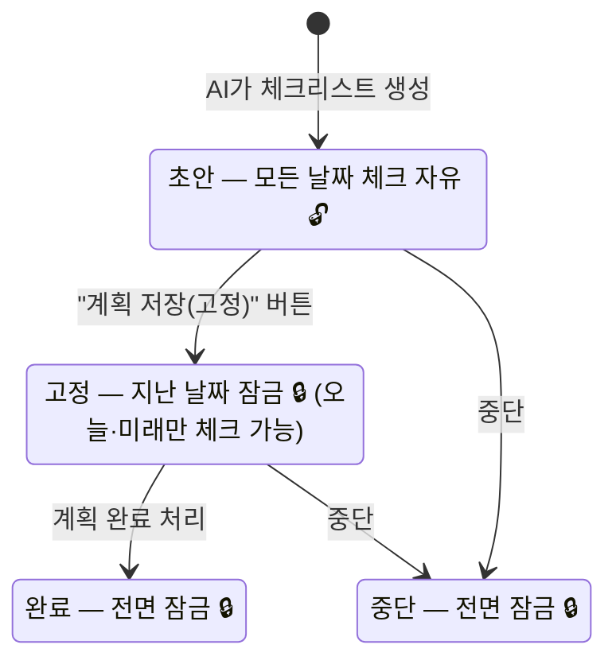
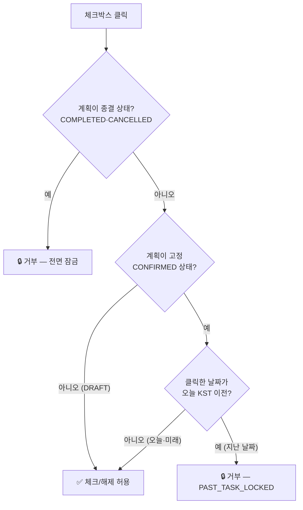
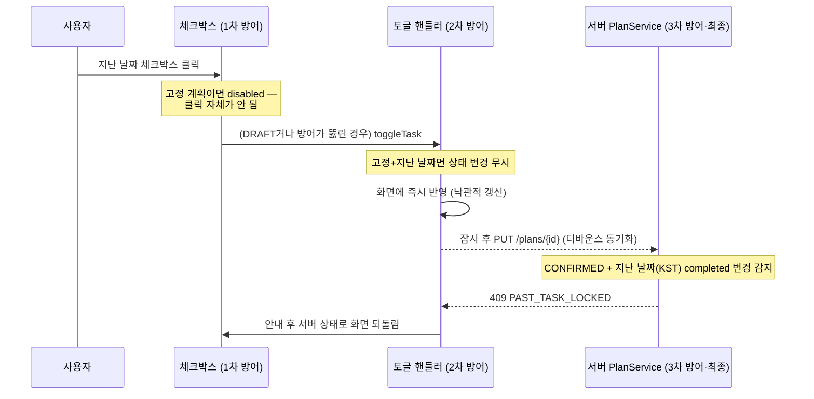

# 지난 날짜 잠금 — 동작 프로세스

> "지난 날짜인데 왜 체크가 되지?" 하고 헷갈릴 때 보는 문서입니다.
> **핵심 한 줄: 잠금은 계획의 날짜가 아니라 계획의 "상태"가 결정합니다 — "계획 저장(고정)"을 누른 순간부터 지난 날짜가 잠깁니다.** (v0.14.2)

## 1. 한눈에 보기 — 상태별 체크박스 규칙

| 계획 상태 | 지난 날짜 | 오늘 | 미래 날짜 | 이유 |
| :--- | :---: | :---: | :---: | :--- |
| **초안(DRAFT)** | ✅ 자유 | ✅ 자유 | ✅ 자유 | 아직 협상 중인 초안 — 내용·구조·체크 모두 자유 수정 단계 |
| **고정(CONFIRMED)** | 🔒 **잠금** | ✅ 가능 | ✅ 가능 | 실행 단계 — 지난 기록은 방향 불문(체크·해제 모두) 확정 |
| **종결(COMPLETED·CANCELLED)** | 🔒 잠금 | 🔒 잠금 | 🔒 잠금 | 끝난 계획은 전면 잠금(조회·회고·삭제만) |

- "지난 날짜" 판정 기준은 **한국 시간(KST)의 오늘**입니다(서버 기준).
- 미래 날짜 체크(내일 것 미리 하기)는 고정 계획에서도 허용됩니다 — 미리 하는 건 부지런함이지 조작이 아니기 때문.

## 2. 상태 수명주기 — 잠금이 켜지는 시점

스크린샷에서 Day 2(지난 날짜)가 체크됐다면, 그 계획은 아직 **DRAFT**였던 것입니다. 버그가 아니라 위 표 그대로의 동작입니다.

## 3. 체크박스를 클릭하면 — 판정 순서

이 판정이 **프론트(체크박스 비활성화 + 토글 핸들러)와 서버(PUT 검증)에서 각각 같은 순서로** 실행됩니다.

## 4. 클릭부터 저장까지 — 3중 방어선의 시퀀스

| 방어선 | 위치 | 역할 |
| :--- | :--- | :--- |
| 1차 — 체크박스 비활성화 | `frontend/src/components/chat_coach.jsx` (Day 카드 렌더링) | 고정 계획의 지난 날짜는 클릭 불가 + 툴팁 "지난 날짜는 변경할 수 없어요" |
| 2차 — 토글 핸들러 가드 | `chat_coach.jsx` `toggleTask` / `isPastLockedDate` | 화면 상태 변경 자체를 차단 |
| 3차 — 서버 검증 (최종) | `backend/.../plan/service/PlanService.assertUnlockedOrToggleOnly` | KST 기준으로 지난 날짜 completed 변경을 409 `PAST_TASK_LOCKED`로 거부 — 프론트가 뚫려도 여기서 막힘 |

## 5. 왜 DRAFT는 잠그지 않나 (설계 의도)

- 초안은 아직 **AI와 협상 중인 단계**입니다 — 내용 추가·삭제·재생성이 모두 자유이므로, 완료 체크만 잠그는 것은 의미가 없습니다(항목을 지웠다 다시 만들면 그만).
- "강제성"이 보호하려는 것은 **실행 기록의 소급 조작 방지**입니다 — 완료율("N/M 완료")과 회고·변경 이력은 고정 이후의 실행 단계에서 쌓이므로, 잠금도 고정 시점부터 발동합니다.
- 지키지 못한 지난 항목은 이월도 불가("오늘 → 내일"만 허용)라서, **미루지 않은 지난 미완료 항목은 "놓친 것"으로 확정**됩니다. 이것이 일반 투두리스트와 다른 지점입니다.

## 6. 알려진 한계 (인지된 동작)

| 상황 | 현상 | 방어 |
| :--- | :--- | :--- |
| 브라우저 타임존이 KST가 아님 | 프론트의 "오늘"과 서버(KST)의 "오늘"이 어긋나 체크박스가 일시 활성화될 수 있음 | 서버 409가 최종 판정 — 체크가 잠시 보였다가 서버 상태로 되돌아감 |
| 자정을 넘겨 열어둔 탭 | 화면을 다시 그리기 전까지 어제 체크박스가 활성 상태로 남음 | 동일 — 서버 409로 되돌림 |

## 관련 문서

- [CHANGELOG v0.14.2](../CHANGELOG.md) — 이 규칙이 도입된 배경("미루지 않은 지난 항목은 놓친 것으로 확정")
- [API_REFERENCE](API_REFERENCE.md) — 409 `PAST_TASK_LOCKED` 명세
- [FEATURES](FEATURES.md) — 미완료 내일로 이동(이월) 규칙
